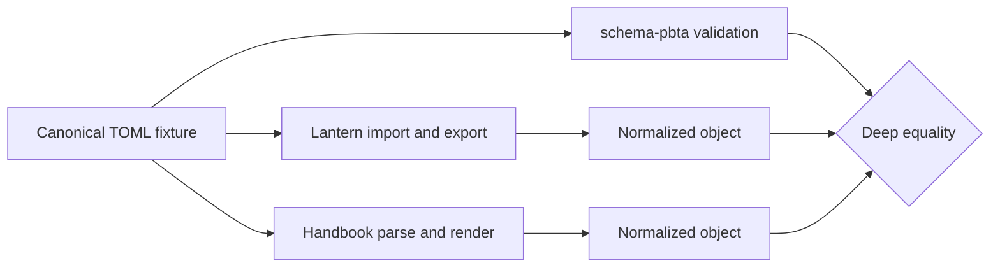

# Add a PbtA game across Schema, Lantern, and Handbook

Add one game through a single versioned TOML contract, then prove that Lantern and Handbook consume it without data loss.

## Why

**One source of truth** prevents Lantern and Handbook from inventing competing document shapes.

**Semantic round trips** catch differences between TOML parsers without confusing formatting with data.

**Host-first delivery** prevents a pack from advertising blocks that the installed Handbook cannot run.

**Shared capabilities** keep the workflow constant as new PbtA games are added.

## Steps to ship an interoperable PbtA game

#### 1) 📜 Define the canonical contract in schema-pbta

Author document structure only in `src/zod/`; generated JSON Schema, consumer types, and examples must derive from it.

1. Add the game and supported document targets to `src/zod/constants.ts`.
2. Reuse the shared `move`, `playbook`, `npc`, `front`, and `game-definition` schemas instead of cloning them per consumer.
3. Put editor defaults in Lantern's `createBlank`, never in the exchange schema.
4. Keep TOML objects strict and optional fields optional; put cross-document rules in `tools/validate-references.ts`.

```ts
export const playbookSchema = z.strictObject({
  slug: slugSchema,
  name: nonEmptyString,
  game: gameRefSchema,
  stats: z.record(z.string(), portableInteger),
  moves: z.array(moveEntry),
  attributes: z.record(z.string(), attributeValue).optional(),
});
```

#### 2) 🔖 Publish an immutable contract version

Version the format independently from the game vocabulary so every consumer can identify the exact contract it reads.

1. Export the canonical Zod schemas, inferred TypeScript types, TOML codecs, and JSON Schemas from the `schema-pbta` package.
2. Give generated schemas an immutable major path such as `/schemas/v1/masks/playbook.schema.json`; never use `main` as the published identity.
3. Pin the same package version in Lantern and Handbook lockfiles.
4. Follow [Semantic Versioning](https://semver.org/): optional compatible additions are minor; removals, renames, required fields, and type changes are major.

```json
{
  "$id": "https://raw.githubusercontent.com/RebelliousSmile/schema-pbta/v1/schemas/masks/playbook.schema.json",
  "$schema": "http://json-schema.org/draft-07/schema#"
}
```

#### 3) 🧪 Build one shared conformance corpus

Exercise the same valid and invalid TOML in all three repositories instead of maintaining parallel fixtures.

1. Add one minimal and one complete valid TOML document for every supported target.
2. Add invalid fixtures for unknown fields, missing required fields, invalid references, and hybrid `ref` plus inline moves.
3. Include TOML edge cases such as multiline strings, arrays of tables, quoted keys, integers, and booleans.
4. Compare parsed objects after normalization, not TOML bytes; key order, quoting, and whitespace are not schema semantics.



#### 4) 🏮 Integrate Lantern without a local PbtA schema

Build the editor and preview around imported contract types so UI code cannot silently widen or narrow the exchange format.

1. Import the schema, types, `parse*Toml`, and `stringify*Toml` functions from the pinned `schema-pbta` package.
2. Add the game to `GameId`, the game/theme registries, and the relevant template definitions.
3. Keep `model.ts` limited to view state; do not declare a competing `*Document` or Zod schema.
4. Test `parse(stringify(parse(toml)))` against the shared fixtures and verify deep semantic equality.

```ts
import {
  parsePlaybookToml,
  stringifyPlaybookToml,
  type Playbook,
} from '@rebellious-smile/schema-pbta';
```

#### 5) 📖 Integrate Handbook through shared PbtA capabilities

Register generic PbtA features once, then activate them for each compatible game instead of cloning five parsers and renderers.

1. Make block activation capability-based so `block:pbta-playbook` and `block:pbta-move` can serve several game ids.
2. Parse TOML with the pinned canonical codec; let the renderer degrade visibly when optional display data is unavailable.
3. Project canonical fields such as `trigger`, `choices`, and `results` into callouts; never introduce extra TOML keys for presentation.
4. Register the blocks, handout renderer, callouts, feature settings, styles, and insertion templates.
5. Assert that Handbook's Theme contents view returns non-empty handout, callout, and block entries for the active game.

```json
{
  "requires": [
    "block:pbta-playbook",
    "block:pbta-move",
    "style:pbta"
  ]
}
```

#### 6) 🔁 Prove the cross-tool round trip

Use one end-to-end gate to detect field loss that isolated unit suites cannot see.

1. Import a canonical playbook fixture into Lantern.
2. Export it as TOML and validate the result with the canonical Zod schema.
3. Parse and render the export in Handbook.
4. Copy or export the canonical object from Handbook and import it back into Lantern.
5. Deep-compare the initial and final normalized objects, including empty arrays, booleans, numbers, inline moves, and references.

```text
fixture -> Lantern -> schema-pbta -> Handbook -> schema-pbta -> Lantern
PASS: semantic document unchanged; block, callout, and handout registered
```

#### 7) 🚀 Release the host before the packs

Publish executable capability support before manifests require it so existing Handbook installations fail clearly instead of showing empty tools.

1. Release Handbook with the generic PbtA blocks, callouts, handout renderer, and capability declarations.
2. Raise every affected pack's `minimumHandbookVersion` to that release.
3. Add the PbtA capabilities to `requires` and bump each `pack.json` version together with its `handbook.json` entry.
4. Install the source through the real Handbook installer and confirm atomic success.

| Order | Artifact | Observable gate |
| ---: | --- | --- |
| 1 | `schema-pbta` contract | Tagged package and immutable schemas exist |
| 2 | Handbook host | PbtA capabilities and registries are shipped |
| 3 | Lantern consumer | Canonical import/export round trip passes |
| 4 | PbtA packs | Installed tools list is non-empty |

#### 8) ✅ Run the completion gate

Consider the game supported only when generation, validation, both consumers, and the installed pack all pass together.

1. Run the producer suite in `schema-pbta`.
2. Run the Lantern contract tests, lint, and production build.
3. Run the Handbook corpus, capability, source-installation, and production checks.
4. Run the pinned three-checkout contract job in CI.
5. Update documentation and asset provenance only after the executable gates pass.

```bash
$ npm run check
✅ All example files passed validation.
✅ All references resolve.
✅ Audit passed.
✅ All Handbook packs and Lantern editor surfaces passed validation.
```

## Verify

- One canonical fixture has the same normalized value before and after the Lantern → Handbook → Lantern round trip.
- Every invalid shared fixture has an explicit expected verdict in all three consumers.
- Lantern and Handbook lock the same `schema-pbta` contract version.
- Handbook lists and renders the game's handout, callouts, and code blocks.
- The pack cannot install on a Handbook version older than its required PbtA capabilities.
