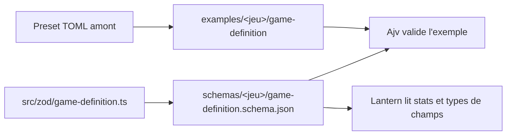

# Instruction: Définition de jeu et amorce Masks

## Architecture projection

```txt
.
├── src/
│   └── zod/
│       ├── constants.ts          ✏️ GAMES remanié, première entrée de TARGETS
│       ├── shared.ts             ✅ slug, référence de jeu, primitives réutilisées partout
│       └── game-definition.ts    ✅ schéma d'une définition de jeu
├── examples/
│   └── masks/
│       └── game-definition/
│           └── masks.toml        ✅ définition Masks dérivée du preset amont
├── schemas/
│   └── masks/
│       └── game-definition.schema.json  ✅ généré par npm.cmd run gen
├── README.md                     ✏️ attribution CC BY du preset Masks
└── CHANGELOG.md                  ✏️ une ligne sous `## [Unreleased]`
```

## User Journey



## Tasks to do

### `1)` Primitives partagées

> Poser une fois ce que tous les schémas réutiliseront.

1. Créer `src/zod/shared.ts`.
2. Y définir un `slugSchema` : chaîne non vide en kebab-case, motif `^[a-z0-9]+(-[a-z0-9]+)*$`.
3. Y définir un `gameRefSchema` : un slug simple, sans énumération des jeux connus. Il porte le `folder` de l'entrée de `GAMES`, pas sa clé : `monster-of-the-week` et non `motw`. Restreindre aux entrées de `GAMES` ferait dépendre le JSON de chaque jeu de la liste entière ; l'appartenance se vérifie en phase 4.
4. N'employer `.optional()` pour tout champ facultatif, jamais `.default()` : en vue output, `.default()` place le champ dans `required` et fait inventer une valeur à Zod.
5. Déclarer les objets en mode strict, afin que les schémas générés portent `additionalProperties: false` au-delà de la racine. Sans cela, les unions se laissent traverser par des objets hybrides et plusieurs critères d'acceptation des phases suivantes deviennent invérifiables.
6. Ne poser aucun `.refine()` : un contrôle inter-champs ne se traduit pas en JSON Schema et disparaîtrait silencieusement à la génération. Ce qui relève de la cohérence part en phase 4.

### `2)` Schéma d'attribut

> Couvrir les onze types du système amont sans les aplatir en un objet permissif.

1. Créer `src/zod/game-definition.ts`.
2. Définir le socle commun d'un attribut : `label`, `description`, `position` parmi `top` et `left`, `customLabel`, `limited`, et `visibleFor` acceptant un booléen, une chaîne, ou un tableau de chaînes. Ce champ correspond au `playbook` du système amont, renommé pour ne pas entrer en collision avec le type de contenu du même nom ; noter l'équivalence en commentaire, elle servira à l'adaptateur d'import.
3. Construire une union discriminée sur `type` pour les onze variantes :
   - `Number` avec `default` numérique ;
   - `Text` et `LongText` avec `default` textuel ;
   - `Resource`, `Clock`, `Xp` avec `max` et `default` numériques ;
   - `Checkbox` avec `checkboxLabel` et `default` booléen ;
   - `ListOne` avec `options`, `sort`, `default` numérique ;
   - `ListMany` avec `options`, `sort`, `condition`, et sans `default` ;
   - `Roll` avec `default` textuel et `showResults` ;
   - `Track`, dont les propriétés ne sont pas documentées dans le wiki : le modéliser en objet permissif et le signaler en commentaire. C'est la seule entorse à la règle de strictesse de la tâche 1 ; la lever demanderait d'inventer des propriétés que la source ne donne pas.
4. Rendre `position` facultatif : le preset Masks laisse `character.attributes.moment` sans position.
5. Ne pas reprendre les tables `attributesTop` et `attributesLeft` que porte le TOML par défaut du système : c'est la forme ancienne de ce que `position` exprime désormais. Le noter en commentaire, l'adaptateur d'import aura les deux formes à absorber.

### `3)` Schéma de définition de jeu

> Décrire un jeu entier : dés, stats, attributs, groupes de moves et d'équipement.

1. Définir le bloc de dés : `rollFormula`, `minMod`, `maxMod`, et `rollResults` en enregistrement de clés libres vers `{ range, label }`. Retenir la forme TOML `range = "7-9"` et une seule : l'API JavaScript du système écrit les mêmes bornes en `start`/`end`, et un `range = false` y désactive un palier — noter les deux équivalences en commentaire, un palier désactivé s'écrivant ici en omettant l'entrée.
2. Modéliser `statToggle` facultatif, en union de deux formes : le preset Masks écrit `statToggle = "Locked"`, le module Urban Shadows écrit une table `{ label, modifier }`. La troisième forme amont, `statToggle = false`, ne se transcrit pas : elle s'écrit ici en omettant le champ.
3. Définir le bloc `character` : `stats` en enregistrement clé vers libellé, `attributes` en enregistrement clé vers attribut, `statToggle` facultatif tel que défini à l'étape 2, `moveTypes`, `equipmentTypes`, `description` facultatif. `statToggle` vit ici et nulle part ailleurs : c'est une propriété de la feuille de personnage du jeu, pas d'une stat prise isolément.
4. Définir le bloc `npc` sur la même base, sans `stats`. Autoriser `equipmentTypes` : les presets Masks et Monster of the Week en déclarent un, contrairement à ce que dit la documentation.
5. Ajouter une entête de contenu : `game` (slug du jeu), `name` et `version` obligatoires, `source` facultatif. `version` suit la définition elle-même et s'incrémente quand ses stats, attributs ou vocabulaires changent ; la rendre obligatoire est ce qui permet à un consommateur de détecter qu'une définition a bougé sous lui.

### `4)` Déclarer la cible et générer

> Faire exister le premier fichier de `schemas/`.

1. Dans `src/zod/constants.ts`, ajouter à `GAMES` les entrées `urban-shadows` et `the-sprawl` manquantes. Le type `Game` impose trois champs : donner à chacune son `name` complet, son `folder` — `urban-shadows` et `the-sprawl`, ce sont eux que porteront les fichiers de contenu — et son `abbr`, égal au `folder` faute d'abréviation d'usage.
2. Retirer de `GAMES` les entrées `aw` et `dw`. Garder `monsterhearts`, `urban-shadows` et `the-sprawl` : chacun dispose d'une configuration de feuille exploitable en amont, respectivement un module tiers, un module tiers et un preset du wiki. Le commentaire du fichier présente déjà la liste comme éditable ; une entrée sans cible ne crée ni dossier ni fichier.
3. Ajouter à `TARGETS` la cible `game-definition` pour le jeu `masks`.
4. Lancer `npm.cmd run gen` et vérifier la création de `schemas/masks/game-definition.schema.json`.

### `5)` Exemple Masks

> Traduire le preset amont en un fichier d'exemple valide.

1. Écrire `examples/masks/game-definition/masks.toml` à partir du preset Masks du wiki. Un seul fichier dans ce dossier, nommé d'après le dossier du jeu : la phase 4 s'appuie sur cette règle : cinq stats (danger, freak, savior, superior, mundane), attributs `heroName`, `xp`, `momentUnlocked`, `conditions`, `look`, `abilities`, `influence`, `moment`, quatre types de moves, un type d'équipement, le bloc PNJ.
2. Ne pas y mettre de clé `$schema` : les schémas générés portent `additionalProperties: false` à la racine et la validation échouerait.
3. Respecter l'ordre TOML : scalaires racine d'abord, tables ensuite, sinon une paire clé/valeur se rattache silencieusement à la mauvaise table.
4. Déposer le fichier à plat dans `examples/masks/game-definition/` : le valideur ne descend pas dans les sous-dossiers et ignorerait le fichier sans rien signaler.
5. Ajouter au README la mention que la définition Masks dérive du preset d'Asacolips publié sous CC BY 4.0, avec crédit à Brendan Conway et Magpie Games.
6. Ajouter sous le `### Added` de la section `## [Unreleased]` déjà présente dans `CHANGELOG.md` une ligne décrivant l'arrivée du premier schéma et du premier jeu. Chaque phase suivante en ajoute une ; aucune ne coupe de version, la publication ne relève pas de ce plan.

## Test acceptance criteria

| Task | Acceptance criteria                                                                                                                        |
| ---- | -------------------------------------------------------------------------------------------------------------------------------------------- |
| 1    | Un champ facultatif d'un schéma généré n'apparaît pas dans `required` et ne porte pas de clé `default`.                                     |
| 2    | Un attribut `ListMany` portant un `default` est refusé ; un attribut sans `position` est accepté ; le schéma généré porte `additionalProperties: false` sur les objets imbriqués, pas seulement à la racine, l'attribut `Track` excepté. |
| 3    | Les deux formes de `statToggle`, chaîne et table, passent la validation sous `character` ; une définition sans `statToggle` reste valide.   |
| 4    | `npm.cmd run gen` écrit `schemas/masks/game-definition.schema.json` et l'annonce sur la sortie standard ; `GAMES` compte cinq entrées, `aw` et `dw` retirées. |
| 5    | `npm.cmd run check` affiche une ligne `✓` pour `examples/masks/game-definition/masks.toml` et sort en succès ; ajouter une clé `$schema` au fichier le fait échouer. Le chemin s'affiche avec les séparateurs de la plateforme, `path.join` étant ce qui le construit : sous Windows, des barres obliques inverses. |
