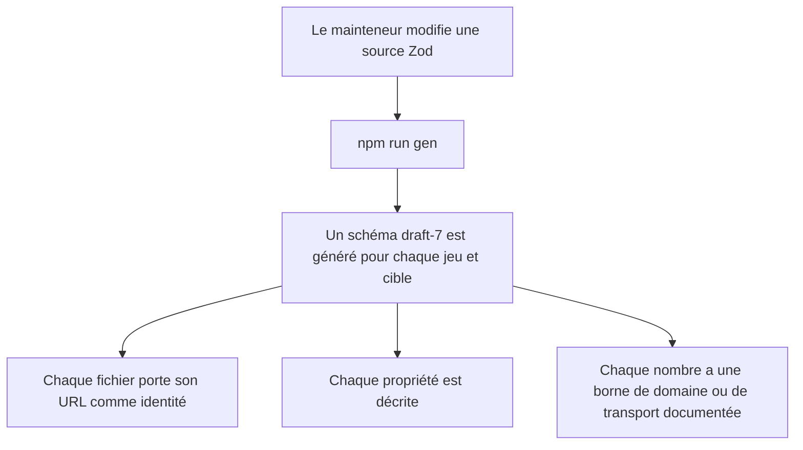
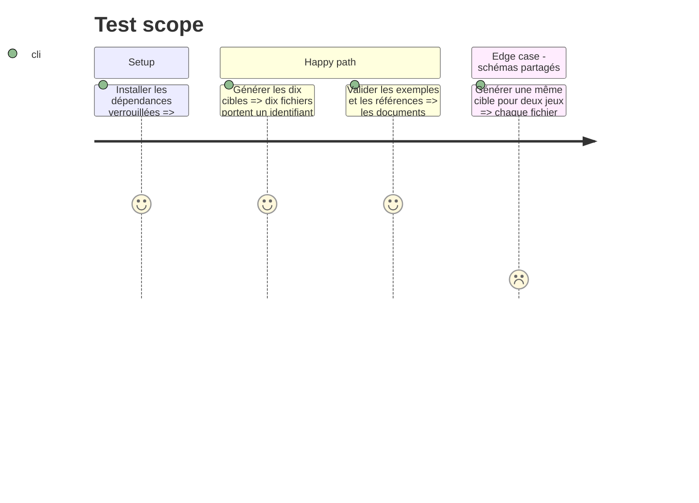

# Instruction: Rendre les schémas mesurables

## Architecture projection

> Tree of the final files. ✅ create · ✏️ modify · ❌ delete

```txt
.
├── src/zod/
│   ├── shared.ts                 ✏️ primitives numériques bornés et métadonnées communes
│   ├── game-definition.ts       ✏️ descriptions et domaines numériques du vocabulaire de jeu
│   ├── move.ts                  ✏️ descriptions et domaines numériques des actions
│   ├── playbook.ts              ✏️ descriptions et domaines numériques des livrets
│   ├── npc.ts                   ✏️ descriptions et domaines numériques des PNJ
│   └── front.ts                 ✏️ descriptions et domaines numériques des fronts
├── tools/gen-schemas.ts         ✏️ `$id` propre à chaque couple jeu/cible
└── schemas/
    ├── masks/*.schema.json      ✏️ artefacts régénérés avec identité, descriptions et bornes
    └── monster-of-the-week/*.schema.json ✏️ mêmes garanties pour Monster of the Week
```

## User Journey



## Test Scope



## Tasks to do

### `1)` Donner une identité à chaque schéma publié

> Produire un `$id` stable et distinct pour chacun des dix fichiers générés.

1. Construire dans `gen-schemas.ts` l’URL raw GitHub depuis `t.game.folder` et `t.name`.
2. Affecter cette URL au JSON généré avant son écriture, sans attacher une identité dépendante du jeu aux cinq objets Zod partagés.
3. Régénérer les schémas Masks et Monster of the Week.

### `2)` Publier la documentation des propriétés

> Faire parvenir les descriptions métier jusque dans les JSON Schemas.

1. Transformer les commentaires de champ pertinents en `.meta({ description })` sur les primitives, objets, branches d’union et propriétés Zod.
2. Donner une description concise aux propriétés actuellement documentées seulement par leur nom ou un commentaire TypeScript.
3. Vérifier récursivement les propriétés, y compris celles sous `items`, `allOf`, `anyOf` et `oneOf`.

### `3)` Borner les valeurs numériques

> Remplacer les plafonds implicites de JavaScript par des bornes de domaine ou de transport explicites.

1. Recenser les nombres de `game-definition`, `move`, `playbook`, `npc` et `front` et regrouper les domaines réellement partagés dans `shared.ts`.
2. Employer une borne issue des règles ou de la structure lorsqu’elle est établie par les sources du dépôt ; ne pas en inventer une pour un champ générique.
3. Pour les nombres volontairement génériques, appliquer la plage de transport signée 32 bits, ou sa moitié non négative pour les comptes, et la documenter comme limite du format plutôt que comme règle du jeu.
4. Préserver les valeurs légitimes des exemples existants et faire rejeter les valeurs au-delà du domaine déclaré.

## Test acceptance criteria

| Task | Acceptance criteria |
| ---- | ------------------- |
| 1 | Les dix JSON Schemas portent chacun un `$id` non vide égal à leur URL raw sous `main`, et les deux jeux n’ont jamais le même `$id` pour une cible homonyme. |
| 2 | Toute propriété atteignable dans chacun des schémas générés possède une `description` non vide. |
| 3 | Tout nœud `integer` ou `number` généré possède soit une borne justifiée par le domaine, soit la plage de transport 32 bits convenue ; aucune borne supérieure n’est absente ou égale à `Number.MAX_SAFE_INTEGER`. |
| 1–3 | Tous les exemples existants valident encore et toutes les références existantes se résolvent. |
