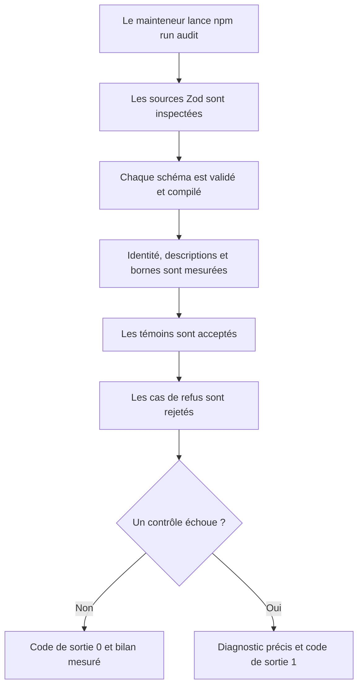
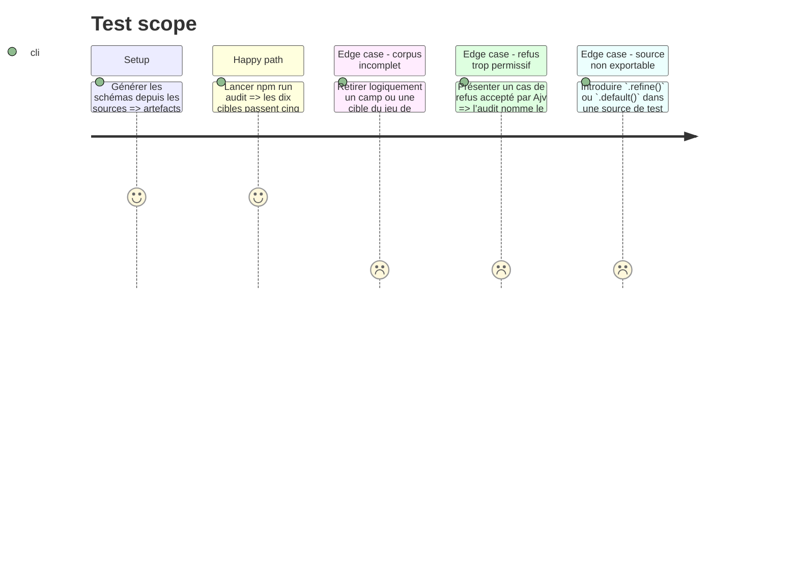

# Instruction: Porter l’auditeur et constituer le corpus

## Architecture projection

> Tree of the final files. ✅ create · ✏️ modify · ❌ delete

```txt
.
├── tools/audit-schemas.ts       ✅ port adapté aux cibles PbtA composites
├── package.json                 ✏️ commandes autonomes `npm run audit` et `npm run typecheck`
└── corpus/
    ├── README.md                ✅ rôle, structure et règles d’écriture du corpus
    ├── temoins/
    │   ├── masks/*/*.json ✅ documents légitimes complets des cinq cibles
    │   └── monster-of-the-week/*/*.json ✅ documents légitimes complets des cinq cibles
    └── refus/
        ├── masks/*/*.json ✅ un défaut réel et nommé par fichier pour les cinq cibles
        └── monster-of-the-week/*/*.json ✅ un défaut réel et nommé par fichier pour les cinq cibles
```

## User Journey



## Test Scope



## Tasks to do

### `1)` Adapter l’auditeur de référence

> Mesurer les garanties demandées pour chaque entrée de `TARGETS`.

1. Analyser les fichiers de `src/zod` avec l’API compilateur TypeScript et signaler les `CallExpression` dont la propriété appelée est `.refine` ou `.default`, avec chemin et ligne ; commentaires, chaînes et propriétés de données homonymes restent ignorés.
2. Pour chaque couple jeu/cible, vérifier le méta-schéma draft-7, la compilation Ajv, le `$id`, la couverture récursive des descriptions via `properties`, `items`, `allOf`, `anyOf` et `oneOf`, puis les bornes numériques finies.
3. Charger les témoins et refus depuis `corpus/<camp>/<jeu>/<cible>` et considérer l’absence de fichiers comme un échec.
4. Résoudre tous les chemins depuis une racine injectable, égale au répertoire courant par défaut, afin de pouvoir auditer un arbre de fixtures temporaire sans toucher au dépôt.
5. Agréger tous les diagnostics avant de sortir avec `0` si tout passe ou `1` si au moins un contrôle échoue.
6. Exposer l’auditeur avec le script `audit` de `package.json` et ajouter le script `typecheck` fondé sur `tsc --noEmit`.
7. Dans une racine temporaire ne contenant que les sources, schémas et corpus nécessaires, provoquer successivement un corpus manquant, un refus accepté, une description absente, un nombre non borné et un appel source interdit ; vérifier pour chacun le diagnostic et le code de sortie `1`, puis supprimer uniquement cette racine temporaire après validation de son chemin absolu.

### `2)` Écrire les témoins

> Prouver que chaque schéma accepte au moins un document légitime complet.

1. Créer un témoin JSON par couple jeu/cible à partir d’un exemple existant valide.
2. Remplir aussi les champs optionnels pertinents afin que les branches et structures imbriquées ne restent pas purement théoriques.
3. Garder les témoins indépendants des vérifications inter-fichiers : l’audit mesure chaque schéma avec Ajv, tandis que `validate:refs` conserve sa responsabilité actuelle.

### `3)` Écrire les cas de refus

> Prouver que les contraintes importantes rejettent des défauts réalistes.

1. Créer un fichier par défaut, nommé d’après ce défaut plutôt que numéroté.
2. Couvrir au minimum les champs requis absents, types incorrects, chaînes ou listes vides, valeurs d’enum inconnues, propriétés supplémentaires, unions hybrides et valeurs numériques hors borne lorsqu’ils s’appliquent.
3. Vérifier qu’un refus ne contient qu’un défaut intentionnel et qu’il redevient valide lorsque ce défaut est corrigé.

### `4)` Documenter le corpus

> Rendre sa convention maintenable sans lire le harness.

1. Expliquer pourquoi témoins et refus sont nécessaires ensemble.
2. Documenter le chemin composite par jeu et cible, le format JSON plat et la règle « un défaut par fichier ».
3. Indiquer la commande autonome `npm run audit`.

## Test acceptance criteria

| Task | Acceptance criteria |
| ---- | ------------------- |
| 1 | `npm run audit` parcourt dynamiquement toutes les entrées de `TARGETS` — les dix actuelles —, affiche le résultat de chaque garantie et échoue dès qu’au moins une garantie, un témoin ou un refus est incorrect. |
| 1 | `npm run typecheck` vérifie statiquement l’auditeur et le reste des sources TypeScript sans émettre de fichier. |
| 1 | Les occurrences de `.refine()` et `.default()` dans les commentaires, chaînes et clés de données ne font pas échouer l’audit, mais un appel exécutable est localisé et bloquant. |
| 1 | Les cinq mutations contrôlées dans une racine de fixtures temporaire produisent chacune le diagnostic attendu et un code non nul sans copier les dépendances ni modifier l’arbre de travail. |
| 2 | Chaque couple jeu/cible possède au moins un témoin JSON et tous les témoins sont acceptés par leur schéma. |
| 3 | Chaque couple jeu/cible possède au moins un refus ; chaque fichier porte un seul défaut nommé et est rejeté par son schéma. |
| 4 | `corpus/README.md` permet de localiser, nommer et exécuter les deux camps sans consulter le code de l’auditeur. |
