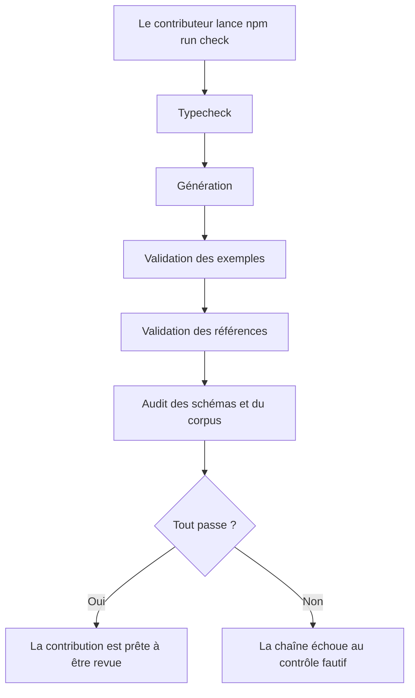
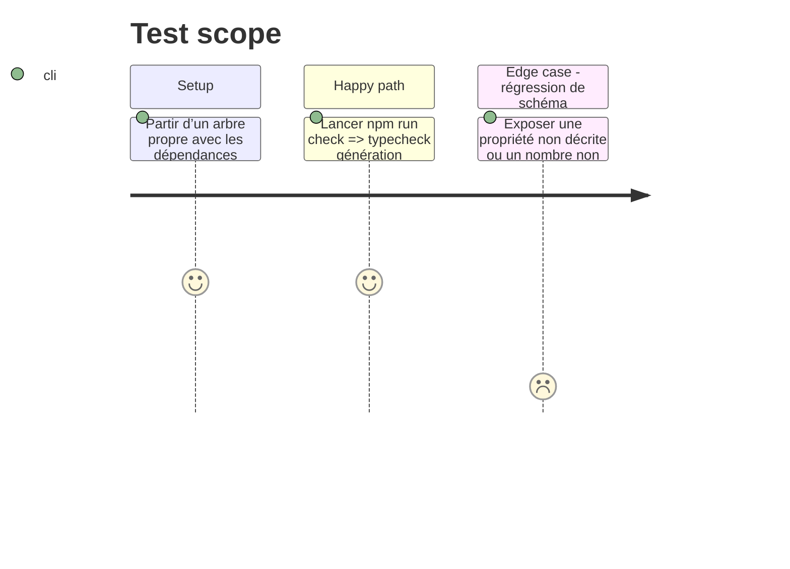

# Instruction: Bloquer les régressions dans le pipeline

## Architecture projection

> Tree of the final files. ✅ create · ✏️ modify · ❌ delete

```txt
.
├── package.json                 ✏️ `check` enchaîne typecheck, génération, validations et audit
├── README.md                    ✏️ garanties mesurées, corpus et commande publique
├── CONTRIBUTING.md              ✏️ exigences de métadonnées, bornes et fixtures
└── CHANGELOG.md                 ✏️ ajout de l’audit et durcissement observable des schémas
```

## User Journey



## Test Scope



## Tasks to do

### `1)` Intégrer l’audit à la commande de qualité

> Faire de toute régression auditée un échec de `npm run check`.

1. Ajouter `npm run typecheck` en tête de chaîne et `npm run audit` après la génération et les deux validations existantes.
2. Conserver l’ordre qui bloque d’abord les erreurs TypeScript et garantit ensuite que l’audit lit des JSON Schemas fraîchement générés.
3. Exécuter la chaîne complète sur un arbre propre et confirmer qu’elle ne modifie que les artefacts générés attendus sans diff résiduel.

### `2)` Documenter la garantie publiée

> Aligner la documentation des utilisateurs et contributeurs sur la nouvelle qualité mesurée.

1. Mettre à jour le statut et l’inventaire du README, actuellement obsolètes sur l’absence de cibles.
2. Ajouter la commande d’audit, la structure du corpus et les garanties réellement bloquantes sans promettre de contraintes inter-fichiers prises en charge par `validate:refs`.
3. Ajouter aux règles de contribution les descriptions Zod, bornes numériques et fixtures positives/négatives attendues pour toute évolution de schéma.
4. Consigner l’ajout dans le changelog avec son effet potentiellement restrictif sur des nombres auparavant non bornés.

## Test acceptance criteria

| Task | Acceptance criteria |
| ---- | ------------------- |
| 1 | Une exécution de `npm run check` vérifie les types, régénère les schémas, accepte les exemples, résout les références, exécute l’audit et termine avec le code `0`. |
| 1 | Toute défaillance de l’audit propage un code non nul à `npm run check`. |
| 2 | README, guide de contribution et changelog décrivent les commandes, chemins et garanties qui existent réellement dans le dépôt. |
