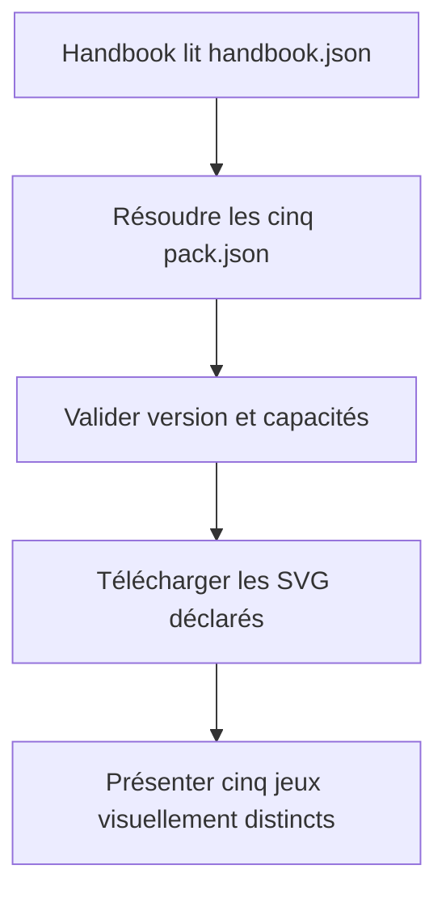
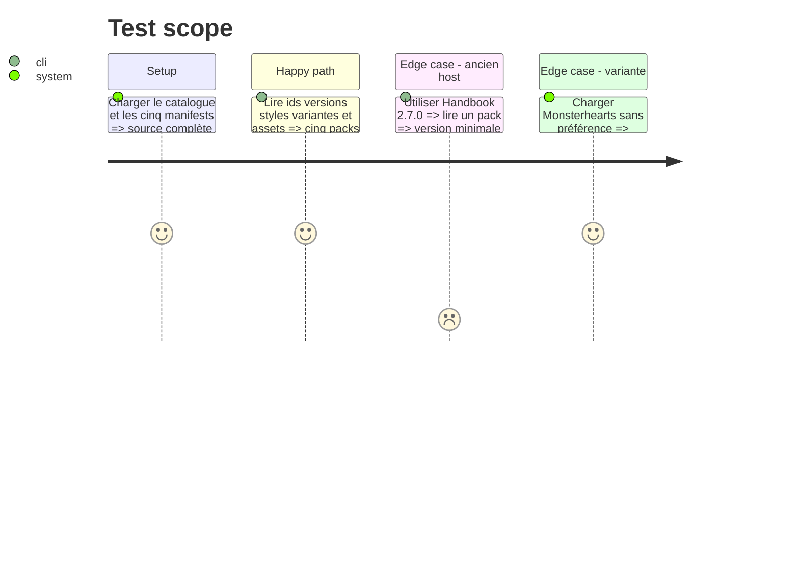

# Instruction: Catalogue et manifests installables

## Architecture projection

> Tree of the final files. ✅ create · ✏️ modify · ❌ delete

```txt
schema-pbta/
├── handbook.json                                      ✅ catalogue racine v1
├── LICENSES/HANDBOOK-ASSETS.md                       ✅ provenance centralisée des SVG
└── handbook/
    ├── masks/pack.json                                ✅ pack clair héroïque
    ├── monster-of-the-week/pack.json                  ✅ pack clair dossier paranormal
    ├── monsterhearts/pack.json                        ✅ pack sombre avec variante drowned-lake
    ├── the-sprawl/pack.json                           ✅ pack sombre cyberpunk
    ├── urban-shadows/pack.json                        ✅ pack clair occulte urbain
    └── {masks,monster-of-the-week,monsterhearts,the-sprawl,urban-shadows}/README.md ✏️ renvoi de provenance
```

## User Journey



## Test Scope



## Tasks to do

### `0)` Nettoyer le plan abandonné

> Repartir du contrat canonique déjà publié sans perdre les artefacts de ce plan.

1. Restaurer depuis `HEAD` uniquement les fichiers suivis actuellement modifiés sous `src/zod`, `schemas`, `examples`, `corpus`, `tools` et `handbook/*/preview/index.html`.
2. Préserver intégralement `aidd_docs/tasks/2026_09/2026_09_10_handbook-catalog/` et vérifier qu’aucun autre fichier utilisateur non suivi n’est supprimé.
3. Confirmer avant création des manifests que le diff suivi ne contient plus de modification issue du contrat PbtA 2.8.0.

### `1)` Déclarer le catalogue

> Publier un inventaire explicite des cinq jeux sous une seule identité de dépôt.

1. Créer `handbook.json` v1 pour `RebelliousSmile/schema-pbta` avec nom, description et auteur.
2. Déclarer Masks, Monster of the Week, Monsterhearts, The Sprawl et Urban Shadows en version `0.1.0` avec ids, chemins, labels et descriptions uniques.
3. Conserver le même ordre canonique que `GAMES` et ne jamais découvrir un pack par simple présence d’un dossier.

### `2)` Créer les cinq manifests

> Transformer les directions visuelles existantes en données acceptées par Handbook.

1. Créer cinq enveloppes `manifestVersion: 1`, `minimumHandbookVersion: 2.7.1`, `requires: []` et faire correspondre exactement ids et versions au catalogue.
2. Mapper chaque palette vers les variables Obsidian natives de note et, seulement si pertinent, de workspace ; garder les valeurs structurelles propres aux previews hors du manifest.
3. Déclarer les polarités réellement conçues : clair pour Masks, MotW et Urban Shadows ; sombre pour Monsterhearts et The Sprawl.
4. Déclarer Monsterhearts `base` comme variante par défaut puis `drowned-lake` comme delta visuel, sans changer identité ni capacités.

### `3)` Fermer le payload d’assets

> Installer uniquement les ressources originales que les packs déclarent.

1. Déclarer les SVG originaux retenus sous `assets/images` avec des rôles stables et des chemins relatifs à `handbook/<jeu>/assets`.
2. Inclure les deux SVG Monsterhearts comme rôles communs au pack afin que le changement de variante ne demande aucun téléchargement tardif.
3. Ne déclarer aucune police tant que les dossiers ne contiennent que des placeholders de provenance.
4. Centraliser auteur, origine et licence des SVG dans `LICENSES/HANDBOOK-ASSETS.md`, avec un renvoi depuis chaque README de jeu concerné.

## Test acceptance criteria

| Task | Acceptance criteria |
| --- | --- |
| 0 | Après restauration ciblée, seuls les artefacts de planification restent non suivis ; aucun fichier extérieur à la liste explicite n’a été modifié ou supprimé. |
| 1 | `handbook.json` annonce exactement cinq ids et chaque entrée pointe vers un manifest existant de même id et version. |
| 2 | Handbook 2.7.1 accepte les cinq manifests ; chaque jeu modifie visiblement la note via ses tokens natifs sans renderer PbtA spécifique. |
| 2 | Monsterhearts démarre avec sa base sombre et expose `drowned-lake` comme unique variante alternative. |
| 3 | Chaque asset déclaré existe sous la racine du pack, possède une extension image admise et aucune police inexistante n’est annoncée. |
| 3 | Chaque SVG déclaré possède une provenance et une licence explicites dès son premier commit distribuable. |
