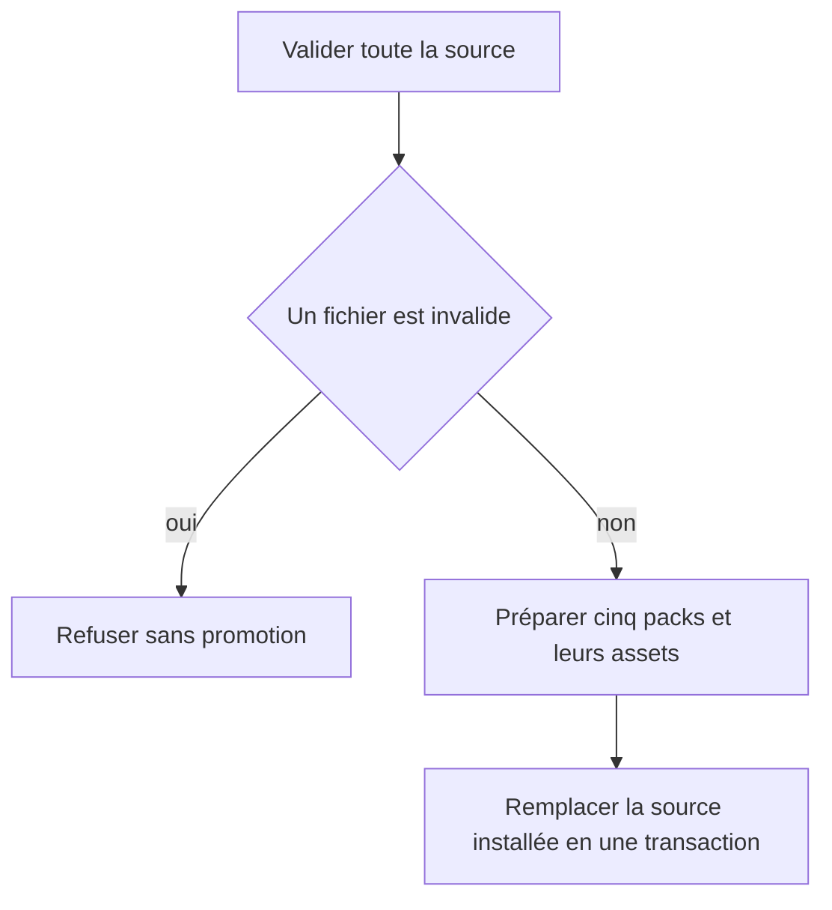
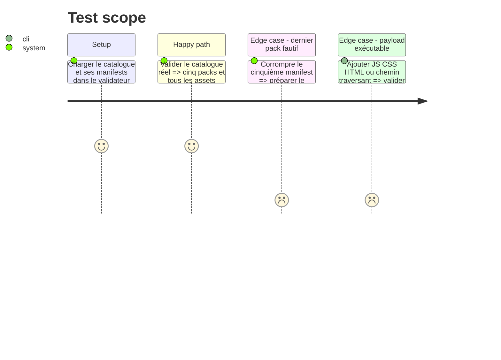

# Instruction: Validation et preuve transactionnelle

## Architecture projection

> Tree of the final files. ✅ create · ✏️ modify · ❌ delete

```txt
schema-pbta/
├── .github/workflows/ci.yml                          ✅ chaîne npm autonome
├── package.json                                      ✏️ intégrer les validations catalogue
└── tools/
    ├── validate-handbook-packs.ts                    ✏️ valider catalogue, manifests et payload
    └── validate-handbook-catalog-fixtures.ts         ✅ refus ciblés du contrat
```

## User Journey



## Test Scope



## Tasks to do

### `1)` Étendre la validation locale

> Faire échouer le dépôt dès que le payload publié diverge du contrat Handbook.

1. Valider les champs fermés de `handbook.json`, SemVer, ids et chemins sûrs, doublons et correspondance exacte avec `GAMES`.
2. Valider les enveloppes v1, la version minimale 2.7.1, `requires: []`, polarités, variantes, tokens sûrs et cohérence id/version.
3. Résoudre les assets sous la racine de chaque pack, limiter leurs extensions aux images admises et refuser absents, absolus ou traversées.
4. Distinguer le payload installable des previews : aucun CSS, HTML, TS, JS ou TOML ne peut être référencé par le catalogue ou un manifest.

### `2)` Ajouter les fixtures de refus et la CI

> Tester chaque frontière sans dépendre d’un réseau ou d’un autre dépôt.

1. Muter des clones en mémoire pour version inconnue, doublon, mismatch, champ inconnu, ancien host, capacité déclarée, token invalide, asset absent et chemin dangereux.
2. Exiger un diagnostic contenant le pack ou chemin fautif pour chaque mutation.
3. Ajouter ces validations à `npm run check` et créer une CI utilisant `npm ci` puis `npm run check`.

## Test acceptance criteria

| Task | Acceptance criteria |
| --- | --- |
| 1 | Le validateur accepte uniquement le catalogue réel fermé et nomme toute divergence de manifest, version, token, chemin ou asset. |
| 2 | Chaque fixture invalide échoue pour sa cause attendue et la CI autonome passe sans checkout Handbook. |
