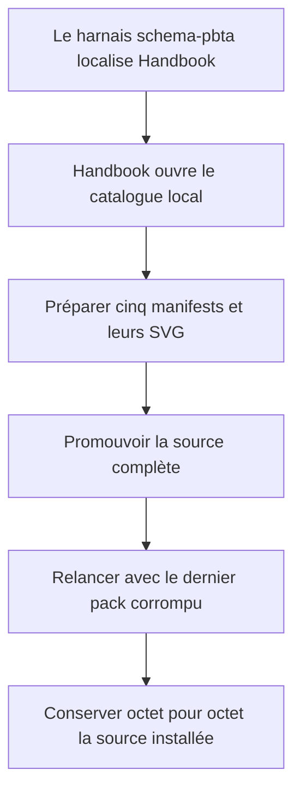
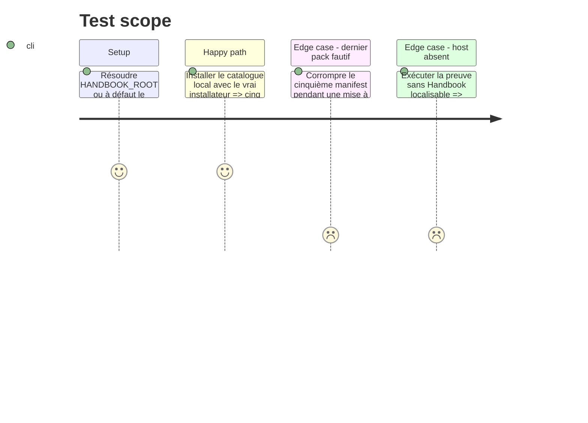

# Instruction: Preuve par le vrai installateur Handbook

## Architecture projection

> Tree of the final files. ✅ create · ✏️ modify · ❌ delete

```txt
schema-pbta/
├── package.json                                      ✏️ exposer l’assertion optionnelle
└── tools/
    └── validate-handbook-install.ts                  ✅ exercer le vrai installateur sur la source locale
```

## User Journey



## Test Scope



## Tasks to do

### `1)` Ajouter le harnais côté source

> Tester le catalogue depuis son propre dépôt sans écrire dans Handbook.

1. Calquer le harnais sur `schema-adrenaline/tools/validate-handbook-install.ts` et garder `process.cwd()` comme racine de la source PbtA.
2. Traiter `HANDBOOK_ROOT` comme autoritaire lorsqu’il est défini ; utiliser le checkout frère `../handbook` seulement sinon, puis vérifier `package.json` et la présence de `src/games/sourceInstaller.ts`.
3. Exposer `handbook:install` dans le `package.json` de `schema-pbta`, sans l’ajouter à `npm run check`.
4. Donner un diagnostic exploitable lorsque le host est absent ou incompatible.

### `2)` Prouver installation et mise à jour atomiques

> Traverser les vrais lecteurs v1 et la vraie frontière de staging.

1. Importer `installResolvedSchemaSource` depuis le checkout Handbook et l’alimenter avec `handbook.json`, les cinq manifests et les SVG réels ; laisser son lecteur de manifests appliquer la comparaison SemVer avec la version du host.
2. Simuler l’adapter Obsidian en mémoire et vérifier les cinq répertoires installés, les versions, les variantes, la métadonnée de source et chaque asset déclaré.
3. Installer un état initial, rendre invalide en mémoire le manifest du cinquième pack pendant une mise à jour, puis comparer récursivement fichiers et dossiers avant et après le rejet.

### `3)` Préserver l’autonomie des deux dépôts

> Garder la preuve inter-dépôts volontaire et unilatérale.

1. Exécuter le nouveau script avec le checkout Handbook explicite puis, variable absente, avec le checkout frère ; vérifier qu’une variable explicite invalide échoue sans fallback silencieux.
2. Exécuter `npm run check` dans `schema-pbta` sans Handbook et confirmer qu’il ne lance pas la preuve externe.
3. Vérifier que le diff de phase ne contient aucun changement dans le dépôt Handbook.

## Test acceptance criteria

| Task | Acceptance criteria |
| --- | --- |
| 1 | `npm run handbook:install` respecte un `HANDBOOK_ROOT` autoritaire ou utilise à défaut le checkout frère, et explique clairement tout chemin ou host absent. |
| 2 | Le véritable lecteur de manifests refuse selon SemVer un host antérieur à 2.7.1, sans comparaison lexicale propre au harnais. |
| 2 | Le vrai installateur promeut exactement cinq packs, leurs variantes et les six SVG ; une erreur du cinquième manifest conserve intégralement fichiers et dossiers de l’installation précédente. |
| 3 | `npm run check` reste autonome sans checkout Handbook et la phase ne modifie que `schema-pbta`. |
