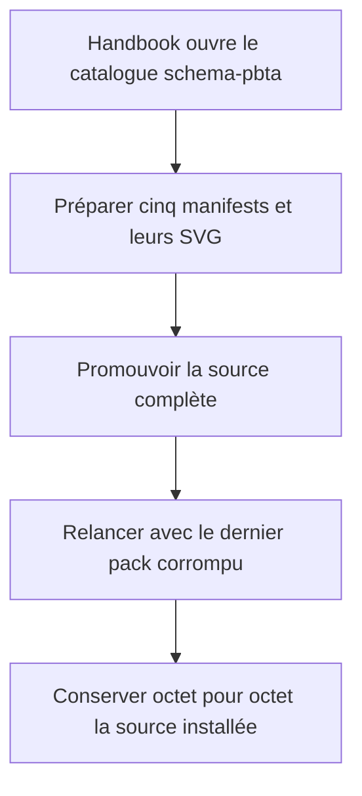
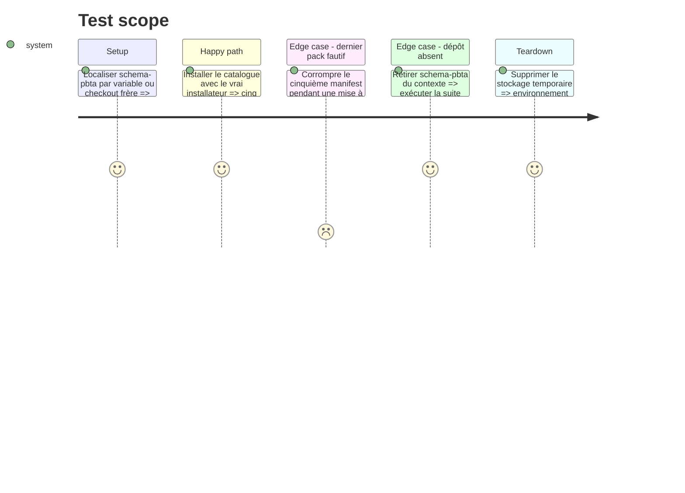

# Instruction: Preuve par le vrai installateur Handbook

## Architecture projection

> Tree of the final files. ✅ create · ✏️ modify · ❌ delete

```txt
../handbook/
├── package.json                                      ✏️ exposer l’assertion externe
└── tools/
    ├── assert-pbta-source.mjs                        ✅ localiser et lancer le harnais
    └── assertPbtaSource.harness.mts                  ✅ installer et mettre à jour la source réelle
```

## User Journey



## Test Scope



## Tasks to do

### `1)` Ajouter le harnais externe

> Tester schema-pbta sans le transformer en dépendance du build Handbook.

1. Calquer le lanceur sur l’assertion de source Adrenaline et résoudre schema-pbta par `SCHEMA_PBTA_ROOT` ou checkout frère.
2. Exposer `assert:pbta-source` dans `package.json` sans l’ajouter à `npm run check`.
3. Donner un diagnostic d’absence exploitable lorsque le dépôt source ne peut pas être localisé.

### `2)` Prouver installation et mise à jour atomiques

> Traverser les vrais lecteurs v1 et la vraie frontière de staging.

1. Alimenter `installResolvedSchemaSource` avec `handbook.json`, les cinq manifests et les SVG réels.
2. Vérifier les cinq répertoires installés, les versions, les variantes et chaque asset déclaré.
3. Installer un état initial, corrompre tardivement le cinquième pack en mémoire, puis comparer récursivement le stockage avant et après l’échec.

### `3)` Préserver l’autonomie Handbook

> Garder le test inter-dépôts volontaire.

1. Exécuter le nouveau script avec schema-pbta présent.
2. Exécuter `npm run check` et confirmer qu’il ne lance ni ne localise schema-pbta.
3. Ne modifier aucun code runtime Handbook ni sa version pour cette issue.

## Test acceptance criteria

| Task | Acceptance criteria |
| --- | --- |
| 1 | `npm run assert:pbta-source` localise la source explicitement ou comme checkout frère et explique clairement son absence. |
| 2 | Le vrai installateur promeut exactement cinq packs et tous leurs SVG ; une erreur du dernier manifest conserve intégralement l’installation précédente. |
| 3 | La suite core Handbook passe sans schema-pbta et le diff Handbook ne contient que le script npm et les deux fichiers de harnais. |
