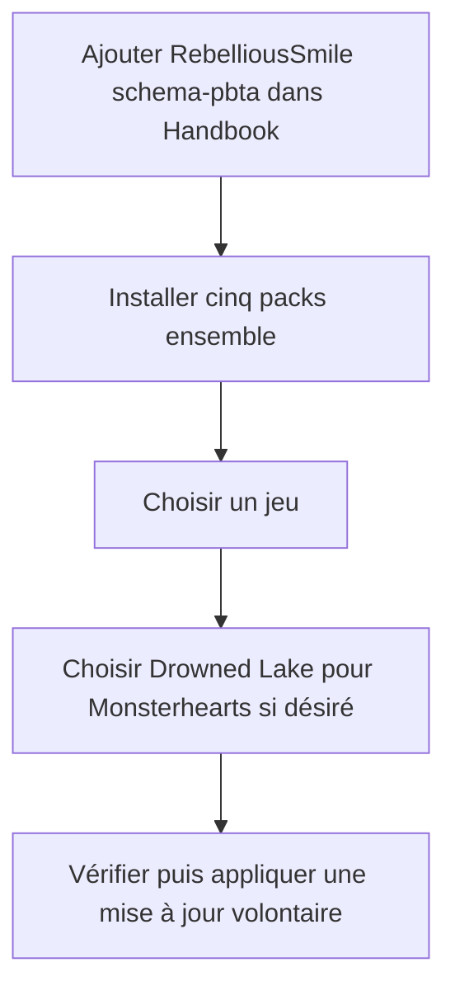
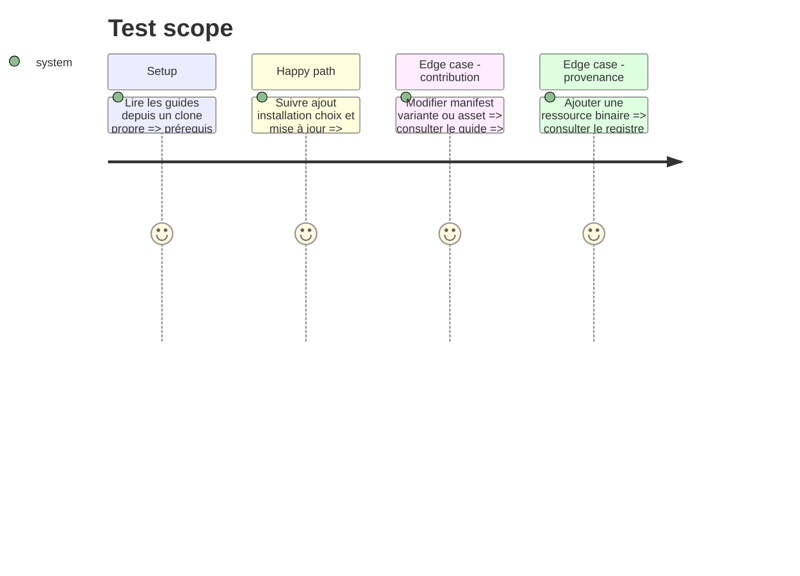

# Instruction: Documentation et publication

## Architecture projection

> Tree of the final files. ✅ create · ✏️ modify · ❌ delete

```txt
schema-pbta/
├── README.md                                      ✏️ installation de la source Handbook
├── CONTRIBUTING.md                               ✏️ maintenance des versions et assets
├── CHANGELOG.md                                  ✏️ catalogue multi-pack sans release npm
├── LICENSES/HANDBOOK-ASSETS.md                   ✅ provenance des SVG originaux
└── handbook/
    ├── README.md                                 ✏️ frontière payload et previews
    └── {masks,monster-of-the-week,monsterhearts,the-sprawl,urban-shadows}/README.md ✏️ apparence et provenance
```

## User Journey



## Test Scope



## Tasks to do

### `1)` Documenter l’installation

> Rendre le parcours source puis jeu compréhensible sans connaître l’arborescence interne.

1. Décrire la version Handbook minimale, l’ajout du dépôt, l’installation groupée et la mise à jour volontaire.
2. Expliquer que les packs v1 changent l’apparence native des notes et ne fournissent encore aucun bloc PbtA ni callout propre au jeu.
3. Documenter le choix de variante en temps réel et la base Monsterhearts utilisée par défaut.

### `2)` Documenter la maintenance

> Préserver l’identité et la compatibilité du catalogue.

1. Exiger un bump simultané du manifest et de son entrée catalogue pour toute modification installable.
2. Distinguer clairement les `pack.json` installables des HTML, CSS et TOML de preview locaux.
3. Décrire les rôles d’assets, les extensions admises et l’interdiction de contenu exécutable.

### `3)` Enregistrer la provenance et la livraison

> Permettre une redistribution vérifiable des seuls SVG annoncés.

1. Centraliser pour chaque SVG auteur, origine, licence et chemin installé.
2. Préciser qu’aucune police placeholder n’est distribuée.
3. Mettre à jour le changelog sans annoncer de publication npm ni de version Handbook inexistante.
4. Consigner la validation autonome et la commande optionnelle `npm run handbook:install`, avec `HANDBOOK_ROOT` ou le checkout frère.

## Test acceptance criteria

| Task | Acceptance criteria |
| --- | --- |
| 1 | Le README permet d’ajouter une source unique, d’installer cinq packs et de changer la variante Monsterhearts avec Handbook 2.7.1 ou supérieur. |
| 1 | La documentation indique explicitement que les fences et callouts PbtA ne font pas partie de cette livraison. |
| 2 | Un contributeur sait quels changements imposent le bump `0.1.x` conjoint et quels fichiers restent exclus du payload. |
| 3 | Chaque SVG distribué possède une provenance et une licence ; aucune police inexistante ou preview n’est annoncée comme installable. |
| 3 | Les commandes documentées reproduisent la validation autonome et `npm run handbook:install` avec le vrai installateur Handbook, sans demander de modifier le dépôt host. |
