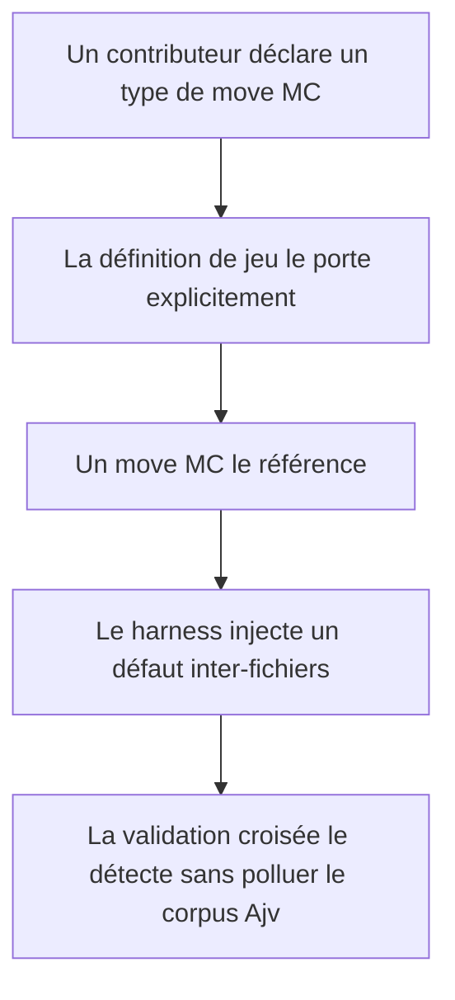
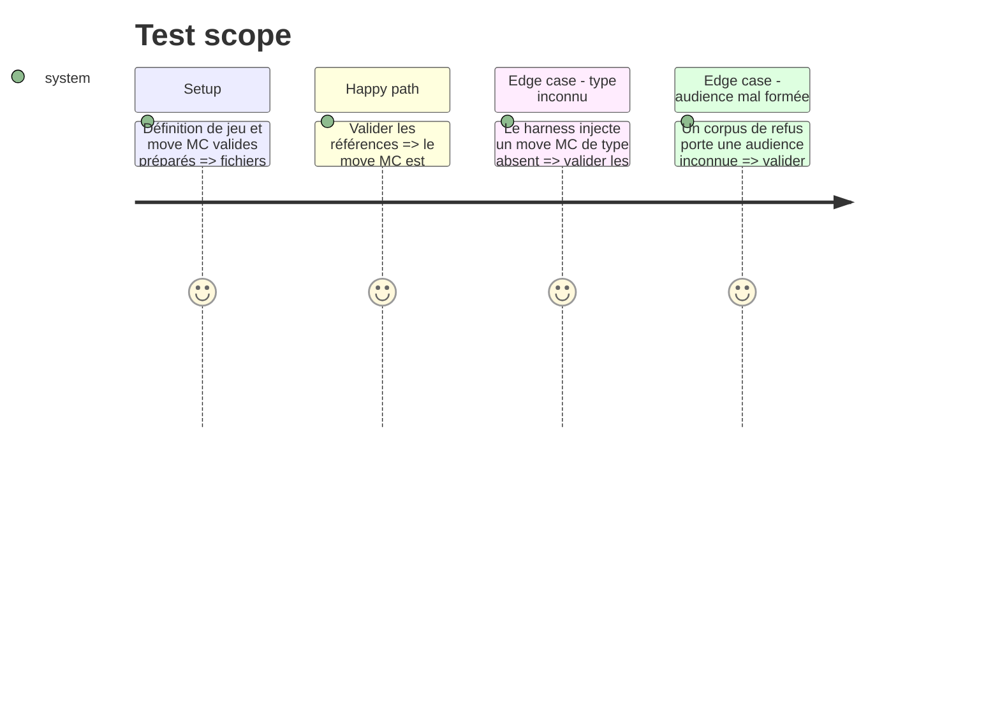

# Instruction: Contrat canonique et actions de MC

## Architecture projection

> Tree of the final files. ✅ create · ✏️ modify · ❌ delete

```txt
.
├── src/zod/
│   ├── game-definition.ts              ✏️ déclarer les vocabulaires d’actions de MC sans les confondre avec les moves de personnage ou PNJ
│   ├── move.ts                         ✏️ porter l’audience optionnelle d’un move de MC
│   └── constants.ts                    ✏️ conserver les cinq jeux et préparer les cibles core
├── tools/
│   ├── validate-references.ts          ✏️ exposer la validation de références réutilisable et valider les types de move MC
│   └── validate-reference-fixtures.ts  ✅ injecter des défauts inter-fichiers dans une copie temporaire des exemples
├── package.json                         ✏️ exécuter le harness dans la chaîne de contrôle
├── examples/masks/game-definition/
│   └── masks.toml                      ✏️ témoin d’une définition sans régression
├── schemas/
│   ├── masks/game-definition.schema.json                 ✏️ schéma régénéré
│   └── monster-of-the-week/game-definition.schema.json   ✏️ schéma régénéré
├── corpus/
│   ├── temoins/                        ✏️ témoins adaptés au contrat commun
│   └── refus/                          ✏️ refus Ajv ciblé d’une audience de move invalide
├── README.md                           ✏️ borner les données publiables et l’interopérabilité Lantern/Handbook
└── CONTRIBUTING.md                     ✏️ documenter la provenance exigée pour toute nouvelle donnée de jeu
```

## User Journey



## Test Scope



## Tasks to do

### `1)` Distinguer les actions de MC dans le modèle partagé

> Donner aux actions de MC un vocabulaire explicite, tout en préservant la compatibilité des définitions Masks et Monster of the Week.

1. Ajouter à la définition de jeu un bloc optionnel et documenté pour les types de move de MC.
2. Ajouter à un move une audience optionnelle ; une action de MC porte obligatoirement l’audience `mc`, tandis que les documents historiques restent compatibles sans ce champ.
3. Réserver aux actions de MC des clés de type distinctes des vocabulaires personnage et PNJ, afin que l’absence d’audience ne puisse pas masquer une action de MC.
4. Étendre la passe croisée pour vérifier qu’un move d’audience `mc` cite le vocabulaire MC de son jeu et qu’un type réservé MC ne peut pas être utilisé sans cette audience.
5. Régénérer les schémas affectés, ajouter un témoin MC et un refus Ajv où l’audience elle-même est invalide.

### `2)` Prouver la validation de cohérence inter-fichiers

> Vérifier des défauts que JSON Schema seul ne peut pas exprimer sans rendre le corpus normal volontairement invalide.

1. Extraire de `validate-references.ts` un point d’entrée qui reçoit une racine d’exemples et retourne des diagnostics, tout en conservant la commande actuelle.
2. Ajouter un harness qui copie les exemples vers un répertoire temporaire, y injecte un type MC inconnu et un type MC réservé sans audience, puis vérifie les diagnostics attendus.
3. Ajouter cette commande à `npm run check` et garantir le nettoyage du répertoire temporaire, y compris après un échec.

### `3)` Écrire la frontière de provenance

> Rendre vérifiable la différence entre structure de jeu, exemples publiables et sources de consultation locales.

1. Mettre à jour le README et le guide de contribution avec la règle de non-copie du contenu publié.
2. Décrire la provenance minimale à conserver pour chaque définition, move et livret ajouté.

## Test acceptance criteria

| Task | Acceptance criteria |
| --- | --- |
| 1 | Un move d’audience `mc` dont le type est déclaré dans le bloc MC est accepté ; le schéma rejette une audience qui ne fait pas partie du contrat, sans modifier les exemples historiques. |
| 2 | Le harness détecte un type MC inconnu et un type MC réservé sans audience dans sa copie temporaire, alors que `corpus/refus/` reste validé uniquement par Ajv. |
| 3 | Les documents expliquent clairement que les PDF de référence ne sont pas des assets ni des contenus à versionner. |
