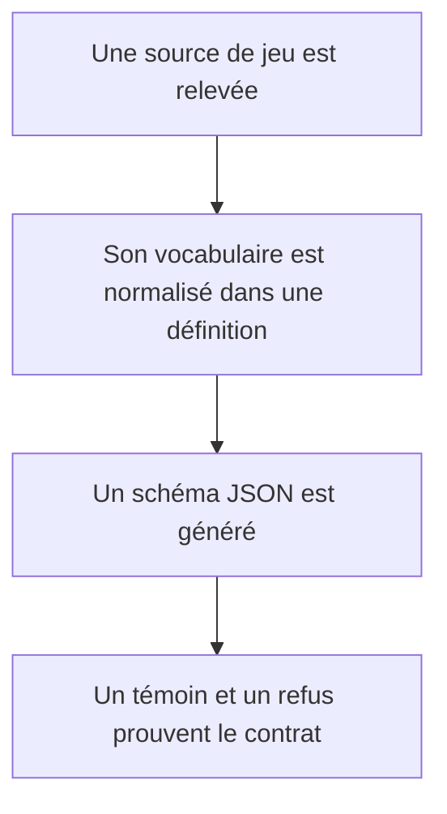
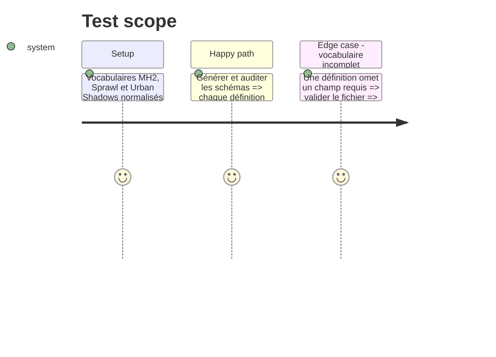

# Instruction: Définitions de jeu des trois corpus en attente

## Architecture projection

> Tree of the final files. ✅ create · ✏️ modify · ❌ delete

```txt
.
├── src/zod/constants.ts                ✏️ activer les cibles game-definition de Monsterhearts, The Sprawl et Urban Shadows
├── examples/
│   ├── monsterhearts/game-definition/monsterhearts.toml   ✅ vocabulaire MH2
│   ├── the-sprawl/game-definition/the-sprawl.toml         ✅ vocabulaire structurel Sprawl 1.1
│   └── urban-shadows/game-definition/urban-shadows.toml   ✅ vocabulaire Urban Shadows 2e
├── schemas/
│   ├── monsterhearts/game-definition.schema.json          ✅ schéma généré
│   ├── the-sprawl/game-definition.schema.json             ✅ schéma généré
│   └── urban-shadows/game-definition.schema.json          ✅ schéma généré
└── corpus/
    ├── temoins/<jeu>/game-definition/                     ✅ un témoin complet par jeu
    └── refus/<jeu>/game-definition/                       ✅ un refus focalisé par jeu
```

## User Journey



## Test Scope



## Tasks to do

### `1)` Établir les cartes de sources et d’édition

> Figer les sources consultées sans les importer dans le dépôt.

1. Associer Monsterhearts 2 aux règles et mues, Urban Shadows 2e à ses règles et playbooks, et The Sprawl 1.1 VO à la structure de sa future VF.
2. Relever pour chacun stats, paliers de jet, attributs, types de move, types d’équipement et actions de MC.
3. Écarter villes, campagnes, scénarios et toute matière qui ne relève pas du modèle de règles ou de livret.

### `2)` Publier les définitions canoniques

> Ajouter les trois définitions de jeu dans les conventions TOML existantes.

1. Activer uniquement la cible `game-definition` pour chacun des trois jeux.
2. Écrire les définitions avec version propre, provenance documentée et clés stables.
3. Générer les trois schémas et constituer leur corpus témoin/refus.

## Test acceptance criteria

| Task | Acceptance criteria |
| --- | --- |
| 1 | Chaque nouveau jeu possède une source, une édition et une liste de données retenues explicitement distinguées des suppléments exclus. |
| 2 | Les trois définitions passent la génération, la validation, la passe croisée et l’audit avec leurs témoins et refus dédiés. |

