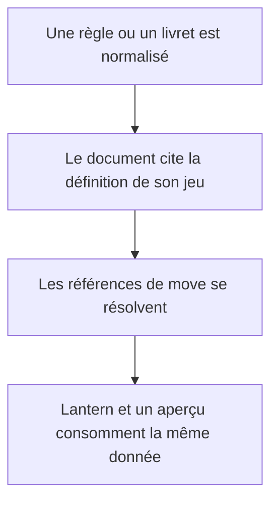
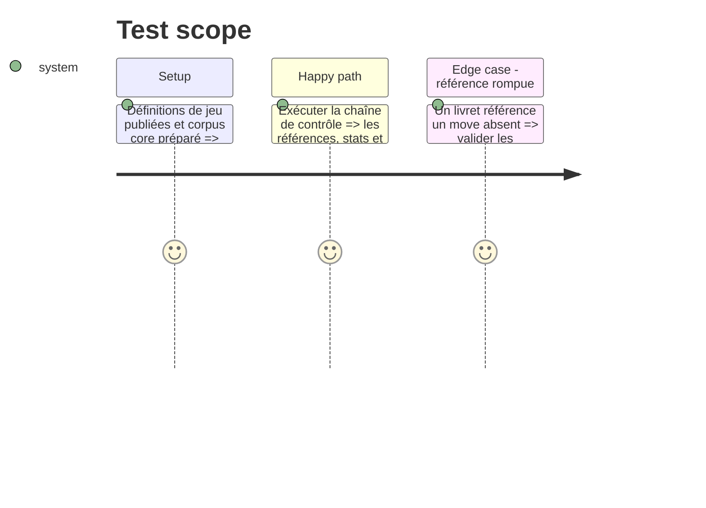

# Instruction: Moves et livrets structurés

## Architecture projection

> Tree of the final files. ✅ create · ✏️ modify · ❌ delete

```txt
.
├── src/zod/constants.ts                         ✏️ activer les cibles move et playbook des trois jeux
├── examples/
│   ├── monsterhearts/{move,playbook}/            ✅ corpus core et mues structurés
│   ├── the-sprawl/{move,playbook}/               ✅ corpus core à structure compatible avec la VF
│   └── urban-shadows/{move,playbook}/            ✅ corpus core et playbooks structurés
├── schemas/
│   ├── monsterhearts/{move,playbook}.schema.json ✅ schémas générés
│   ├── the-sprawl/{move,playbook}.schema.json    ✅ schémas générés
│   └── urban-shadows/{move,playbook}.schema.json ✅ schémas générés
└── corpus/
    ├── temoins/<jeu>/{move,playbook}/            ✅ témoins complets
    └── refus/<jeu>/{move,playbook}/              ✅ refus focalisés
```

## User Journey



## Test Scope



## Tasks to do

### `1)` Activer les cibles de contenu nécessaires

> Rendre les moves et livrets des trois jeux publiables dans le même contrat que Masks et Monster of the Week.

1. Ajouter les cibles `move` et `playbook` dans `TARGETS` pour Monsterhearts, The Sprawl et Urban Shadows.
2. Générer les schémas correspondants et créer les dossiers d’exemples selon les conventions existantes.

### `2)` Constituer les corpus structurés

> Relever le vocabulaire et la structure nécessaires aux règles, actions de MC et livrets, puis les éprouver avec des fixtures originales plutôt qu’avec du texte ou une mise en page protégés.

1. Modéliser Monsterhearts à partir des règles et mues uniquement ; exclure villes et campagnes, et écrire des fixtures de moves et livrets originales.
2. Modéliser The Sprawl avec la structure VO 1.1 et les livrets de la VF locale comme référence de libellés, en utilisant des fixtures originales pour le dépôt.
3. Modéliser Urban Shadows à partir des règles et playbooks 2e, avec des fixtures originales qui exercent ses mécaniques propres.
4. Garder les Team Playbooks et suppléments de Monster of the Week comme extensions distinctes du corpus core ; ne pas les mélanger aux exemples existants.

### `3)` Éprouver le partage de données

> Faire de chaque jeu un consommateur réel des mêmes primitives : stats, attributs, moves, choix et livrets.

1. Ajouter témoins complets et refus ciblés pour toutes les nouvelles cibles actives.
2. Garantir, pour chaque nouveau jeu, au moins un move commun, une action de MC avec audience `mc` et un livret original référencés par le corpus d’aperçu.
3. Vérifier les cas représentatifs : move commun, action de MC, move de livret, choix de création et attribut propre au jeu.

## Test acceptance criteria

| Task | Acceptance criteria |
| --- | --- |
| 1 | Chaque nouveau jeu génère exactement ses schémas `move` et `playbook` et les exemples sont découverts par les validateurs. |
| 2 | Les fixtures publiées sont originales, n’embarquent aucun PDF, image de livre, HTML ou prose publiés, et leurs clés concordent avec la définition de jeu. |
| 3 | Chaque nouveau jeu fournit au moins un move commun, une action de MC et un livret originaux ; la chaîne accepte leurs témoins et rejette au moins une référence ou clé de vocabulaire invalide par nouvelle cible. |
