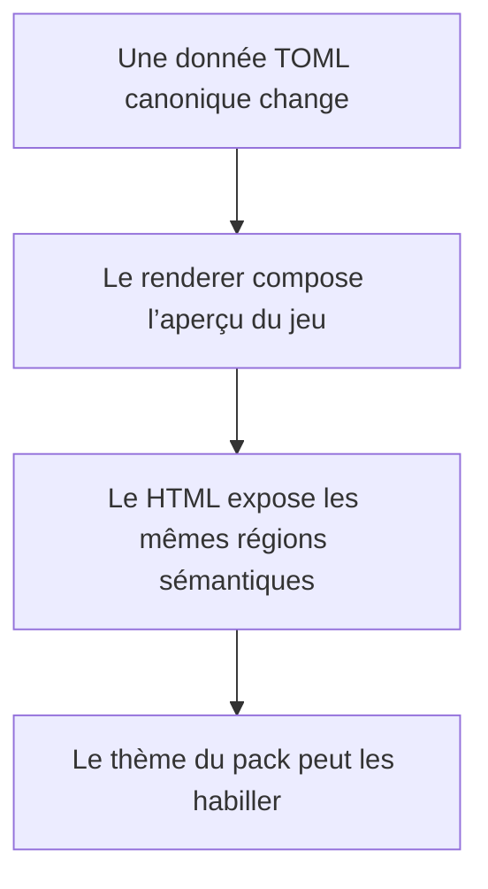
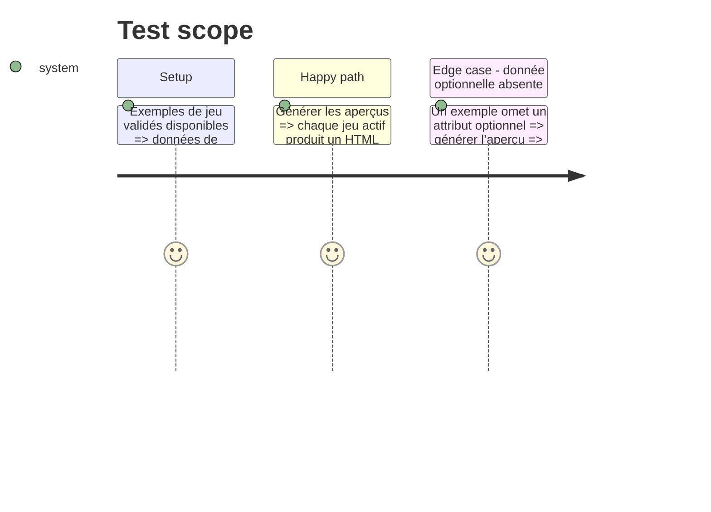

# Instruction: Aperçu Handbook sémantique commun

## Architecture projection

> Tree of the final files. ✅ create · ✏️ modify · ❌ delete

```txt
.
├── tools/
│   └── render-handbook-preview.ts        ✅ rendre les exemples canoniques en HTML d’aperçu
├── handbook/
│   ├── shared/
│   │   ├── preview.css                   ✅ structure et composants sémantiques communs
│   │   └── preview-contract.md           ✅ classes, attributs et entrées de données stables
│   ├── masks/preview/{preview.toml,index.html}          ✅ références déterministes et aperçu généré
│   ├── monster-of-the-week/preview/{preview.toml,index.html} ✅ références déterministes et aperçu généré
│   ├── monsterhearts/preview/{preview.toml,index.html}  ✅ références déterministes et aperçu généré
│   ├── the-sprawl/preview/{preview.toml,index.html}     ✅ références déterministes et aperçu généré
│   └── urban-shadows/preview/{preview.toml,index.html}  ✅ références déterministes et aperçu généré
└── package.json                           ✏️ exposer la génération locale d’aperçus
```

## User Journey



## Test Scope



## Wireframe

```txt
┌──────────────────────────────────────────────────────────┐
│ (1) Identité du jeu                         (2) Variante  │
├───────────────────┬─────────────────────────┬────────────┤
│ (3) Identité      │ (4) Livret              │ (5) État   │
│ du personnage     │     et moves             │ personnage │
│                   │  ┌────────────────────┐ │            │
│                   │  │ (6) Move / résultat │ │            │
│                   │  └────────────────────┘ │            │
├───────────────────┴─────────────────────────┴────────────┤
│ (7) Références et actions de MC                            │
└──────────────────────────────────────────────────────────┘
```

## Tasks to do

### `1)` Définir le contrat de rendu temporaire

> Rendre les données observables sans créer un second modèle Handbook.

1. Documenter les régions HTML, classes et attributs qui correspondent à un livret, un move, un résultat, une stat, un attribut et une action de MC identifiée par son audience.
2. Garder le contrat indépendant du manifeste installable de Handbook, encore en évolution.
3. Définir un descripteur par jeu qui ne contient que des références vers les documents canoniques choisis pour l’aperçu.

### `2)` Générer les aperçus depuis les exemples

> Produire les pages HTML à partir du corpus TOML existant plutôt que de recopier son contenu à la main.

1. Ajouter un renderer local qui résout les références déclarées par chaque aperçu, lit les exemples canoniques et écrit les cinq pages HTML, en plaçant les moves d’audience `mc` dans leur région dédiée.
2. Ajouter une commande de package reproductible et documenter le statut généré des pages.
3. Prévoir des absences de données optionnelles sans inventer de valeurs de rendu.

## Test acceptance criteria

| Task | Acceptance criteria |
| --- | --- |
| 1 | Tous les aperçus partagent les mêmes régions et sélecteurs sémantiques pour les objets communs, et chaque descripteur référence seulement des documents existants de son jeu. |
| 2 | Une modification contrôlée d’un document référencé apparaît dans le HTML régénéré correspondant, sans copie manuelle ni changement lorsque des exemples non référencés sont ajoutés. |
