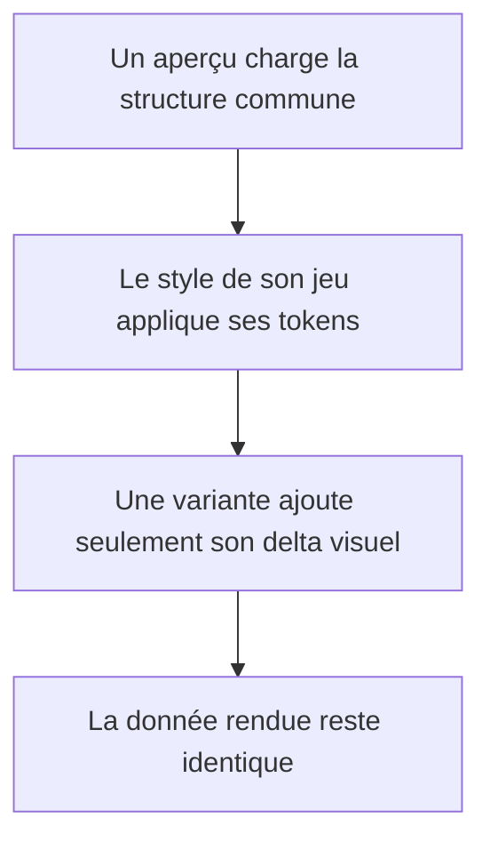
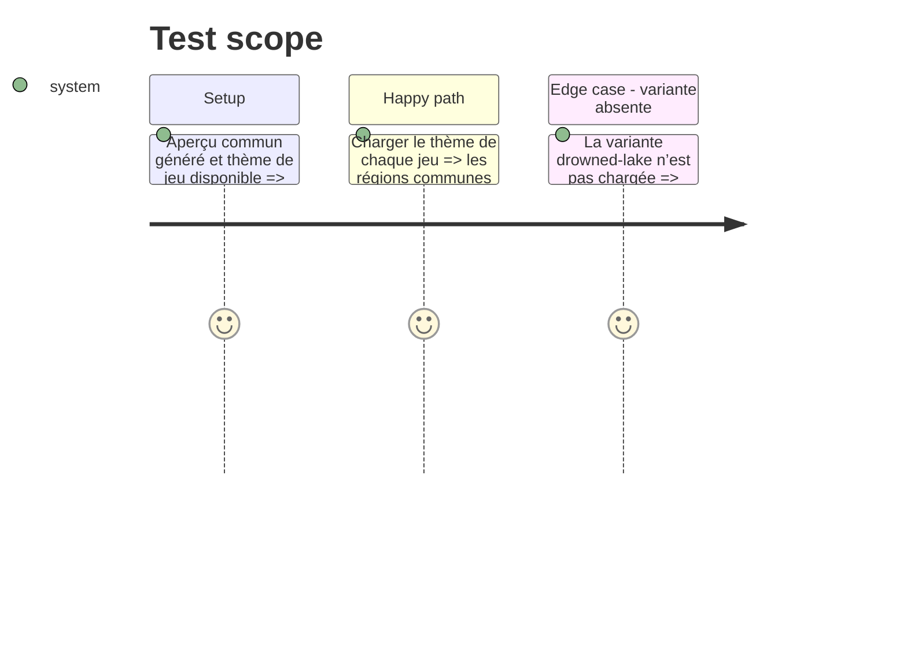

# Instruction: Thèmes, assets et variantes visuelles

## Architecture projection

> Tree of the final files. ✅ create · ✏️ modify · ❌ delete

```txt
.
└── handbook/
    ├── shared/
    │   └── theme-tokens.css                       ✅ tokens de repli communs
    ├── masks/
    │   ├── styles/base.css                        ✅ identité du jeu
    │   ├── assets/{fonts,images}/                 ✅ assets originaux ou licenciés
    │   └── README.md                              ✅ provenance et usage
    ├── monster-of-the-week/
    │   ├── styles/base.css                        ✅ identité du jeu
    │   ├── assets/{fonts,images}/                 ✅ assets originaux ou licenciés
    │   └── README.md                              ✅ provenance et usage
    ├── monsterhearts/
    │   ├── styles/base.css                        ✅ gothique sobre MH2
    │   ├── styles/variants/drowned-lake.css       ✅ variante purement visuelle
    │   ├── assets/{fonts,images,variants/drowned-lake}/ ✅ assets séparés par portée
    │   └── README.md                              ✅ variantes et provenance
    ├── the-sprawl/
    │   ├── styles/base.css                        ✅ identité cyberpunk originale
    │   ├── assets/{fonts,images}/                 ✅ assets originaux ou licenciés
    │   └── README.md                              ✅ provenance et usage
    └── urban-shadows/
        ├── styles/base.css                        ✅ identité urbaine occulte originale
        ├── assets/{fonts,images}/                 ✅ assets originaux ou licenciés
        └── README.md                              ✅ provenance et usage
```

## User Journey



## Test Scope



## Wireframe

```txt
┌──────────────────────────────────────────────────────────┐
│ (1) Identité du jeu                         (2) Variante  │
├───────────────────┬─────────────────────────┬────────────┤
│ (3) Identité      │ (4) Livret              │ (5) État   │
│ du personnage     │     et moves             │ personnage │
│                   │  ┌────────────────────┐ │            │
│                   │  │ (6) Move / résultat │ │            │
│                   │  └────────────────────┘ │            │
├───────────────────┴─────────────────────────┴────────────┤
│ (7) Références et actions de MC                            │
└──────────────────────────────────────────────────────────┘
```

## Tasks to do

### `1)` Poser les fondations de thème

> Associer à la structure commune des tokens de repli et un style de base par jeu.

1. Créer les dossiers de pack et leurs styles de base sans dupliquer le HTML de structure.
2. Définir une identité originale pour chaque jeu, distincte des maquettes publiées : enquête surnaturelle, adolescence super-héroïque, gothique MH2, dossier cyberpunk et occultisme urbain.
3. Ranger chaque police, image et texture sous le pack qui la consomme avec sa provenance.

### `2)` Créer l’architecture de variantes

> Rendre une variante composable sans lui donner de pouvoir sur les données.

1. Créer `styles/variants/` et `assets/variants/` comme emplacements conventionnels, même pour les jeux sans variante actuelle.
2. Implémenter `drowned-lake` pour Monsterhearts comme un delta de tokens, styles et assets sur le thème MH2 de base.
3. Vérifier que la même page générée reste le support du thème de base et de sa variante.

## Test acceptance criteria

| Task | Acceptance criteria |
| --- | --- |
| 1 | Les cinq aperçus utilisent la même structure HTML tout en ayant chacun une feuille de style et des assets propres. |
| 2 | La variante `drowned-lake` modifie uniquement des références CSS et assets ; aucune donnée TOML, classe sémantique ou région HTML générée n’est changée. |
