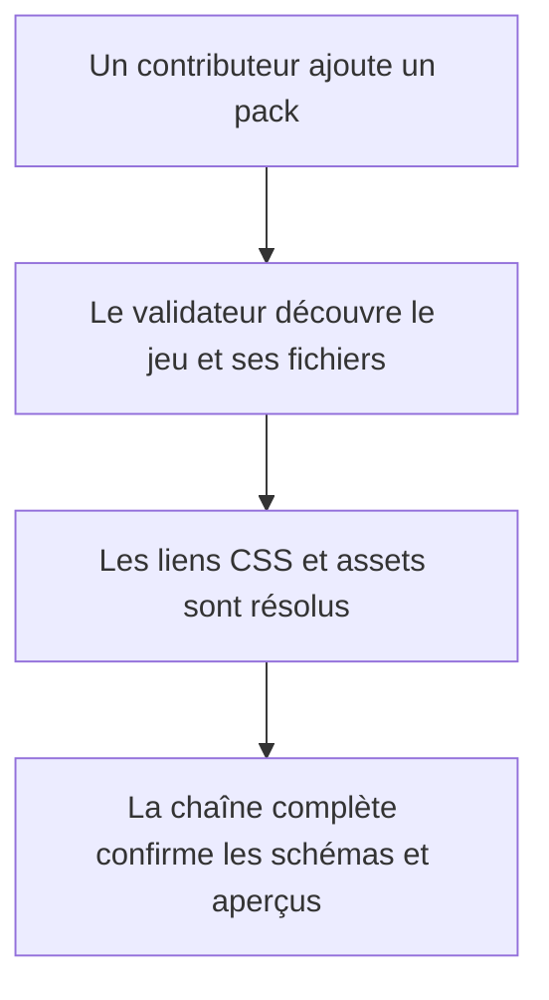
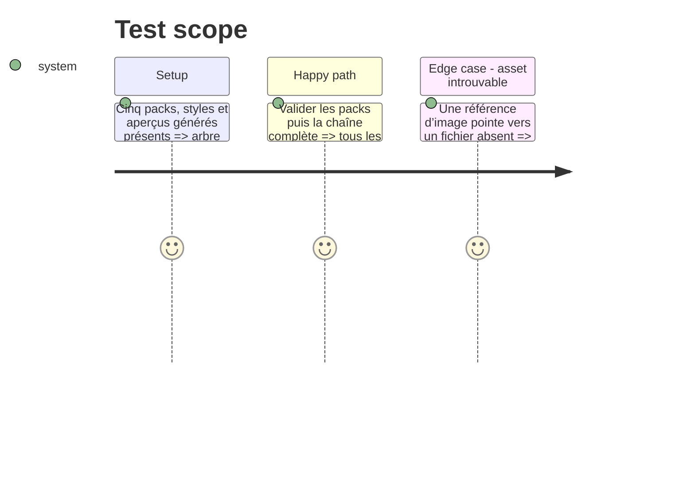

# Instruction: Vérification des packs et documentation

## Architecture projection

> Tree of the final files. ✅ create · ✏️ modify · ❌ delete

```txt
.
├── tools/validate-handbook-packs.ts     ✅ contrôler l’arborescence, les liens et la séparation thème/données
├── package.json                         ✏️ exposer la validation des aperçus et packs
├── README.md                            ✏️ expliquer corpus, aperçus et packs en attente d’intégration Handbook
├── CONTRIBUTING.md                      ✏️ décrire l’ajout d’un jeu, d’un thème et d’une variante
├── CHANGELOG.md                         ✏️ annoncer les données et aperçus ajoutés sous Unreleased
└── handbook/
    └── README.md                        ✅ décrire le contrat local et la future intégration Handbook
```

## User Journey



## Test Scope



## Tasks to do

### `1)` Rendre les packs vérifiables

> Détecter les écarts d’arborescence et de chemins avant qu’ils ne deviennent un défaut d’intégration Handbook.

1. Écrire un validateur qui exige un pack pour chacun des cinq jeux déclarés dans `GAMES`, avec styles, aperçu et assets.
2. Vérifier les références locales, les descripteurs d’aperçu, les répertoires de variantes et l’absence de documents de données canoniques sous `handbook/`.
3. Vérifier la surface d’édition Lantern : les définitions exposent stats, types de moves et attributs typés, et les livrets portent leurs valeurs mécaniques sans demander d’analyser `statsDetail` ou leur prose.
4. Ajouter les commandes de génération et validation à la chaîne du dépôt.

### `2)` Donner les règles de maintenance

> Permettre d’ajouter un jeu ou une variante sans recréer une représentation de règles ni figer le futur contrat Handbook.

1. Documenter la différence entre données canoniques, aperçu généré, thème de base et variante.
2. Documenter les exigences de provenance des assets et le statut différé du manifeste installable.
3. Mettre à jour le changelog sans publier de version.

## Test acceptance criteria

| Task | Acceptance criteria |
| --- | --- |
| 1 | Un chemin d’asset, de stylesheet, de référence d’aperçu ou une surface mécanique insuffisante pour les formulaires Lantern fait échouer la validation avec un diagnostic précis, tandis que les cinq packs attendus passent. |
| 2 | Les guides permettent à un contributeur de distinguer sans ambiguïté où ajouter une donnée, un aperçu, un thème ou une variante. |
