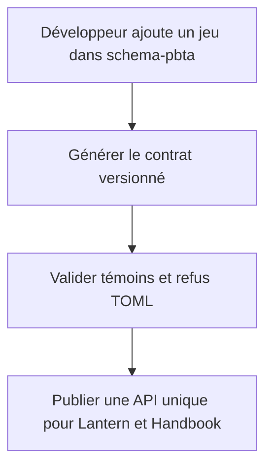
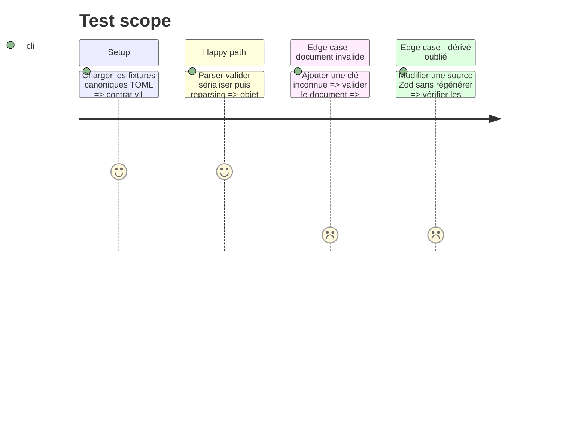

# Instruction: Package de contrat canonique

## Architecture projection

> Tree of the final files. ✅ create · ✏️ modify · ❌ delete

```txt
schema-pbta/
├── package.json                                      ✏️ exports runtime et artefacts publiés
├── tsconfig.build.json                               ✅ compilation distribuable
├── src/
│   ├── index.ts                                      ✅ API publique du contrat
│   ├── contract-version.ts                           ✅ version du format
│   ├── codecs/toml.ts                                ✅ parse et stringify canoniques
│   └── zod/*.ts                                     ✏️ types inférés exportables
├── schemas/v1/*/*.schema.json                          ✅ identités immuables générées
├── corpus/contract/                                   ✅ fixtures TOML partagées et verdicts
├── tools/
│   ├── gen-schemas.ts                                ✏️ chemins et ids versionnés
│   └── validate-contract.ts                          ✅ round-trip et artefacts générés
└── aidd_docs/recipes/add-a-cross-tool-pbta-game.md    ✅ workflow réutilisable
```

## User Journey



## Test Scope



## Tasks to do

### `1)` Publier l'API canonique

> Transformer la source Zod actuelle en contrat consommable sans copie.

1. Exporter schémas Zod, types inférés, version et codecs TOML.
2. Compiler une distribution ESM utilisable par Vite et esbuild.
3. Conserver les règles inter-fichiers dans une API dédiée.

### `2)` Versionner les artefacts

> Remplacer les identités liées à `main` par une identité majeure immuable.

1. Générer les JSON Schemas sous `schemas/v1/` avec `$id` stable.
2. Publier schémas et corpus dans les fichiers du package.
3. Faire échouer la suite sur tout artefact généré obsolète.

### `3)` Établir le corpus de conformité

> Donner exactement les mêmes entrées et verdicts aux deux consommateurs.

1. Couvrir formes minimales, complètes, références et unions inline.
2. Couvrir chaînes multilignes, tableaux de tables, clés citées, nombres et booléens TOML.
3. Comparer les valeurs normalisées après chaque round-trip.

## Test acceptance criteria

| Task | Acceptance criteria |
| --- | --- |
| 1 | Un consommateur importe les types, schémas et codecs depuis l'API publique sans fichier Zod local. |
| 2 | Chaque JSON Schema porte un `$id` v1 immuable et une source Zod modifiée laisse un diff généré détectable. |
| 3 | Tous les témoins conservent leur valeur sémantique et tous les refus échouent pour la cause attendue. |
