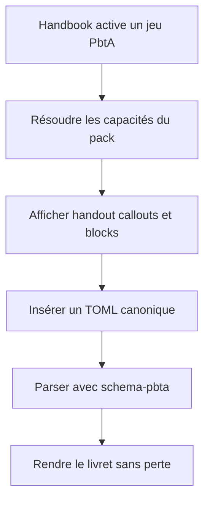
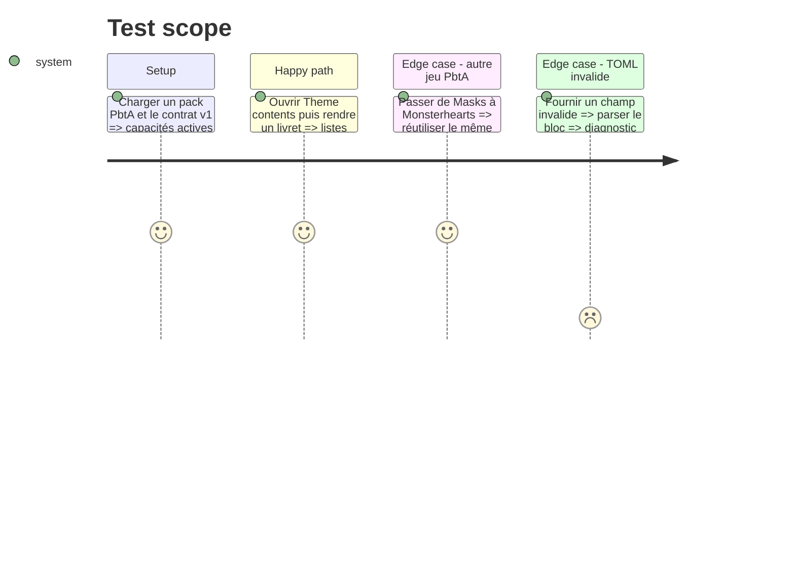

# Instruction: Capacités PbtA runtime dans Handbook

## Architecture projection

> Tree of the final files. ✅ create · ✏️ modify · ❌ delete

```txt
obsidian-handbook/
├── package.json                                      ✏️ dépendance contrat et assertions PbtA
├── src/features/
│   ├── blocks/*.ts                                   ✏️ activation multi-jeu et export canonique
│   ├── callouts/nativeCallouts.ts                    ✏️ projections PbtA déclarées
│   └── pbta/
│       ├── playbookBlock.ts                          ✅ définition et insertion
│       ├── moveBlock.ts                              ✅ définition et insertion
│       ├── renderer.ts                               ✅ handout sémantique partagé
│       └── shapes.ts                                 ✅ zones des deux blocs
├── src/games/capabilities.ts                         ✏️ capacités partagées par cinq jeux
├── src/settings/types.ts                             ✏️ activation des fonctions PbtA
├── src/settings/themeContentsModal.ts                ✏️ inventaire handout
├── src/styles/pbta/                                  ✏️ blocs et callouts runtime
└── tools/assert-pbta-contract.mjs                    ✅ corpus, registres et rendu
```

## User Journey



## Test Scope



## Tasks to do

### `1)` Partager l'activation des blocs

> Permettre à une capacité de servir plusieurs modes de jeu.

1. Remplacer l'égalité unique `block.mode` par une activation fondée sur les capacités du pack actif.
2. Préserver les ids et flags historiques.
3. Vérifier la cohérence entre registre et catalogue de capacités.

### `2)` Ajouter les blocs et le handout PbtA

> Rendre le TOML canonique avec un parser et un renderer communs.

1. Importer le contrat versionné au lieu de redéfinir les documents.
2. Créer les blocs `pbta-playbook` et `pbta-move` et leurs exports TOML.
3. Rendre toutes les zones du livret, y compris valeurs fausses ou vides significatives.

### `3)` Déclarer les callouts projetés

> Exposer déclencheur, règle, choix et résultat sans étendre le schéma.

1. Déclarer les callouts PbtA applicables aux jeux compatibles.
2. Les alimenter uniquement depuis les champs canoniques.
3. Les inclure dans les commandes, menus et Theme contents.

## Test acceptance criteria

| Task | Acceptance criteria |
| --- | --- |
| 1 | Une même définition de bloc est activable par les cinq ids PbtA sans dupliquer son parser. |
| 2 | Un livret canonique se parse, se rend et se recopie en TOML avec une valeur sémantique inchangée. |
| 3 | Theme contents et les insertions affichent les handouts, callouts et blocks PbtA attendus. |
