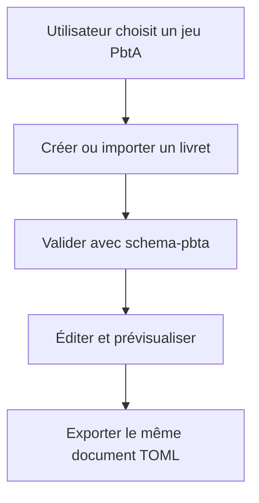
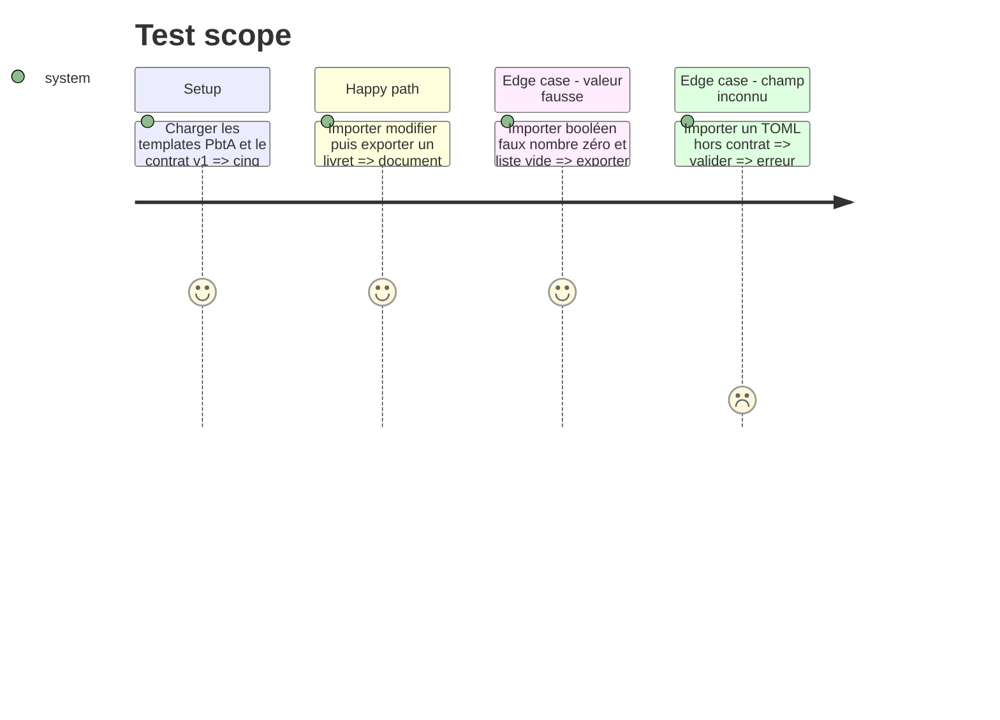

# Instruction: Consommateur PbtA dans Lantern

## Architecture projection

> Tree of the final files. ✅ create · ✏️ modify · ❌ delete

```txt
lantern/
├── package.json                                      ✏️ dépendance contrat et tests
├── src/core/gamePacks.ts                            ✏️ cinq jeux PbtA
├── src/core/gameThemes.ts                           ✏️ thèmes PbtA
├── src/core/templates/registry.tsx                  ✏️ définitions PbtA
├── src/core/templates/types.ts                     ✏️ ids PbtA
├── src/templates/pbta/
│   ├── playbook/*.tsx                                ✅ éditeur commun
│   ├── playbook/*.ts                                 ✅ adaptateurs vers le codec canonique
│   ├── move/*.tsx                                    ✅ éditeur commun
│   ├── move/*.ts                                     ✅ adaptateurs vers le codec canonique
│   └── shared/                                       ✅ aperçu et composants réutilisés
├── src/templates/masks/                             ✅ exemple de registration mince par jeu
└── tests/pbta-contract.test.ts                       ✅ corpus partagé et round-trip
```

## User Journey



## Test Scope



## Tasks to do

### `1)` Enregistrer les jeux PbtA

> Étendre les registres sans créer cinq implémentations de template.

1. Ajouter les ids, labels, thèmes et registrations des jeux.
2. Paramétrer les templates communs par jeu et type de document.
3. Garder les exemples dans le corpus canonique.

### `2)` Construire les éditeurs communs

> Dériver le formulaire du type canonique tout en séparant l'état de vue.

1. Importer types et codecs depuis le package verrouillé.
2. Créer les panneaux de livret et de move autour des champs canoniques.
3. Ne mettre aucune valeur implicite dans l'import ou l'export.

### `3)` Prouver le round-trip Lantern

> Détecter toute perte avant l'intégration Handbook.

1. Exécuter le corpus partagé dans un vrai test runner.
2. Comparer les objets normalisés après import et export.
3. Ajouter ces tests à la CI avec lint et build.

## Test acceptance criteria

| Task | Acceptance criteria |
| --- | --- |
| 1 | Les cinq jeux PbtA exposent les mêmes templates communs avec leur identité propre. |
| 2 | Lantern ne contient aucun schéma Zod PbtA concurrent et importe le type canonique. |
| 3 | Chaque témoin et refus partagé possède le verdict attendu et l'export réimporté est sémantiquement égal. |
