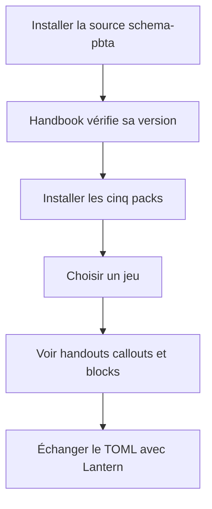
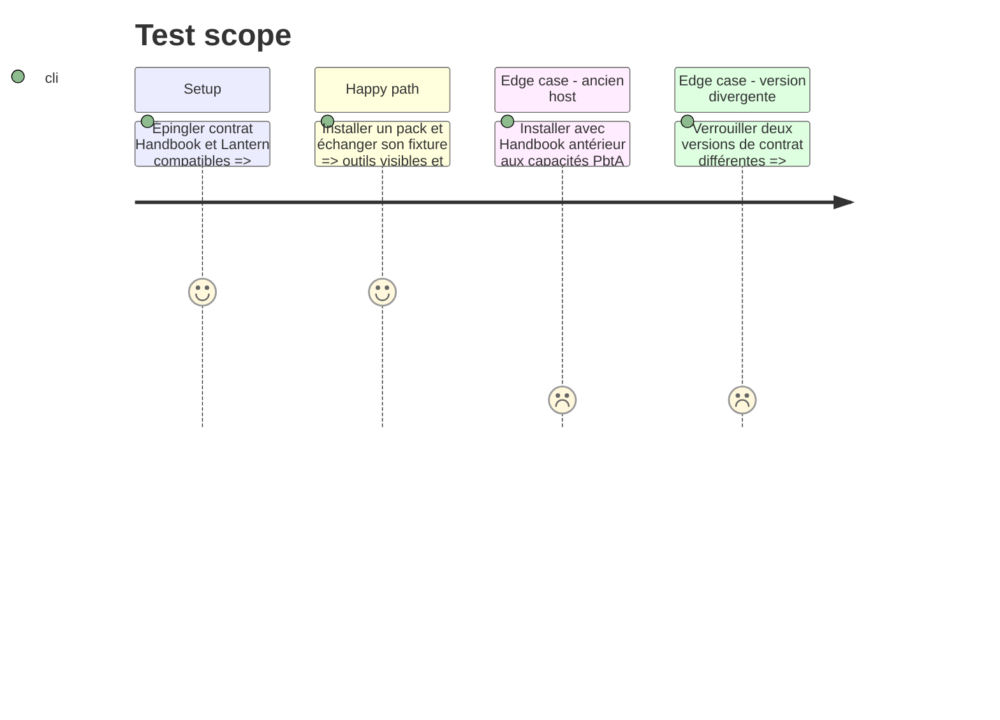

# Instruction: Activation des packs et preuve inter-dépôts

## Architecture projection

> Tree of the final files. ✅ create · ✏️ modify · ❌ delete

```txt
schema-pbta/
├── handbook.json                                     ✏️ versions synchronisées
├── handbook/*/pack.json                            ✏️ version host et capacités PbtA
├── tools/validate-handbook-packs.ts                  ✏️ vrai vocabulaire de capacités
├── tools/validate-handbook-install.ts                ✏️ version Handbook publiée
├── tools/validate-cross-tool-contract.ts             ✅ matrice à trois consommateurs
├── README.md                                         ✏️ support runtime réel
└── .github/workflows/ci.yml                          ✏️ job de contrat épinglé
```

## User Journey



## Test Scope



## Tasks to do

### `1)` Activer les capacités dans les packs

> Annoncer seulement ce que la version Handbook publiée fournit réellement.

1. Relever `minimumHandbookVersion` après la livraison host.
2. Déclarer les capacités PbtA dans chaque manifest.
3. Bumper ensemble version du pack et entrée du catalogue.

### `2)` Remplacer les faux positifs locaux

> Nommer précisément les contrôles et exécuter les vrais consommateurs.

1. Renommer la validation actuelle de « surface Lantern » en contrôle de données structurées.
2. Ajouter la matrice réelle Schema, Lantern et Handbook.
3. Épingler versions ou commits des trois checkouts en CI.

### `3)` Vérifier l'installation et documenter

> Fermer le parcours utilisateur et le workflow du jeu suivant.

1. Tester installation atomique, inventaires non vides et rendu du handout.
2. Vérifier le round-trip complet Lantern vers Handbook puis Lantern.
3. Mettre README et recette en accord avec les capacités livrées.

## Test acceptance criteria

| Task | Acceptance criteria |
| --- | --- |
| 1 | Chaque pack installable exige une version Handbook qui fournit toutes ses capacités déclarées. |
| 2 | Une divergence de contrat ou une perte de champ fait échouer la CI inter-dépôts. |
| 3 | Après installation, les trois inventaires sont non vides et le TOML revient dans Lantern avec le même objet canonique. |
