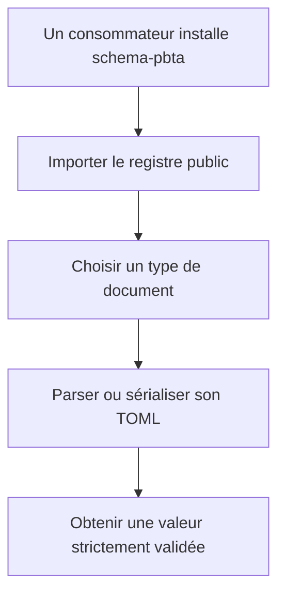
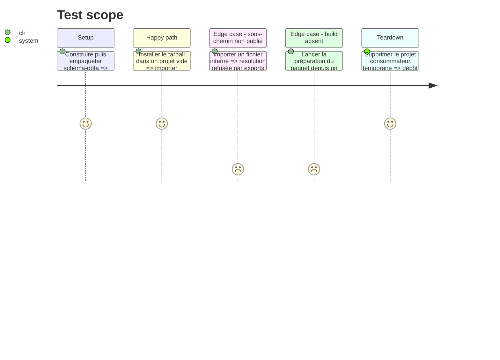

# Instruction: Surface publique et artefact installable

## Architecture projection

> Tree of the final files. ✅ create · ✏️ modify · ❌ delete

```txt
schema-pbta/
├── package.json                    ✏️ exports, scripts de build et contenu publié
├── package-lock.json               ✏️ verrou aligné sur les dépendances runtime
├── schemas/v1/
│   └── {masks,monster-of-the-week,monsterhearts,the-sprawl,urban-shadows}/*.schema.json ✏️ IDs v1 générés
├── src/
│   ├── contract-version.ts         ✏️ versions publiques du contrat et de TOML
│   ├── codecs/toml.ts              ✏️ registre typé des cinq codecs
│   └── index.ts                    ✏️ point d’entrée public complet
└── tools/
    ├── audit-schemas.ts            ✏️ contrôle des IDs immuables
    ├── gen-schemas.ts              ✏️ génération pilotée par la version publique
    └── validate-package.ts         ✅ test du tarball comme un vrai consommateur

Aucune suppression.
```

## User Journey



## Test Scope



## Tasks to do

### `1)` Déclarer la compatibilité publique

> Rendre explicites les versions du contrat et de la syntaxe TOML supportée.

1. Exposer la majeure de schéma et TOML 1.0.0 depuis `contract-version.ts` et `index.ts`.
2. Documenter par les types que le registre couvre exactement les cinq cibles publiées.
3. Garder les parseurs et sérialiseurs nommés existants pour la compatibilité des premiers consommateurs.

### `2)` Unifier la sélection des codecs

> Permettre à Handbook et Lantern de choisir un document sans reconstruire leur propre table.

1. Associer chaque cible à son schéma, son parseur TOML et son sérialiseur TOML dans un registre typé.
2. Conserver les objets stricts et l’absence de valeurs implicites lors du passage par le registre.
3. Vérifier que les types inférés restent ceux des schémas Zod canoniques.

### `3)` Verrouiller les schémas versionnés

> Produire les JSON Schemas depuis la même version publique et refuser tout `$id` divergent.

1. Faire dériver le chemin de génération et le `$id` de la constante de contrat plutôt que d’un second littéral local.
2. Continuer à générer l’alias courant sous `schemas/<jeu>` sans le publier comme référence immuable.
3. Auditer chaque artefact `schemas/v1` contre son jeu, sa cible et son URL canonique sous le tag v1.

### `4)` Fermer et tester le package

> Valider ce qui sera réellement installé, pas seulement les sources locales.

1. Déclarer les exports racine, schémas versionnés et corpus autorisés dans `package.json`.
2. Déclarer explicitement la surface ESM, construire automatiquement les fichiers distribués avant l’empaquetage et aligner le lockfile.
3. Ajouter un harnais qui crée le tarball, l’installe dans un dossier temporaire et importe chaque entrée publique.
4. Refuser dans le harnais l’accès accidentel aux modules internes non exportés.
5. Autoriser le paquet préparatoire `0.x`, puis vérifier que toute version stable à partir de `1.0.0` possède la même majeure que le contrat.

## Test acceptance criteria

| Task | Acceptance criteria |
| --- | --- |
| 1 | Un consommateur importe les versions du contrat et de TOML depuis la racine du package sans lire `package.json`. |
| 2 | Chacune des cinq cibles résout un schéma, un parseur et un sérialiseur de types concordants. |
| 2 | Une propriété inconnue reste rejetée et aucune valeur absente n’est inventée par le registre. |
| 3 | Chaque schéma v1 généré porte un `$id` canonique dérivé de la version publique et l’audit rejette toute autre URL. |
| 3 | L’alias courant peut évoluer sans changer le chemin versionné importé par un consommateur v1. |
| 4 | Le tarball construit depuis un clone propre contient uniquement la surface déclarée et s’installe dans un projet ESM vide. |
| 4 | Tous les imports publics fonctionnent depuis le tarball, tandis qu’un sous-chemin interne non déclaré échoue. |
| 4 | Le harnais accepte la préparation `0.x`, mais refuse toute version stable du paquet dont la majeure diffère de `PBTA_CONTRACT_VERSION`. |
