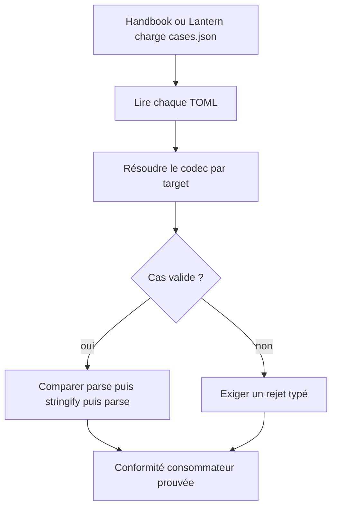
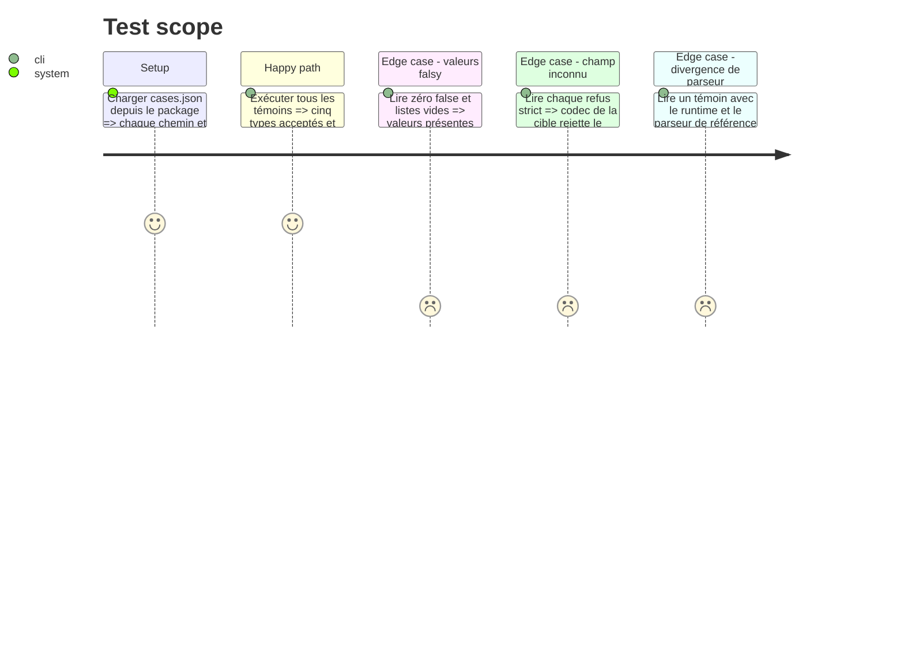

# Instruction: Corpus TOML multi-document

## Architecture projection

> Tree of the final files. ✅ create · ✏️ modify · ❌ delete

```txt
schema-pbta/
├── corpus/
│   ├── README.md                                  ✏️ protocole de conformité partagé
│   └── contract/
│       ├── cases.json                             ✅ manifeste machine des cas
│       ├── valid/
│       │   ├── front-complete.toml                ✅ témoin front
│       │   ├── game-definition-complete.toml      ✅ témoin définition de jeu
│       │   ├── move-complete.toml                 ✅ témoin move
│       │   ├── npc-complete.toml                  ✅ témoin NPC
│       │   ├── playbook-complete.toml             ✏️ témoin complet conservant les valeurs limites
│       │   └── playbook-minimal.toml              ✏️ témoin minimal
│       └── invalid/
│           ├── front-unknown-field.toml            ✅ refus front
│           ├── game-definition-unknown-field.toml  ✅ refus définition de jeu
│           ├── move-unknown-field.toml             ✅ refus move
│           ├── npc-unknown-field.toml              ✅ refus NPC
│           └── playbook-unknown-field.toml          ✏️ refus playbook existant
└── tools/
    └── validate-contract.ts                       ✏️ exécution générique du manifeste

Aucune suppression.
```

## User Journey



## Test Scope



## Tasks to do

### `1)` Définir le manifeste de conformité

> Rendre la matrice de tests découvrable sans convention locale à un consommateur.

1. Déclarer pour chaque cas son chemin, sa cible et son résultat attendu dans `cases.json`.
2. Valider l’unicité des chemins, l’existence des fichiers et l’exhaustivité des cinq cibles.
3. Inclure le manifeste et tous ses fichiers référencés dans le tarball.

### `2)` Couvrir les cinq documents

> Prouver tous les codecs publiés avec les mêmes exigences.

1. Ajouter un témoin complet et un refus strict pour `game-definition`, `move`, `playbook`, `npc` et `front`.
2. Exercer dans chaque témoin les champs significatifs de sa cible et, dans l’ensemble du corpus, chaînes multilignes, clé citée, zéro, `false`, listes vides et tables imbriquées.
3. Utiliser uniquement du contenu original de test et conserver un défaut unique identifiable par refus.

### `3)` Généraliser la validation sémantique

> Faire du corpus le test de référence de tous les consommateurs.

1. Résoudre le codec demandé depuis le registre public plutôt que coder `playbook` dans le harnais.
2. Comparer récursivement les objets normalisés avant et après sérialisation.
3. Comparer le runtime `smol-toml` au parseur de référence `@iarna/toml` sur chaque témoin.
4. Produire une erreur nommant le cas, sa cible et la propriété divergente.

## Test acceptance criteria

| Task | Acceptance criteria |
| --- | --- |
| 1 | Un consommateur installé depuis le tarball découvre tous les cas par un seul manifeste et aucun chemin n’est manquant. |
| 2 | Les cinq types possèdent chacun un témoin complet accepté et un cas strictement rejeté. |
| 2 | Les valeurs `0`, `false`, listes vides, clés citées et chaînes multilignes restent présentes et identiques après aller-retour. |
| 3 | `parse -> stringify -> parse` produit la même valeur normalisée pour chaque témoin avec le codec de sa cible. |
| 3 | Le runtime `smol-toml` et la référence indépendante `@iarna/toml` produisent la même valeur normalisée sur tout le corpus valide. |
