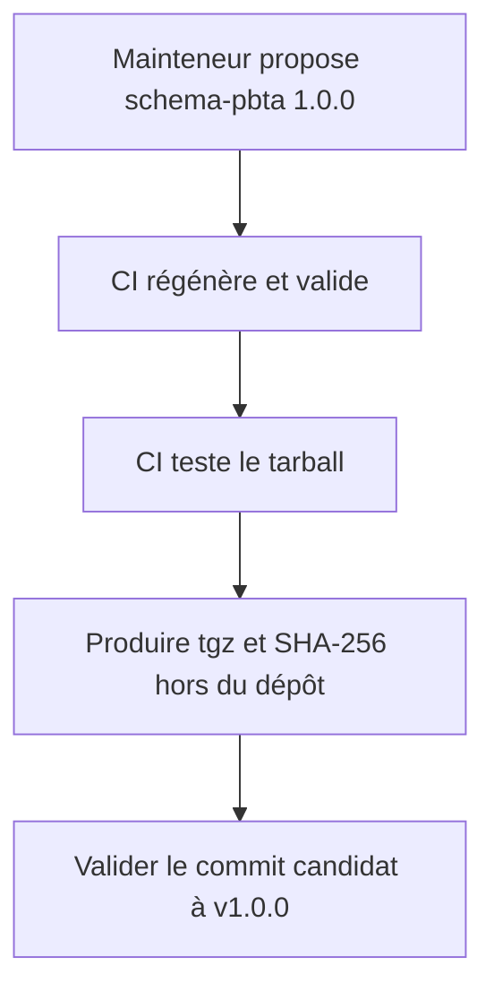
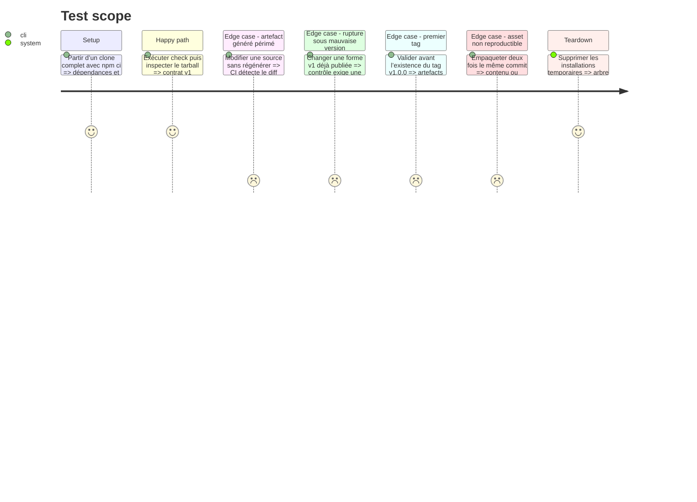

# Instruction: Compatibilité, CI et préparation de la release

## Architecture projection

> Tree of the final files. ✅ create · ✏️ modify · ❌ delete

```txt
schema-pbta/
├── .github/workflows/ci.yml        ✏️ génération reproductible, tags complets et tarball vérifié
├── README.md                       ✏️ installation, API et politique de versions
├── corpus/README.md                ✏️ procédure de conformité consumer
├── docs/
│   └── compatibility.md            ✅ matrice package schéma TOML et hosts
├── package.json                    ✏️ version stable et commandes finales
├── schemas/v1/**/*.schema.json     ✏️ IDs résolus par le tag immuable v1.0.0
├── src/contract-version.ts         ✏️ tag baseline exact du contrat v1
└── tools/
    ├── gen-schemas.ts              ✏️ IDs fondés sur la baseline immuable
    ├── audit-schemas.ts            ✏️ refus du ref majeur flottant v1
    ├── prepare-release.ts          ✅ contenu canonique et SHA-256 de l'asset hors du dépôt
    ├── validate-package.ts         ✏️ inspection finale du contenu publié
    └── validate-version-compat.ts  ✅ comparaison avec la majeure publiée

Aucune suppression.
```

## User Journey



## Test Scope



## Tasks to do

### `1)` Documenter le contrat importable

> Remplacer les instructions de copie par l’utilisation du package canonique.

1. Donner les exemples d’installation et d’import ESM des schémas, types, codecs et versions.
2. Décrire `cases.json` et la commande minimale qu’un consumer doit exécuter.
3. Expliquer la frontière entre schéma, formulaire Lantern, renderer Handbook et pack de jeu.

### `2)` Fixer la politique de compatibilité

> Dire précisément ce qui déclenche patch, minor ou nouvelle majeure de schéma.

1. Publier la matrice version du paquet, majeure de schéma, TOML 1.0.0 et hosts compatibles.
2. Classer comme rupture tout changement faisant rejeter ou perdre une valeur v1 auparavant acceptée.
3. Avant la première release, remplacer le ref `$id` inexistant `v1` par le tag exact `v1.0.0`, puis vérifier la reproductibilité de `schemas/v1` sur le commit portant le paquet `1.0.0`.
4. Après cette release, comparer les schémas générés au tag immuable `v1.0.0` et exiger `schemas/v2` dès qu’une forme diverge.
5. Interdire le déplacement ou la réécriture d’un `$id` déjà publié.

### `3)` Fermer la CI sur l’artefact publié

> Faire échouer une release inutilisable par les consommateurs.

1. Configurer le checkout CI avec l’historique et les tags complets nécessaires à la comparaison de version.
2. Exécuter génération, validations structurelles, références et corpus depuis `npm ci`.
3. Vérifier que la génération ne laisse aucun diff et que le tarball passe son installation isolée.
4. Vérifier la compatibilité contre la majeure publiée, puis la présence de `cases.json` et de tous ses fichiers dans le tarball.

### `4)` Qualifier la commande de préparation

> Prouver que le futur artefact peut être reproduit avant toute création de tag ou de release.

1. Exposer par une commande unique la production de `schema-pbta-1.0.0.tgz` et de son SHA-256 dans un dossier temporaire.
2. Exécuter deux fois cette commande sur le même arbre candidat et comparer la liste ainsi que les contenus canoniques des archives.
3. Jeter les deux archives de qualification et vérifier que ni le tarball ni le checksum ne salissent Git.
4. Réutiliser exactement cette commande en phase 4 pour produire une seule archive finale depuis le commit de phase 3.

## Test acceptance criteria

| Task | Acceptance criteria |
| --- | --- |
| 1 | La documentation n’invite plus à copier les schémas et montre les imports ESM depuis `schema-pbta`. |
| 2 | La matrice associe package, schéma, TOML et hosts ; chaque classe SemVer est illustrée. |
| 2 | Avant le premier tag, la préparation valide les artefacts v1 committés comme baseline candidate ; après publication, les validations utilisent uniquement le tag `v1.0.0` immuable. |
| 2 | Modifier une forme publiée sous v1 échoue tant que le contrat ne crée pas une nouvelle majeure. |
| 2 | Aucun `$id` publié ne contient le ref flottant ou inexistant `/v1/` ; tous résolvent `/v1.0.0/schemas/v1/`. |
| 3 | La CI échoue sur génération périmée, entrée publique manquante, corpus incomplet ou tarball non installable. |
| 3 | Le tarball contient le code compilé, les schémas v1 et tous les cas référencés, sans module interne accidentel. |
| 4 | Une commande produit le tarball `1.0.0` et son SHA-256 hors de l'arbre suivi, puis les archives de qualification sont supprimées et Git reste propre. |
| 4 | Deux préparations du même commit possèdent la même liste et les mêmes contenus canoniques ; toute divergence du package distribué échoue. |
