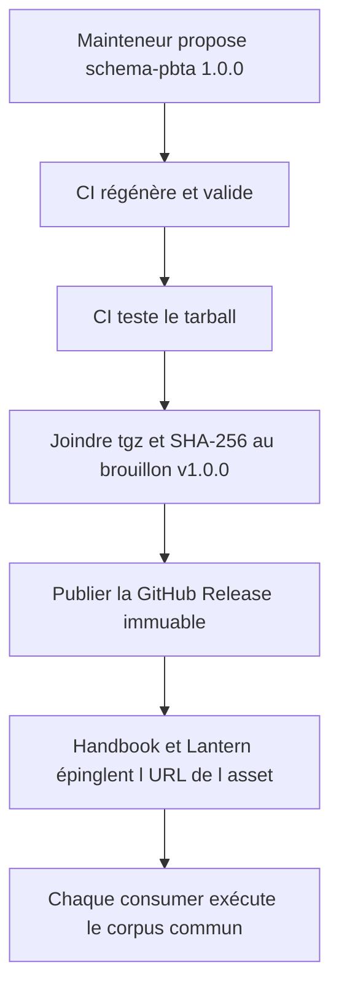

# Instruction: Compatibilité, CI et publication du contrat

## Architecture projection

> Tree of the final files. ✅ create · ✏️ modify · ❌ delete

```txt
schema-pbta/
├── .github/workflows/ci.yml        ✏️ génération reproductible, tags complets et tarball vérifié
├── README.md                       ✏️ installation, API et politique de versions
├── corpus/README.md                ✏️ procédure de conformité consumer
├── docs/
│   └── compatibility.md            ✅ matrice package schéma TOML et hosts
├── package.json                    ✏️ version stable et commandes finales
└── tools/
    ├── validate-package.ts         ✏️ inspection finale du contenu publié
    └── validate-version-compat.ts  ✅ comparaison avec la majeure publiée

Aucune suppression.
```

## User Journey



## Test Scope


## Tasks to do

### `1)` Documenter le contrat importable

> Remplacer les instructions de copie par l’utilisation du package canonique.

1. Donner les exemples d’installation et d’import ESM des schémas, types, codecs et versions.
2. Décrire `cases.json` et la commande minimale qu’un consumer doit exécuter.
3. Expliquer la frontière entre schéma, formulaire Lantern, renderer Handbook et pack de jeu.

### `2)` Fixer la politique de compatibilité

> Dire précisément ce qui déclenche patch, minor ou nouvelle majeure de schéma.

1. Publier la matrice version du paquet, majeure de schéma, TOML 1.0.0 et hosts compatibles.
2. Classer comme rupture tout changement faisant rejeter ou perdre une valeur v1 auparavant acceptée.
3. Avant la première release, vérifier la reproductibilité de `schemas/v1`, puis préparer la release `v1.0.0` sur le commit portant le paquet `1.0.0`.
4. Après cette release, comparer les schémas générés au tag immuable v1 et exiger `schemas/v2` dès qu’une forme diverge.
5. Interdire le déplacement ou la réécriture d’un `$id` déjà publié.

### `3)` Fermer la CI sur l’artefact publié

> Faire échouer une release inutilisable par les consommateurs.

1. Configurer le checkout CI avec l’historique et les tags complets nécessaires à la comparaison de version.
2. Exécuter génération, validations structurelles, références et corpus depuis `npm ci`.
3. Vérifier que la génération ne laisse aucun diff et que le tarball passe son installation isolée.
4. Vérifier la compatibilité contre la majeure publiée, puis la présence de `cases.json` et de tous ses fichiers dans le tarball.

### `4)` Publier et transmettre le contrat

> Livrer le package avant que Handbook ne publie les capacités qui en dépendent.

1. Construire une seule fois `schema-pbta-1.0.0.tgz` et son fichier SHA-256 depuis le commit validé.
2. Créer la GitHub Release `v1.0.0` en brouillon sur ce même commit, sans publication sur le registre npm.
3. Joindre le tarball et son SHA-256 au brouillon, vérifier leur présence et leur contenu, puis seulement publier la release immuable.
4. Arrêter avant publication si l'identité GitHub, l'autorisation, l'immutabilité ou un asset requis manque ; ne jamais déplacer ensuite le tag ni remplacer un asset publié.
5. Mettre à jour les tickets producteurs PbtA, Mist Engine et Adrenaline ainsi que `obsidian-handbook#27` et `lantern#2` pour nommer l'asset GitHub Release immuable plutôt qu'une publication de registre.
6. Communiquer l'URL versionnée de l'asset, sa version et son intégrité à `obsidian-handbook#27` et `lantern#2`.
7. Faire épingler cette URL exacte et vérifier `cases.json` par chaque consumer dans sa propre CI, avec esbuild pour Handbook et Vite pour Lantern.

## Test acceptance criteria

| Task | Acceptance criteria |
| --- | --- |
| 1 | La documentation n’invite plus à copier les schémas et montre les imports ESM depuis `schema-pbta`. |
| 2 | La matrice associe package, schéma, TOML et hosts ; chaque classe SemVer est illustrée. |
| 2 | La première release crée sa baseline sans tag préalable ; les exécutions suivantes utilisent uniquement le tag v1 immuable. |
| 2 | Modifier une forme publiée sous v1 échoue tant que le contrat ne crée pas une nouvelle majeure. |
| 3 | La CI échoue sur génération périmée, entrée publique manquante, corpus incomplet ou tarball non installable. |
| 3 | Le tarball contient le code compilé, les schémas v1 et tous les cas référencés, sans module interne accidentel. |
| 4 | La publication s'arrête au brouillon si GitHub ne peut pas garantir l'immutabilité ou si le tarball et son SHA-256 ne sont pas tous deux vérifiés. |
| 4 | Le paquet `1.0.0`, le tag `v1.0.0` et l'asset GitHub Release désignent le même commit et la même forme de contrat. |
| 4 | Après publication, le tag distant et les assets sont immuables ; toute correction produit une nouvelle version SemVer. |
| 4 | Handbook et Lantern peuvent épingler exactement l'URL de l'asset `v1.0.0`, vérifier son intégrité et lancer la même matrice dans leurs propres CI. |
| 4 | Les cinq tickets liés décrivent tous la même distribution par asset GitHub Release et aucun n'exige une publication sur le registre npm. |
| 4 | L’import ESM passe le bundle esbuild de Handbook et le bundle Vite de Lantern sans adaptateur local. |
