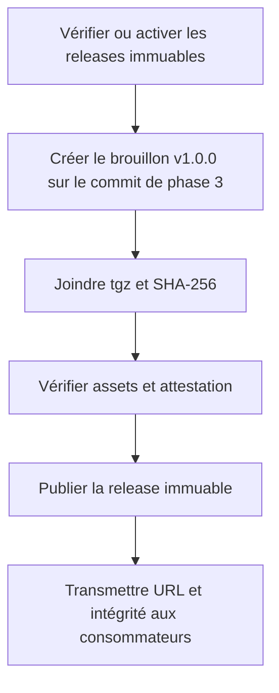
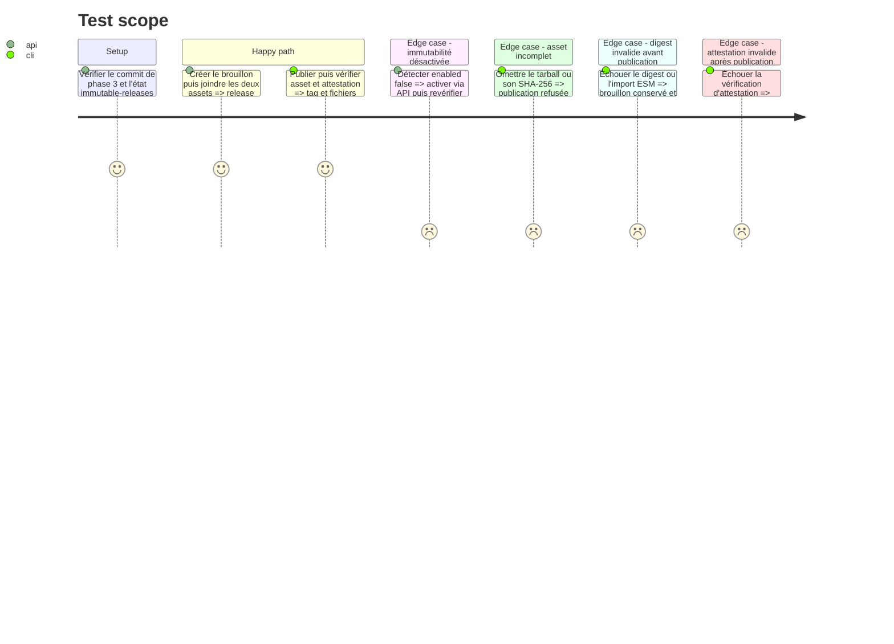

# Instruction: Publication immuable du contrat

## Architecture projection

> Tree of the final files. ✅ create · ✏️ modify · ❌ delete

```txt
schema-pbta/
└── aidd_docs/tasks/2026_09/2026_09_11_schema-pbta-canonical-contract/
    └── phase-4.md                  ✏️ preuve de publication externe achevée

Aucun fichier applicatif créé, modifié ou supprimé : cette phase publie l'artefact préparé par la phase 3.
```

## User Journey



## Test Scope



## Tasks to do

### `1)` Établir le prérequis d'immutabilité

> Ne jamais publier une release modifiable présentée comme contrat canonique.

1. Lire `GET /repos/RebelliousSmile/schema-pbta/immutable-releases` avant toute création de release.
2. Si nécessaire, activer la politique par l'API GitHub avec un compte administrateur, puis exiger une réponse `enabled: true`.
3. Arrêter avant le brouillon si l'autorisation d'administration ou l'immutabilité manque.

### `2)` Publier l'artefact exact

> Faire pointer la release sur le commit déjà validé et commité par la phase 3.

1. Reproduire le tarball et son SHA-256 depuis le commit de phase 3 sans modification locale.
2. Créer la GitHub Release `v1.0.0` en brouillon sur ce commit, sans publication sur le registre npm.
3. Joindre les deux assets, vérifier leur présence, leur digest et l'import ESM avant de publier le brouillon.
4. Vérifier après publication le tag, l'asset et l'attestation avec GitHub CLI ; en cas d'échec postpublication, signaler l'incident et ne jamais déplacer le tag ni remplacer un asset publié.

### `3)` Aligner et informer les consommateurs

> Rendre le même mode de distribution explicite dans tous les dépôts.

1. Mettre à jour les tickets producteurs PbtA, Mist Engine et Adrenaline ainsi que `obsidian-handbook#27` et `lantern#2` pour nommer l'asset GitHub Release immuable plutôt qu'une publication de registre.
2. Communiquer l'URL versionnée de l'asset, sa version et son intégrité à `obsidian-handbook#27` et `lantern#2`.
3. Donner aux tickets consommateurs l'exemple de dépendance par URL HTTPS, le SHA-256 de release et les critères exigeant que leur lockfile conserve l'URL complète et son intégrité SRI.
4. Déléguer explicitement à `obsidian-handbook#27` et `lantern#2` leurs preuves esbuild, Vite et corpus, sans les déclarer acquises dans le producteur.

## Test acceptance criteria

| Task | Acceptance criteria |
| --- | --- |
| 1 | L'API GitHub confirme `enabled: true` avant la création du brouillon ; l'état actuellement désactivé est traité explicitement. |
| 2 | Le paquet `1.0.0`, le tag `v1.0.0` et l'asset GitHub Release désignent le commit de phase 3 et la même forme de contrat. |
| 2 | Le brouillon ne peut être publié sans tarball, SHA-256, import ESM valide et vérification d'intégrité réussie. |
| 2 | Après publication, GitHub confirme la release immuable et l'attestation de l'asset ; toute correction exige une nouvelle version SemVer. |
| 2 | Un échec détecté après publication est rendu visible sans tenter de réécrire le tag ou les assets immuables. |
| 3 | Les cinq tickets liés décrivent tous la distribution par asset GitHub Release et aucun n'exige le registre npm. |
| 3 | Les deux tickets consommateurs reçoivent l'URL `v1.0.0`, le SHA-256 et des critères explicites pour l'intégrité SRI, le corpus et leur bundler. |
| 3 | La clôture du ticket producteur ne prétend pas que les intégrations esbuild et Vite sont déjà livrées ; ces preuves restent rattachées aux tickets consommateurs. |
