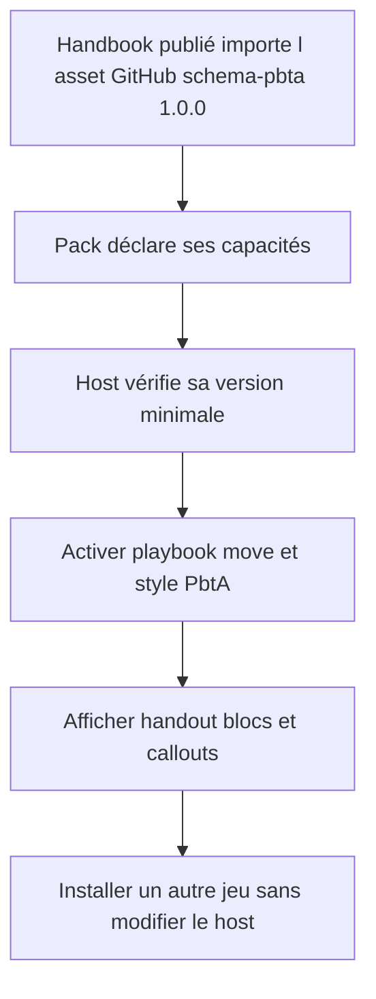
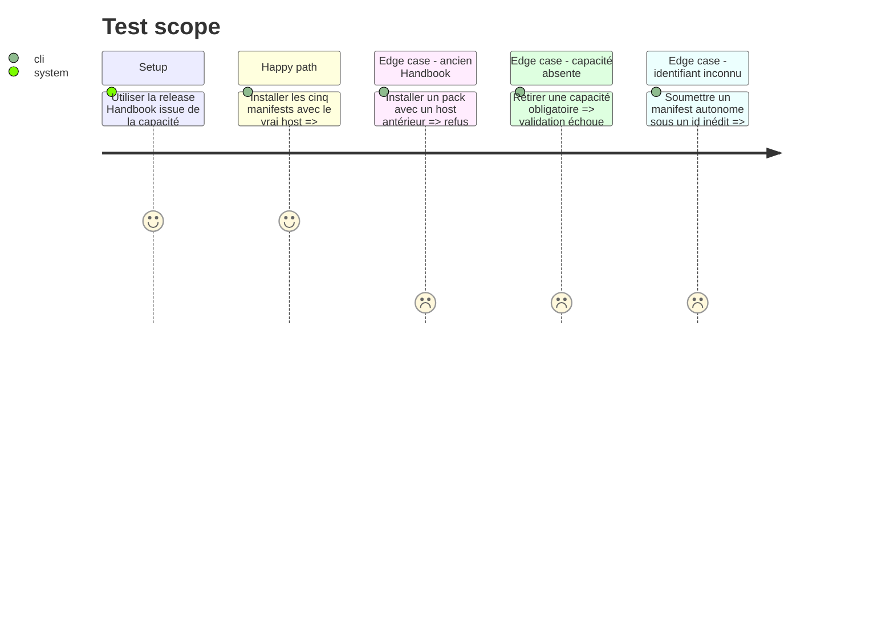

# Instruction: Capacités portables des packs Handbook

## Architecture projection

> Tree of the final files. ✅ create · ✏️ modify · ❌ delete

```txt
schema-pbta/
├── package.json                               ✏️ commande d’intégration Handbook
├── docs/compatibility.md                      ✏️ première version Handbook compatible
├── handbook.json                              ✏️ versions des packs activés
├── handbook/
│   ├── masks/pack.json                        ✏️ capacités PbtA portables
│   ├── monster-of-the-week/pack.json          ✏️ capacités PbtA portables
│   ├── monsterhearts/pack.json                ✏️ capacités PbtA portables
│   ├── the-sprawl/pack.json                   ✏️ capacités PbtA portables
│   └── urban-shadows/pack.json                ✏️ capacités PbtA portables
└── tools/
    ├── validate-handbook-packs.ts             ✏️ contrat attendu des capacités
    ├── validate-handbook-catalog-fixtures.ts  ✏️ refus des capacités et versions invalides
    └── validate-handbook-install.ts           ✏️ installation contre le vrai host compatible

Aucune suppression.
```

## User Journey



## Test Scope



## Tasks to do

### `1)` Épingler le premier host compatible

> Attendre que Handbook consomme le package publié et livre ses primitives génériques.

1. Relever la première release de `obsidian-handbook#27` qui dépend de l'asset GitHub immuable `schema-pbta-1.0.0.tgz` et fournit les trois capacités.
2. Définir cette release comme `minimumHandbookVersion` des cinq packs et l’inscrire dans la matrice de compatibilité.
3. Ne jamais utiliser une branche, un SHA mutable ou une version supposée comme minimum publié.

### `2)` Activer les primitives portables

> Déclarer les mêmes fonctions réutilisables quel que soit l’identifiant du jeu.

1. Ajouter `block:pbta-playbook`, `block:pbta-move` et `style:pbta` à `requires` de chaque pack.
2. Incrémenter chaque version de pack et reporter exactement ces versions dans `handbook.json`.
3. Garder palettes, assets et variantes comme données propres à chaque pack.

### `3)` Valider l’absence de couplage au jeu

> Empêcher le retour d’une liste d’identifiants autorisés.

1. Remplacer les assertions historiques `requires: []` par la liste fermée des capacités PbtA publiées.
2. Ajouter au harnais d’intégration un manifest autonome sous un identifiant inconnu, hors du catalogue fermé de schema-pbta.
3. Adapter `validate-handbook-install.ts` à la release compatible et vérifier le payload avec le véritable installateur Handbook.
4. Exposer cette intégration par un script recevant `HANDBOOK_ROOT`, distinct du check producteur autonome.
5. Conserver les tests atomiques de version, catalogue, assets et rollback.

## Test acceptance criteria

| Task | Acceptance criteria |
| --- | --- |
| 1 | La version minimale de chaque pack est une release Handbook qui importe l'asset GitHub immuable `schema-pbta-1.0.0.tgz` et expose les trois capacités. |
| 2 | Les cinq manifests et le catalogue portent des versions concordantes et annoncent les mêmes capacités PbtA. |
| 2 | Le vrai installateur de la release minimale accepte les cinq packs et conserve leurs capacités déclarées. |
| 3 | Le vrai lecteur de manifest Handbook accepte un sixième jeu autonome sans ajouter son identifiant au catalogue ni au host. |
| 3 | Une capacité absente, inconnue ou une version de host trop ancienne empêche atomiquement la promotion du pack. |
| 3 | Le rendu du handout, des deux blocs et des callouts reste prouvé dans la CI de `obsidian-handbook#27`, sans copier ce harnais ici. |
