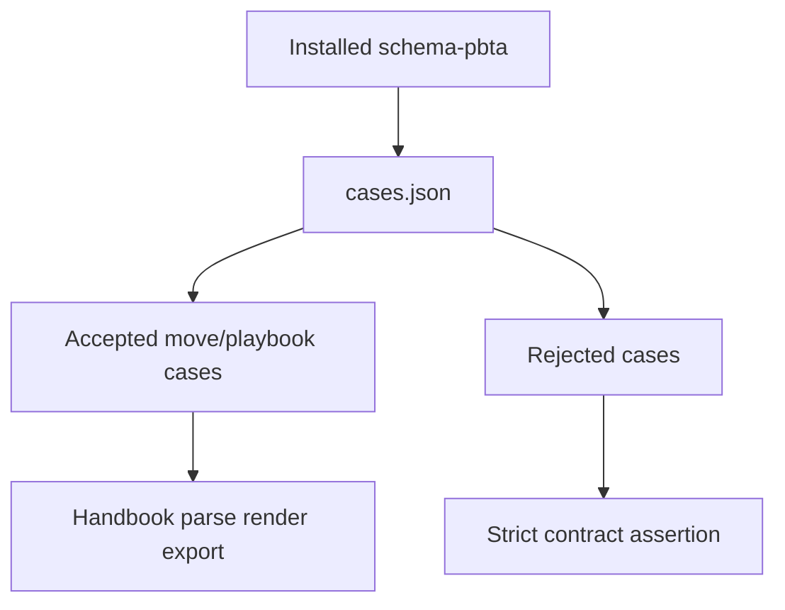
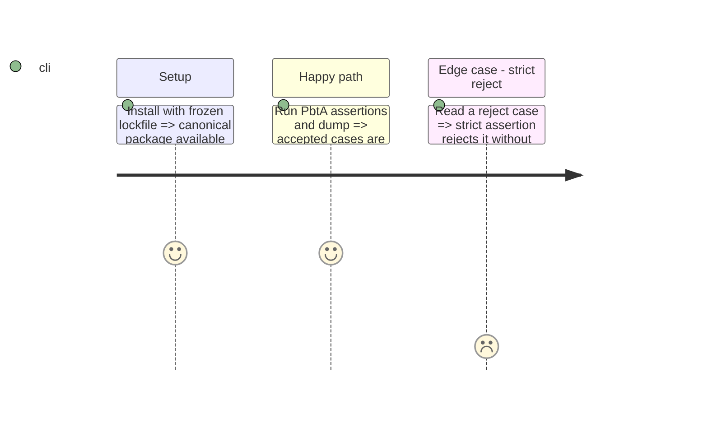

# Instruction: Réconciliation contrat-projection

## Architecture projection

> Tree of the final files. ✅ create · ✏️ modify · ❌ delete

```txt
obsidian-handbook/
├── tools/{assert-pbta-contract.mjs,pbtaContractCorpus.mts,assertCorpus.harness.mts,dumpDom.harness.mts}  ✏️ only if a reproducible defect is found
└── corpus/temoins/{pbta-move.toml,pbta-playbook.toml}  ❌ remain absent
```

## User Journey



## Test Scope



## Tasks to do

### `1)` Auditer la livraison existante

> Vérifier chaque critère avant toute correction.

1. Vérifier résolution, version, unicité et confinement des chemins du manifeste par le helper.
2. Vérifier que corpus et dump utilisent les cas acceptés `move`/`playbook`, et le contrôle strict tous les verdicts.
3. Vérifier l’absence et la garde de duplication des deux témoins locaux.

### `2)` Corriger uniquement un écart prouvé

> Préserver la livraison si les preuves passent.

1. Corriger seulement le harnais ou la documentation responsable d’un échec reproductible.
2. Ne pas modifier le package, les schémas ou les packs PbtA ; ne pas créer de contrat fondé sur un jeu.

## Test acceptance criteria

| Task | Acceptance criteria |
| --- | --- |
| 1 | Les cas acceptés `move` et `playbook` sont lus depuis le package, rendus et exportés ; les rejets restent stricts sans projection inventée. |
| 1 | Le dump emploie les mêmes cas sous des en-têtes stables ; les deux témoins restent absents et interdits. |
| 2 | Tout changement est limité à un écart reproductible Handbook. |
