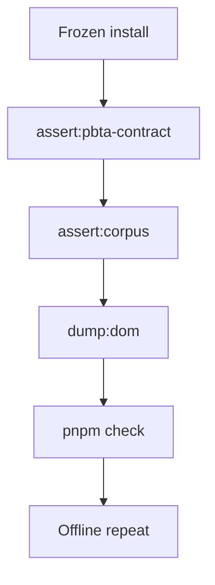
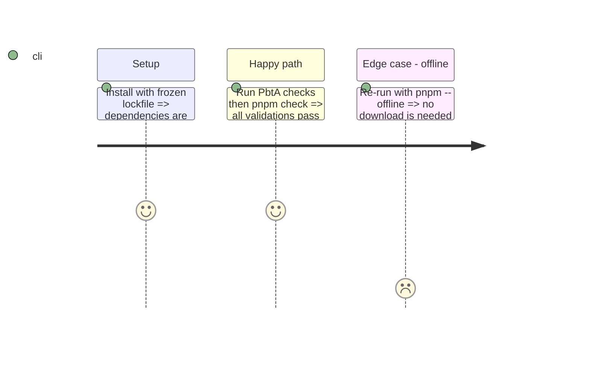

# Instruction: Validation figée et clôture

## Architecture projection

> Tree of the final files. ✅ create · ✏️ modify · ❌ delete

```txt
obsidian-handbook/
├── tools/                    ✏️ only if phase 1 proves a defect
├── corpus/temoins/           ❌ PbtA duplicates remain absent
└── pnpm-lock.yaml            unchanged; release-integrity evidence
```

## User Journey



## Test Scope



## Tasks to do

### `1)` Produire les preuves

> Valider l’intégration figée puis hors ligne.

1. Exécuter `pnpm assert:pbta-contract`, `pnpm assert:corpus`, `pnpm dump:dom` et `pnpm check` après installation figée.
2. Répéter les commandes avec `pnpm --offline` et inspecter le diff.

### `2)` Clôturer factuellement

> Ne publier qu’une preuve verte et concise.

1. Vérifier les commentaires existants de l’issue #5.
2. Si tout est vert, publier un unique résumé et fermer l’issue ; sinon la laisser ouverte avec l’échec exact.

## Test acceptance criteria

| Task | Acceptance criteria |
| --- | --- |
| 1 | Les quatre commandes passent après installation figée puis hors ligne. |
| 2 | L’issue est commentée au plus une fois et fermée uniquement avec les quatre validations vertes. |
