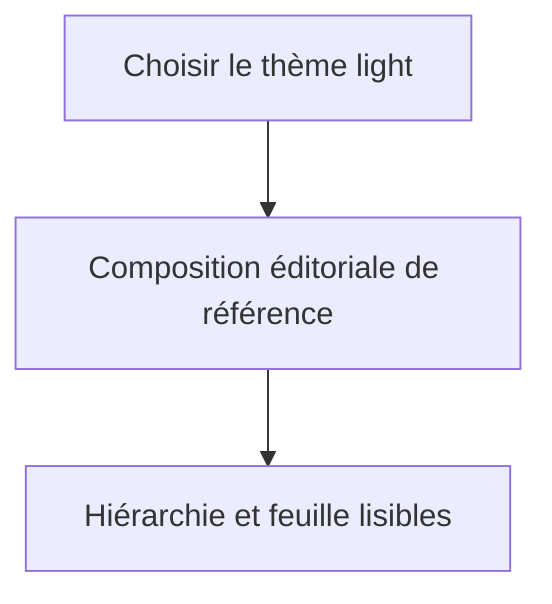
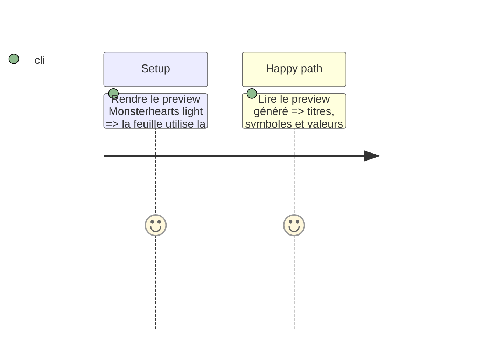

# Instruction: Thème light fidèle à la maquette

## Architecture projection

> Tree of the final files. ✅ create · ✏️ modify · ❌ delete

```txt
schema-pbta/handbook/monsterhearts/
├── styles/base.css                         ✏️ structure light, typographie et symboles
├── assets/fonts/README.md                  ✏️ provenance des polices seulement si un asset autorisé est ajouté
└── pack.json                               ✏️ tokens light seulement si nécessaires
```

## User Journey



## Test Scope



## Wireframe

```txt
┌ Titre du livret ─────────────── repère éditorial ────┐
│ identité / texte narratif      │ caractéristiques     │
├──────────── panneaux papier et rythme imprimé ───────┤
│ création / choix               │ actions / progression│
└──────────────────────────────────────────────────────┘
```

## Tasks to do

### `1)` Établir la référence light

> Traduire la maquette claire en feuille Monsterhearts structurée et utilisable.

1. Recomposer la grille, les colonnes, zones de saisie, titres et encadrés de `base.css` pour retrouver le rythme imprimé de la maquette.
2. Aligner titres, corps, lettres capitales, italiques, symboles et cases sur le langage éditorial Monsterhearts de référence.
3. Vérifier que les polices de référence sont disponibles sous une licence compatible ; sinon employer la pile de secours déjà déclarée plutôt que télécharger ou embarquer une police tierce.
4. Conserver contrastes, focus et contrôles accessibles.

## Test acceptance criteria

| Task | Acceptance criteria |
| --- | --- |
| 1 | Le thème light restitue la hiérarchie, le rythme, les symboles et les zones de feuille de la maquette, avec une police autorisée ou sa pile de secours, tout en gardant les contrôles lisibles. |
