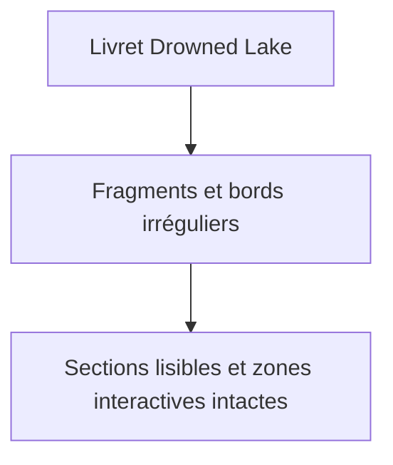
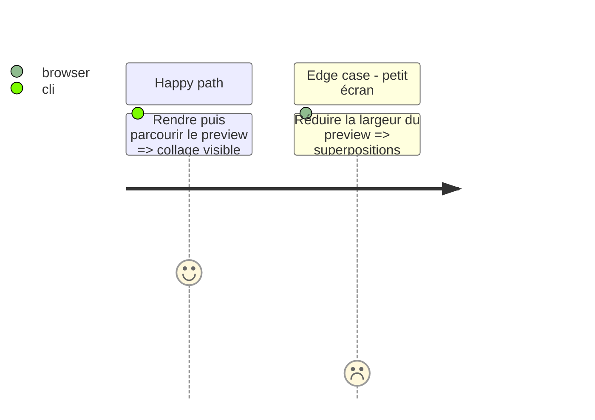

# Instruction: Drowned Lake dérivé : palette et collage

## Architecture projection

> Tree of the final files. ✅ create · ✏️ modify · ❌ delete

```txt
schema-pbta/handbook/monsterhearts/
├── assets/variants/drowned-lake/zine-lake.svg  ✏️ collage abstrait original
└── styles/variants/drowned-lake.css            ✏️ bords découpés, couches et panneaux
```

## User Journey



## Test Scope



## Wireframe

```txt
  ╱╲ fragment collage ╱╲
┌──────────────────────────────┐
│  panneau identité découpé    │
├───────╲───────╱──────────────┤
│ choix   │ illustration abstraite│
├─────────╲─────╱──────────────┤
│ actions / cases / progression │
└──────────────────────────────┘
```

## Tasks to do

### `1)` Donner une matérialité de collage

> Dériver le light validé en fragments imprimés froids et contrôlés.

1. Hériter de la grille, des polices, de la hiérarchie et des symboles du light ; ne les surcharger que pour appliquer gris froid, bleu clair fonctionnel, rouge d’accent, contours, déchirures et chevauchements.
2. Réserver le décor aux calques non interactifs ; maintenir l’ordre de lecture et les zones de saisie.

## Test acceptance criteria

| Task | Acceptance criteria |
| --- | --- |
| 1 | Les zones de livret évoquent le découpage montré en référence sans asset tiers ni perte de lisibilité. |
