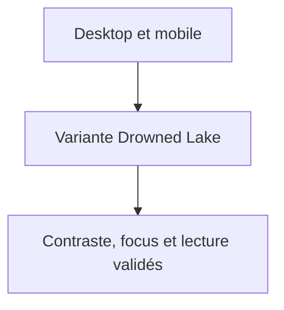
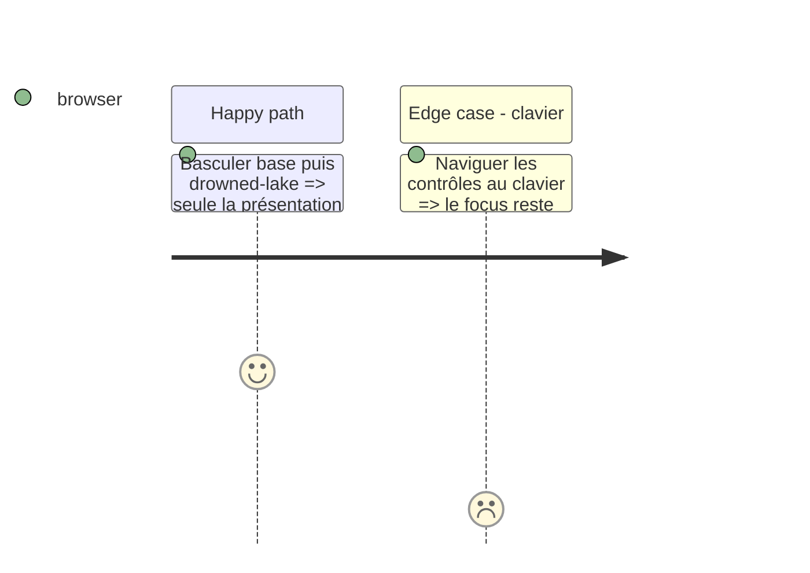

# Instruction: Validation responsive et visuelle

## Architecture projection

> Tree of the final files. ✅ create · ✏️ modify · ❌ delete

```txt
schema-pbta/handbook/monsterhearts/styles/variants/drowned-lake.css  ✏️ corrections issues de QA
schema-pbta/handbook/monsterhearts/assets/variants/drowned-lake/     ✏️ only if an original abstract asset is needed
```

## User Journey



## Test Scope



## Tasks to do

### `1)` Prouver la variante

> Comparer les formats et prévenir les régressions de pack.

1. Capturer le preview light de référence aux largeurs desktop et mobile, puis Drowned Lake aux mêmes largeurs ; vérifier que la variante conserve grille, typographie et contrôles light avant ses seuls changements de palette et collage.
2. Vérifier sélection de variante, contraste et focus, puis exécuter `npm run handbook:render`, `npm run handbook:validate`, `npm run handbook:validate:fixtures` et inspecter le diff pour exclure toute mutation de données ou de capacités.

## Test acceptance criteria

| Task | Acceptance criteria |
| --- | --- |
| 1 | La variante reste responsive, accessible et purement visuelle ; base et données PbtA ne régressent pas. |
