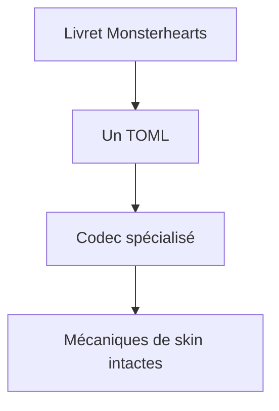
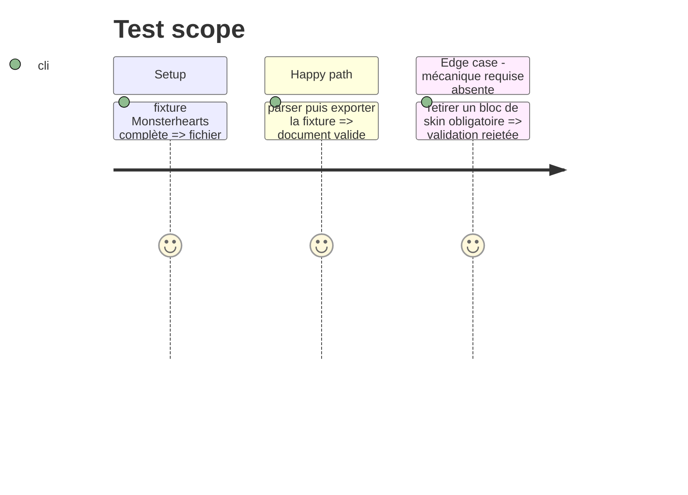

# Instruction: Contrat Monsterhearts atomique

## Architecture projection

> Tree of the final files. ✅ create · ✏️ modify · ❌ delete

```txt
src/zod/monsterhearts-playbook.ts                 ✅ Variante Monsterhearts structurée.
src/zod/constants.ts                              ✏️ Déclare la cible générée dédiée.
src/codecs/toml.ts                                ✏️ Expose le codec TOML.
src/index.ts                                      ✏️ Exporte types et codec.
schemas/**/monsterhearts-playbook.schema.json     ✅ Schémas générés courant et versionné.
examples/monsterhearts/monsterhearts-playbook/    ✅ Exemple original complet.
corpus/contract/                                  ✏️ Témoins accepté, rejeté et manifeste.
```

## User Journey



## Test Scope



## Tasks to do

### `1)` Définir les mécaniques de skin

> Modéliser seulement les données propres à Monsterhearts après lecture des playbooks et de la game definition existante.

1. Identifier les mécaniques communes aux skins qui manquent au socle PbtA.
2. Créer une extension Zod stricte avec bornes, descriptions et exemples.
3. Déclarer `pbta/monsterhearts-playbook` sans modifier `pbta/playbook`.

### `2)` Générer et prouver le contrat

> Rendre la variante publiable et vérifiable.

1. Enregistrer le codec et les exports.
2. Régénérer les schémas courant et versionné.
3. Ajouter exemple et témoins de corpus originaux, puis lancer les validations.

## Test acceptance criteria

| Task | Acceptance criteria |
| --- | --- |
| 1 | Les mécaniques propres à Monsterhearts sont typées et les champs inconnus refusés. |
| 2 | Un livret complet tient dans un seul TOML et passe parse, export et re-parse. |
