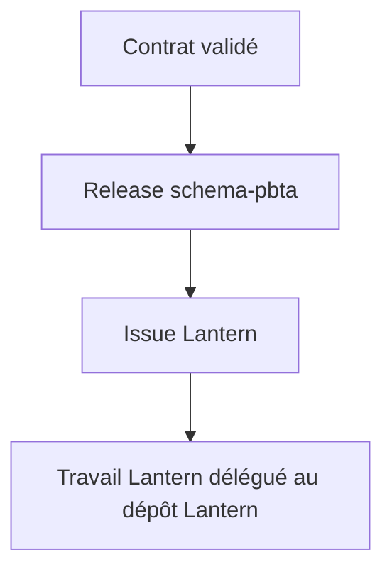
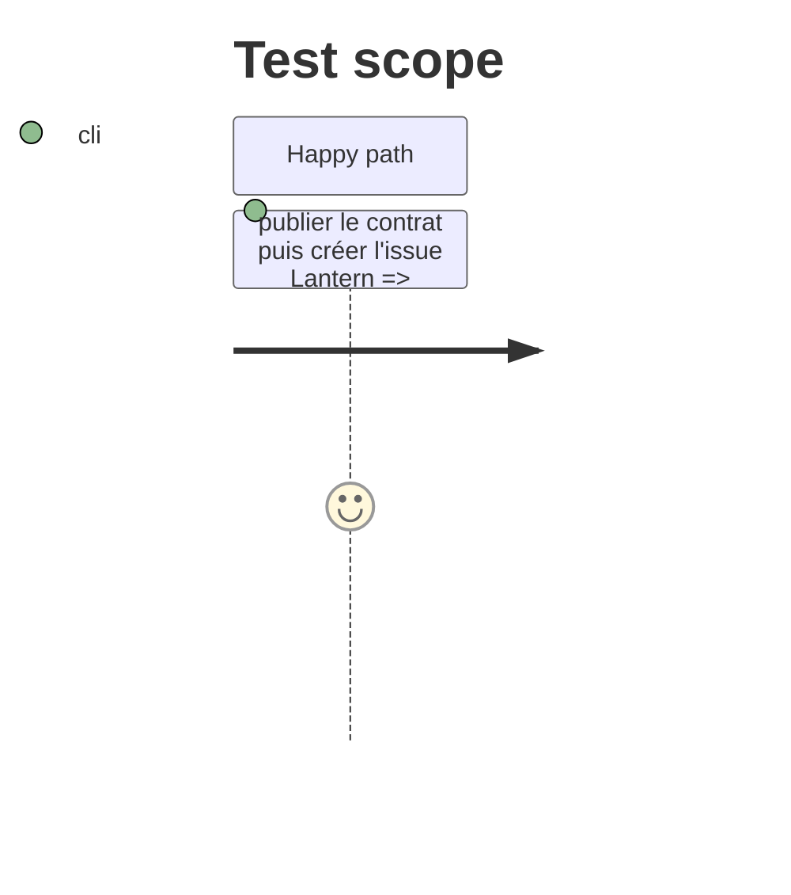

# Instruction: Issue et livraison inter-projets

## Architecture projection

> Tree of the final files. ✅ create · ✏️ modify · ❌ delete

```txt
CHANGELOG.md                                      ✏️ Documente la cible publiée.
package.json                                      ✏️ Versionne schema-pbta.
GitHub issue RebelliousSmile/lantern              ✅ Suit le template spécialisé avant tout code Lantern.
```

## User Journey



## Test Scope



## Tasks to do

### `1)` Livrer le contrat et ouvrir l'issue

> Créer une dépendance Lantern résoluble et une unité de travail explicitement suivie.

1. Préparer et publier la release schema-pbta contenant la cible.
2. Créer l'issue Lantern avec dépendance, périmètre, contraintes et critères d'acceptation.
3. Ne créer aucun worktree, fichier, configuration ou code Lantern.

## Test acceptance criteria

| Task | Acceptance criteria |
| --- | --- |
| 1 | Une issue Lantern lie explicitement le template à la release de contrat requise. |

## Livraison

- Release : https://github.com/RebelliousSmile/schema-pbta/releases/tag/v2.0.0
- Suivi Lantern : https://github.com/RebelliousSmile/lantern/issues/5
- Aucun fichier, worktree ou paramètre Lantern n'a été modifié.
