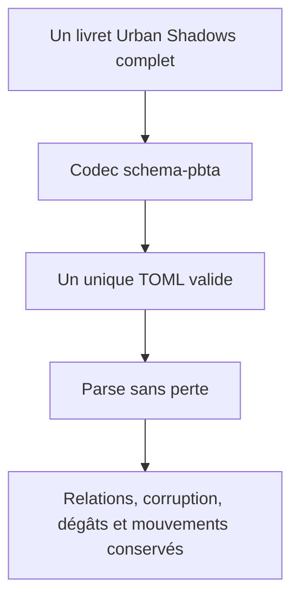
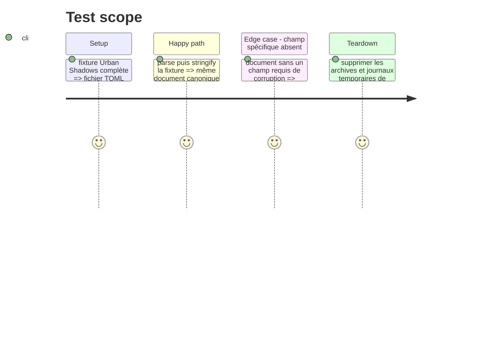

# Instruction: Contrat Urban Shadows atomique

## Architecture projection

> Tree of the final files. ✅ create · ✏️ modify · ❌ delete

```txt
src/
├── zod/
│   ├── urban-shadows-playbook.ts                 ✅ Variante structurée du playbook Urban Shadows.
│   └── constants.ts                              ✏️ Déclare la cible générée Urban Shadows dédiée.
├── codecs/toml.ts                                ✏️ Expose le codec `urban-shadows-playbook`.
└── index.ts                                      ✏️ Exporte le type et le codec publiés.
schemas/
└── urban-shadows/
    └── urban-shadows-playbook.schema.json        ✅ Schéma JSON régénéré de la variante.
schemas/v1/urban-shadows/
└── urban-shadows-playbook.schema.json            ✅ Schéma versionné régénéré de la variante.
examples/urban-shadows/urban-shadows-playbook/
└── the-aware.toml                                ✅ Exemple original, complet et atomique.
corpus/contract/
├── valid/urban-shadows-playbook-complete.toml    ✅ Témoin accepté du round-trip.
├── invalid/urban-shadows-playbook-missing-corruption.toml ✅ Témoin rejeté à défaut unique.
└── cases.json                                    ✏️ Référence les deux témoins et la cible.
```

## User Journey



## Test Scope



## Tasks to do

### `1)` Définir la variante Urban Shadows

> Décrire exclusivement les mécaniques de livret qui ne peuvent pas rester dans le contrat PbtA générique.

1. Créer un schéma Zod strict, composé du socle existant et de sections Urban Shadows typées.
2. Fixer les bornes numériques, descriptions et exemples de tous les champs ajoutés.
3. Déclarer la clé cible publiée `pbta/urban-shadows-playbook`, sans modifier l'identité du schéma générique.

### `2)` Publier le codec et les schémas générés

> Rendre la variante disponible à Lantern par le registre de codecs de schema-pbta.

1. Enregistrer la cible dans la génération et dans le dispatch TOML.
2. Régénérer les JSON Schemas courants et versionnés, puis contrôler leurs identités.
3. Conserver la rétrocompatibilité des cibles PbtA génériques existantes.

### `3)` Établir les fixtures de contrat

> Prouver qu'un livret complet reste un seul fichier et qu'une erreur précise est rejetée.

1. Ajouter un playbook Urban Shadows original couvrant chaque section spécialisée.
2. Ajouter un témoin valide et un témoin invalide à défaut unique.
3. Référencer ces témoins dans le corpus et exécuter les validations de contrat.

## Test acceptance criteria

| Task | Acceptance criteria |
| --- | --- |
| 1 | Le schéma accepte les données Urban Shadows structurées et refuse les champs inconnus. |
| 2 | Le package publie `pbta/urban-shadows-playbook` sans changer le comportement de `pbta/playbook`. |
| 3 | Une fixture complète tient dans un seul TOML et passe parse, export et re-parse. |
