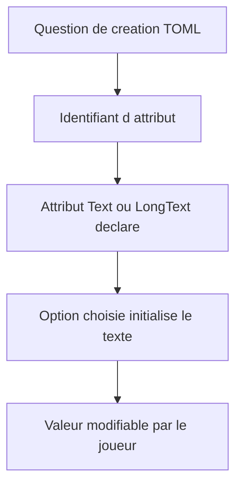
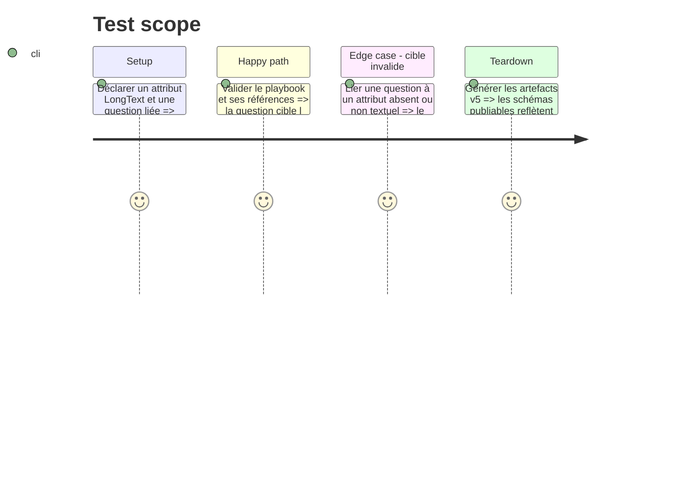

# Instruction: Contrat v5 et validation de références

## Architecture projection

```txt
src/zod/playbook.ts ✏️ Ajoute le lien facultatif d’une question de création vers un attribut.
tools/validate-references.ts ✏️ Vérifie que la cible existe, est un champ `Text` ou `LongText` et est visible pour le playbook.
tools/validate-reference-fixtures.ts ✏️ Couvre les diagnostics de cible inconnue ou non textuelle.
corpus/contract/** ✏️ Prouve la forme TOML acceptée et les refus de type invalide.
examples/monsterhearts/** ✏️ Lie des propositions d’identité ou d’apparence à leurs attributs libres existants.
schemas/** ✏️ Régénère les schémas courants et v5 sans modifier les lignes publiées v1 à v4.
```

## User Journey



## Test Scope



## Tasks to do

### `1)` Décrire un choix de création qui initialise un champ

> Ajouter le lien générique sans introduire de libellé ou de liste métier dans le schéma.

1. Étendre `creationQuestionSchema` avec une cible d’attribut facultative, documentée dans les schémas générés.
2. Contrôler, dans le second passage de validation, que cette cible existe dans `character.attributes`, que son type est `Text` ou `LongText`, et que son éventuel `visibleFor` autorise le playbook.
3. Ajouter les témoins, refus et fixtures de références ; adapter les exemples Monsterhearts pour montrer l’initialisation de l’identité ou de l’apparence.
4. Régénérer les schémas v5 et exécuter les validations de contrat, références, audit et compatibilité.

## Test acceptance criteria

| Task | Acceptance criteria |
| --- | --- |
| 1 | Une question de création peut nommer un attribut texte déclaré par le jeu et le TOML passe les deux validations. |
| 1 | Une cible absente, numérique, liste ou booléenne échoue avec un diagnostic qui désigne la question concernée. |
| 1 | Une cible textuelle restreinte à un autre playbook par `visibleFor` est refusée. |
| 1 | Une question sans cible demeure valide et conserve son rôle purement éditorial. |
| 1 | Les schémas v1 à v4 restent inchangés. |
