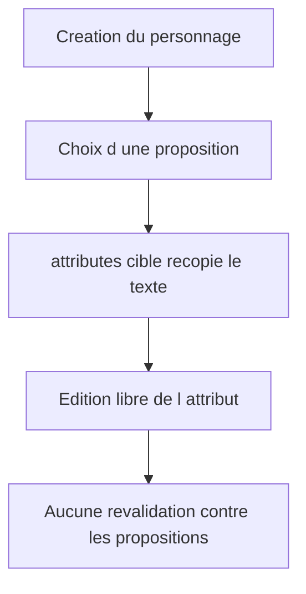
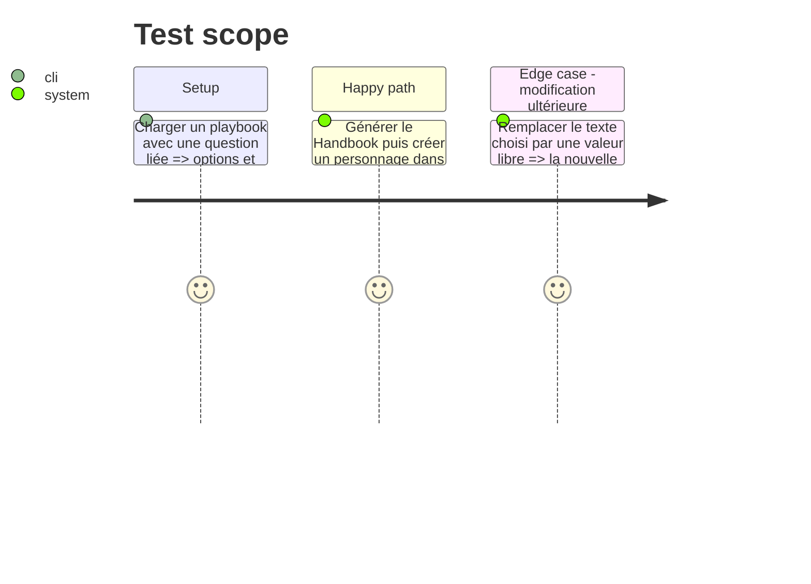

# Instruction: Présentation Handbook et intégration Lantern

## Architecture projection

```txt
tools/render-handbook-preview.ts ✏️ Expose le lien entre chaque question de création et son attribut dans le rendu de référence.
tools/validate-handbook-packs.ts ✏️ Vérifie que le rendu conserve la cible structurée d une question liée.
examples/monsterhearts/monsterhearts-playbook/*.toml ✏️ Porte une question liée, ses options éditoriales et l attribut texte initialisé.
Lantern issue ✅ Décrit le formulaire de création qui initialise `attributes[target]`, puis laisse le champ texte entièrement éditable.
```

## User Journey



## Test Scope



## Tasks to do

### `1)` Rendre le lien visible dans le consommateur de référence

> Préserver la destination structurée dans le Handbook sans transformer les options en état de personnage.

1. Faire porter au rendu de création l’identifiant de l’attribut cible lorsqu’il est fourni.
2. Ajouter une assertion de rendu et une fixture contenant à la fois la question, ses options et l’attribut texte initialisé.

### `2)` Transmettre le contrat à Lantern

> Faire appliquer le cycle de vie : choix initial, puis édition libre.

1. Créer une issue Lantern qui référence ce plan et précise la lecture de `creation[].attribute`.
2. Demander à Lantern de préremplir `attributes[attribute]` depuis le choix, sans enregistrer les options ni une référence d’option dans l’état du personnage.
3. Vérifier dans Lantern qu’une modification manuelle ou une progression peut remplacer le texte initialisé.

## Test acceptance criteria

| Task | Acceptance criteria |
| --- | --- |
| 1 | Le rendu Handbook d’une question liée expose sa destination attribut sans dupliquer la valeur du joueur. |
| 2 | Lantern initialise le champ texte ciblé au choix de création et laisse ensuite ce champ librement éditable. |
| 2 | Les questions sans cible conservent leur rendu purement informatif. |
