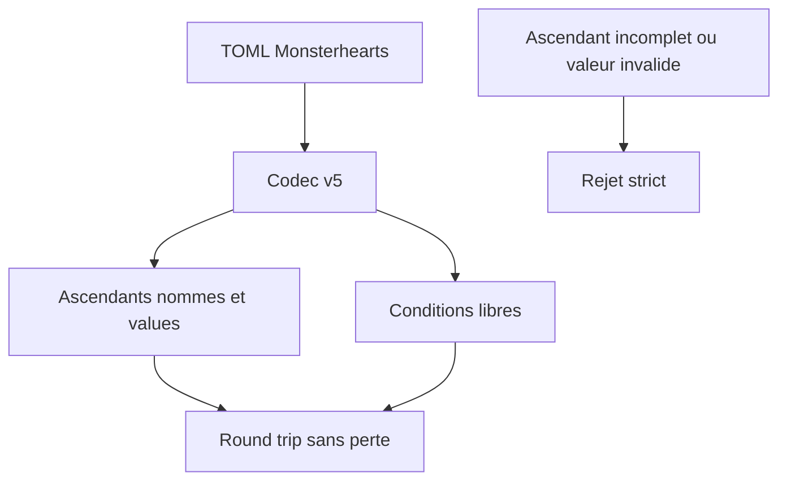
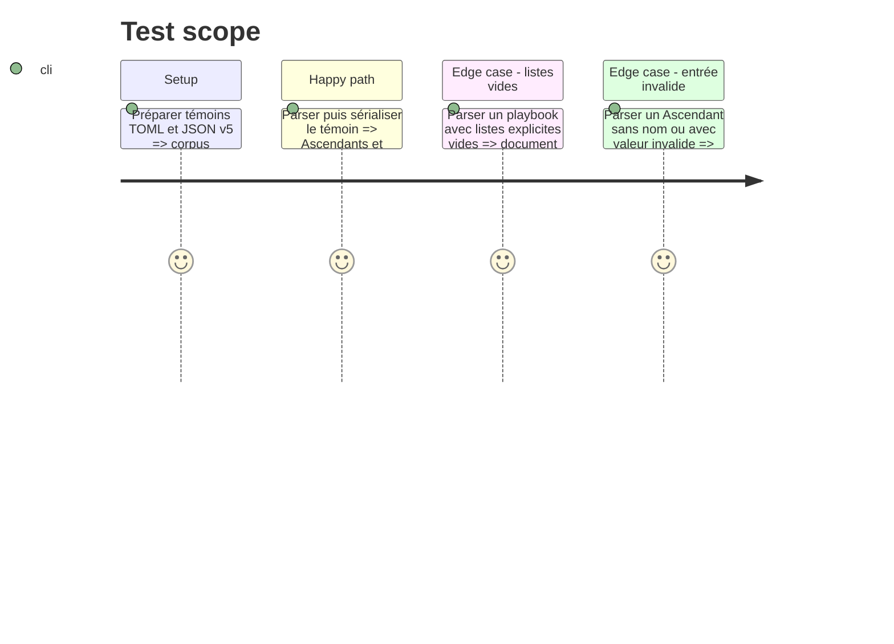

# Instruction: Contrat v5 et corpus Monsterhearts

## Architecture projection

> Tree of the final files. ✅ create · ✏️ modify · ❌ delete

```txt
src/zod/monsterhearts-playbook.ts ✏️ Ajoute les entrées d’Ascendant nommées et leur valeur, sans énumérer de noms.
corpus/contract/cases.json ✏️ Référence les nouveaux témoins v5 du codec Monsterhearts.
corpus/contract/valid/monsterhearts-playbook-complete.toml ✏️ Porte plusieurs Ascendants et Conditions libres, puis fait foi pour le round-trip.
corpus/contract/valid/monsterhearts-playbook-empty-ascendants.toml ✅ Prouve qu’une liste explicite vide reste un document valide.
corpus/contract/invalid/monsterhearts-playbook-invalid-ascendant.toml ✅ Refuse une entrée d’Ascendant de forme invalide.
corpus/temoins/monsterhearts/monsterhearts-playbook/playbook-complete.json ✏️ Couvre la nouvelle structure dans l’audit JSON.
corpus/refus/monsterhearts/monsterhearts-playbook/ascendant-invalide.json ✅ Prouve le refus du même défaut au niveau schéma.
examples/monsterhearts/monsterhearts-playbook/the-eclipse.toml ✏️ Montre un état éditable représentatif, sans contenu de jeu repris.
schemas/v5/monsterhearts/monsterhearts-playbook.schema.json ✅ Schéma JSON généré de la nouvelle ligne majeure.
```

## User Journey



## Test Scope



## Tasks to do

### `1)` Modéliser les données éditables de la fiche

> Faire des Ascendants une liste d’entrées libres `{ name, value }` et conserver les Conditions libres, sans confondre ces valeurs avec la configuration `strings` du livret.

1. Déclarer la forme stricte de l’Ascendant, avec un nom non vide et une valeur de compteur portable.
2. Ajouter la liste d’Ascendants au playbook Monsterhearts en acceptant une liste explicitement vide.
3. Maintenir `strings.max` et `strings.starting` comme configuration existante, et conserver les Conditions comme entrées éditables indépendantes.
4. Construire des témoins de contrat distincts pour les listes remplies, les listes explicitement vides et une entrée invalide, ainsi que leurs équivalents d’audit JSON, à partir de contenu original.

## Test acceptance criteria

| Task | Acceptance criteria |
| --- | --- |
| 1 | Un TOML Monsterhearts peut définir zéro ou plusieurs Ascendants nommés avec leur valeur, et le codec v5 les restitue sans perte. |
| 1 | Les noms d’Ascendants et de Conditions sont des données libres du TOML, jamais une énumération de schéma. |
| 1 | Une entrée d’Ascendant incomplète ou de valeur invalide est rejetée par le schéma JSON et le codec. |
