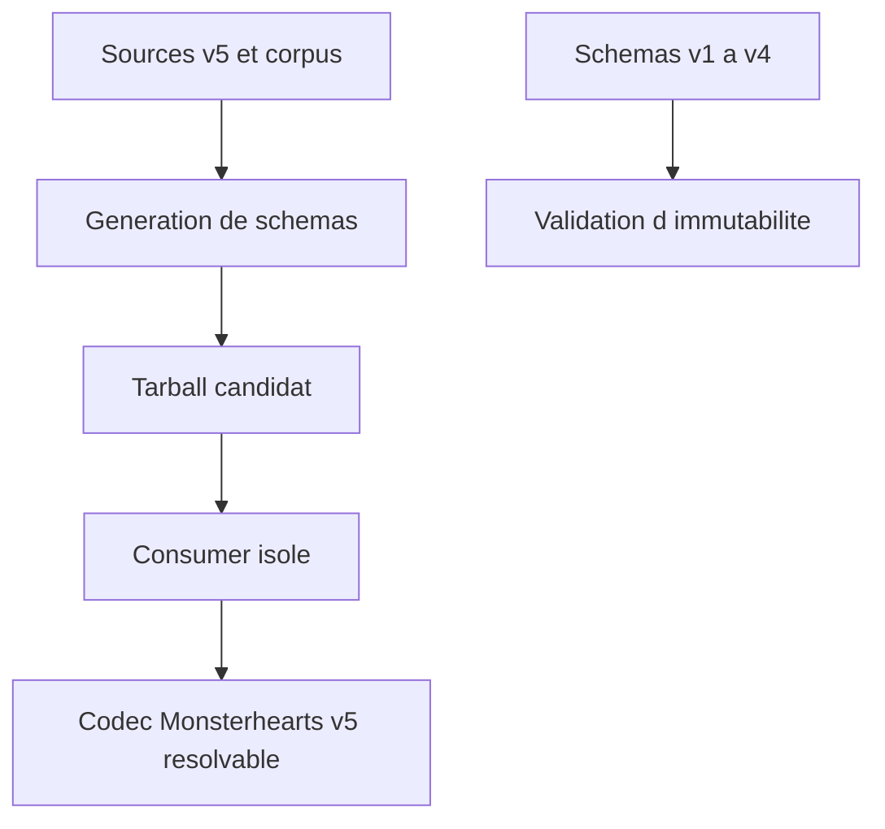
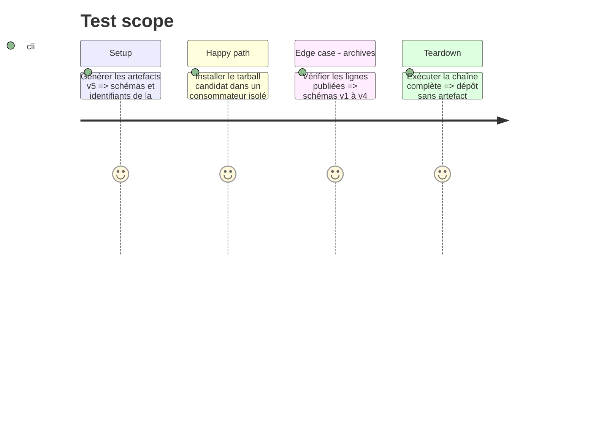

# Instruction: Artefacts v5 et préparation de publication

## Architecture projection

> Tree of the final files. ✅ create · ✏️ modify · ❌ delete

```txt
package.json, package-lock.json ✏️ Portent le majeur v5 et l’export public `schemas/v5/*`.
schemas/v5/** ✅ Ligne de schémas générée avec des identifiants v5.0.0.
schemas/monsterhearts/monsterhearts-playbook.schema.json ✏️ Alias de développement régénéré sur le contrat courant.
tools/validate-version-compat.ts ✏️ Archive v4 et reconnaît v5 comme baseline candidate avant publication.
tools/validate-package.ts ✏️ Vérifie depuis un tarball les exports, le codec et le corpus v5.
README.md ✏️ Documente la disponibilité de la ligne v5 et le contenu éditable Monsterhearts.
docs/compatibility.md ✏️ Ajoute v5 à la matrice, en préservant les règles d’immuabilité v4.
```

## User Journey



## Test Scope



## Tasks to do

### `1)` Établir une ligne majeure publiable

> Générer et vérifier le contrat v5 sans déplacer l’artefact immuable v4.0.0.

1. Mettre les constantes de version, l’archive de compatibilité et les contrôles de package en cohérence avec v5.
2. Régénérer les schémas et vérifier le codec, le corpus, le tarball et la compatibilité des archives.
3. Mettre à jour la documentation de compatibilité et préparer les assets de release ; ne publier qu’avec une autorisation explicite.

## Test acceptance criteria

| Task | Acceptance criteria |
| --- | --- |
| 1 | Le tarball v5 expose le codec Monsterhearts et son corpus avec les Ascendants, tandis que les schémas v1 à v4 ne changent pas. |
| 1 | Les artefacts générés utilisent les identifiants v5.0.0 et la documentation distingue clairement v4 publié de v5 candidat. |
