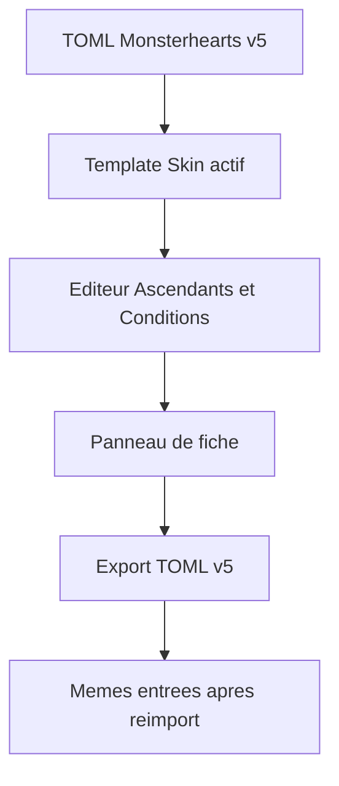
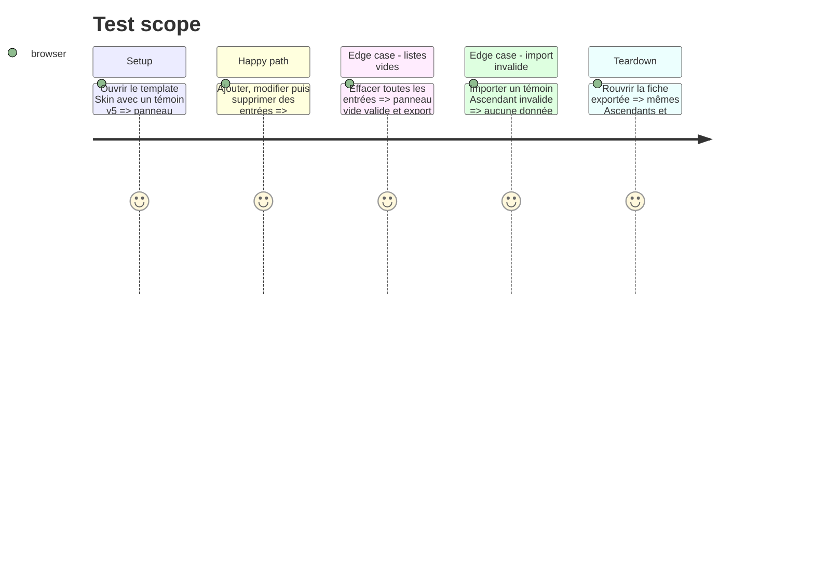

# Instruction: Édition et rendu Lantern

## Architecture projection

> Tree of the final files. ✅ create · ✏️ modify · ❌ delete

```txt
Lantern package.json, package-lock.json ✏️ Épinglent l’asset immuable schema-pbta v5 après sa publication autorisée.
Lantern src/templates/monsterhearts/playbook/model.ts ✏️ Ajoute la section Ascendants et les valeurs vides au document vierge, à partir du type publié.
Lantern src/templates/monsterhearts/playbook/editor/MonsterheartsPlaybookEditorPanel.tsx ✏️ Fournit une édition structurée des deux listes.
Lantern src/templates/monsterhearts/playbook/preview/MonsterheartsPlaybookPreview.tsx ✏️ Rend le panneau commun Ascendants et Conditions au lieu du JSON brut.
Lantern src/templates/monsterhearts/playbook/preview/monsterheartsPlaybookTheme.css ✏️ Met en page la zone éditable du playbook.
Lantern outils de contrat et tests de template ✏️ Prouvent import, persistance et export des témoins v5.
```

## User Journey



## Test Scope



## Wireframe

```txt
┌─────────────────────────────────────────────┐
│ (1) Identité de la fiche                     │
├─────────────────────────────────────────────┤
│ (2) Régions existantes du playbook           │
├─────────────────────────────────────────────┤
│ (3) Ascendants et Conditions                 │
│  ┌────────────────────────────────────────┐ │
│  │ (4) Entrées nom et valeur              │ │
│  └────────────────────────────────────────┘ │
│  ┌────────────────────────────────────────┐ │
│  │ (5) Entrées de condition et détail      │ │
│  └────────────────────────────────────────┘ │
└─────────────────────────────────────────────┘
```

1. Identifie le playbook Monsterhearts ouvert.
2. Préserve les régions de fiche existantes.
3. Réunit les deux données éditables dans la zone demandée.
4. Porte les Ascendants libres et leur compteur.
5. Porte les Conditions libres et leur précision facultative.

## Tasks to do

### `1)` Consommer et présenter les données v5

> Faire de la zone Ascendants et Conditions une partie éditable, persistée et exportée du même document TOML Monsterhearts.

1. Épingler le contrat v5 publié et mettre à jour les assertions de consommateur.
2. Étendre le modèle, les sections et le document vierge avec une liste d’Ascendants vide.
3. Remplacer la sérialisation JSON du rendu par les deux listes structurées de la maquette.
4. Ajouter des contrôles ciblés et des preuves de round-trip navigateur pour listes remplies, vides et invalides.

## Test acceptance criteria

| Task | Acceptance criteria |
| --- | --- |
| 1 | Lantern importe un TOML Monsterhearts v5, permet d’éditer ses Ascendants et Conditions, puis réexporte les mêmes listes dans ce même target. |
| 1 | Une liste vide est affichée comme une zone de fiche vide valide et reste vide après export et réimport. |
| 1 | Le panneau n’affiche plus ces données sous forme de JSON brut et aucune entrée invalide ne devient un état persisté. |
