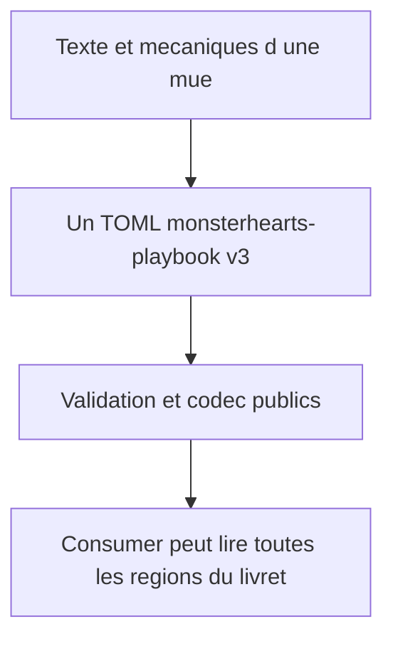
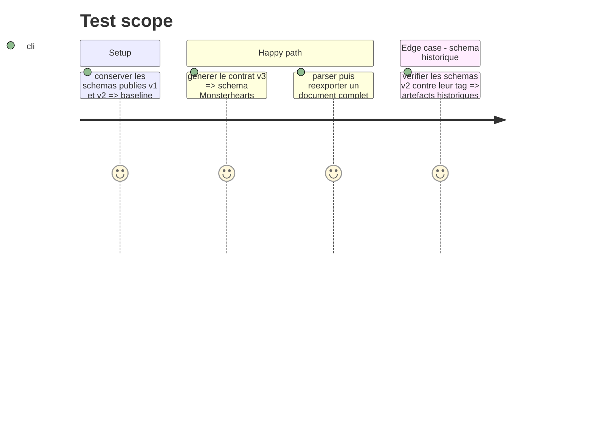

# Instruction: Contrat Monsterhearts v3 complet

## Architecture projection

> Tree of the final files. ✅ create · ✏️ modify · ❌ delete

```txt
src/contract-version.ts                         ✏️ Passe le contrat canonique à v3 sans modifier les artefacts v1/v2.
package.json                                    ✏️ Aligne la majeure publique du package sur le contrat v3.
src/zod/monsterhearts-playbook.ts               ✏️ Définit les sections mécaniques et éditoriales communes à toute mue.
schemas/v3/monsterhearts/monsterhearts-playbook.schema.json ✅ Schéma v3 généré et versionné.
schemas/monsterhearts/monsterhearts-playbook.schema.json    ✏️ Alias canonique vers la génération v3.
schemas/v1/**, schemas/v2/**                    ✏️ Conservés sans altération comme versions publiées.
```

## User Journey



## Test Scope



## Tasks to do

### `1)` Versionner la nouvelle forme canonique

> Introduire v3 sans réécrire le contrat publié.

1. Mettre à niveau la version de contrat, les chemins distribués et la version du package selon la politique existante.
2. Préserver `schemas/v1` et `schemas/v2` tels que publiés, et générer le nouvel alias non versionné depuis v3.
3. Adapter les validations de compatibilité afin qu’elles contrôlent les trois lignes de schémas.

### `2)` Décrire le livret complet

> Modéliser tout texte visible et toute donnée jouable dans la même forme stricte.

1. Étendre la variante Monsterhearts avec des régions nommées pour l’accroche, l’origine, les conseils, le démon intérieur, l’action sexuelle, l’aide MC, l’identité, les choix, les actions et la progression.
2. Conserver les champs mécaniques structurés ; les paragraphes éditoriaux restent des valeurs textuelles, jamais des fragments HTML.
3. Régénérer les schémas v3 depuis les exports publics spécialisés déjà en place.

## Test acceptance criteria

| Task | Acceptance criteria |
| --- | --- |
| 1 | Les URLs et fichiers v1/v2 restent inchangés, tandis que le package expose un schéma Monsterhearts v3. |
| 2 | Un document `monsterhearts-playbook` v3 valide peut contenir chaque région visible d’un livret sans champ libre ou fichier associé. |
