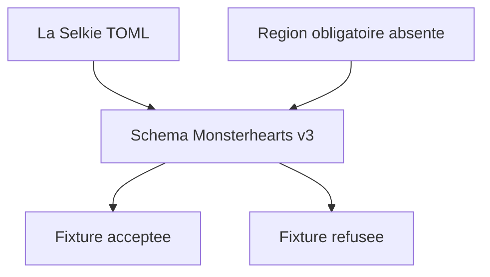
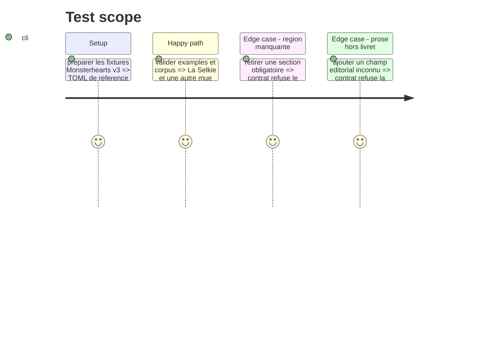

# Instruction: Fixtures canoniques et conformité

## Architecture projection

> Tree of the final files. ✅ create · ✏️ modify · ❌ delete

```txt
examples/monsterhearts/monsterhearts-playbook/la-selkie.toml ✅ Fixture complète qui porte toutes les régions du livret de référence.
examples/monsterhearts/monsterhearts-playbook/the-eclipse.toml ✏️ Migre la fixture spécialisée existante au modèle v3 commun.
examples/monsterhearts/monsterhearts-playbook/la-noyee.toml ✅ Migre la fixture de La Noyée au modèle spécialisé commun.
examples/monsterhearts/playbook/la-noyee.toml              ❌ Retire la seconde source générique du même livret.
corpus/contract/valid/monsterhearts-playbook-complete.toml ✏️ Témoin accepté du contrat v3 enrichi.
corpus/contract/invalid/monsterhearts-playbook-*.toml      ✅ Refus ciblés des régions requises ou mal structurées.
corpus/contract/cases.json                                  ✏️ Enregistre les témoins et refus v3.
corpus/temoins/monsterhearts/monsterhearts-playbook/**      ✏️ Met à jour le témoin JSON audité.
corpus/refus/monsterhearts/monsterhearts-playbook/**        ✅ Ajoute le refus JSON représentatif.
tools/validate-references.ts                                ✏️ Vérifie les invariants de région propres à Monsterhearts si nécessaires.
```

## User Journey



## Test Scope



## Tasks to do

### `1)` Établir les exemples de référence

> Faire de La Selkie la preuve complète du modèle commun.

1. Transcrire son contenu visible dans un unique TOML original, structuré par régions plutôt que par mise en page codée.
2. Migrer The Eclipse et La Noyée pour prouver que le modèle ne dépend pas d’une seule mue.
3. Retirer la fixture générique concurrente de La Noyée afin qu’un livret n’ait qu’une source canonique.

### `2)` Prouver les contraintes du contrat

> Couvrir le document entier, sa sérialisation et ses rejets significatifs.

1. Mettre à jour les cas acceptés, refusés et les témoins JSON de l’audit.
2. Ajouter les règles de références transverses nécessaires aux sections Monsterhearts.
3. Vérifier génération, exemples, corpus et audit avec les scripts du dépôt.

## Test acceptance criteria

| Task | Acceptance criteria |
| --- | --- |
| 1 | La Selkie, The Eclipse et La Noyée utilisent le même schéma spécialisé, avec une seule source canonique par livret et aucun fichier annexe pour leur prose. |
| 2 | Toute fixture complète passe validation et round-trip ; une région obligatoire absente ou un champ éditorial inconnu est rejeté. |
