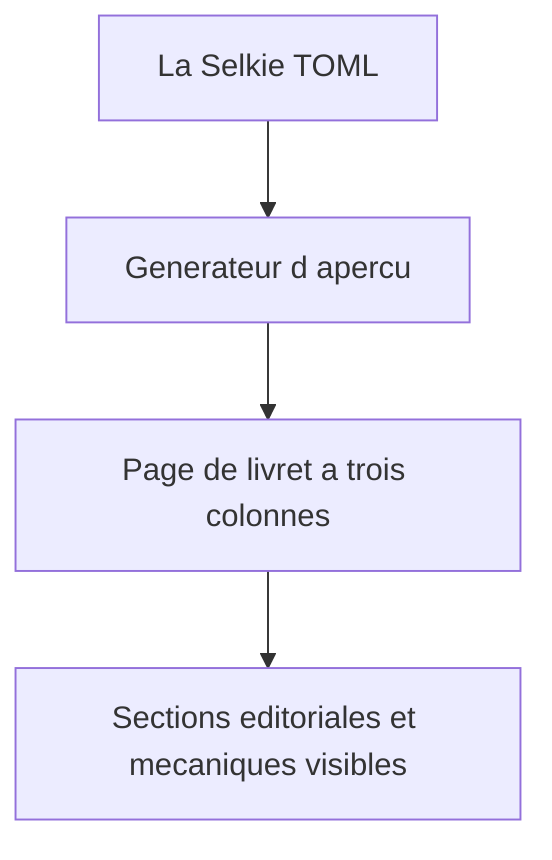
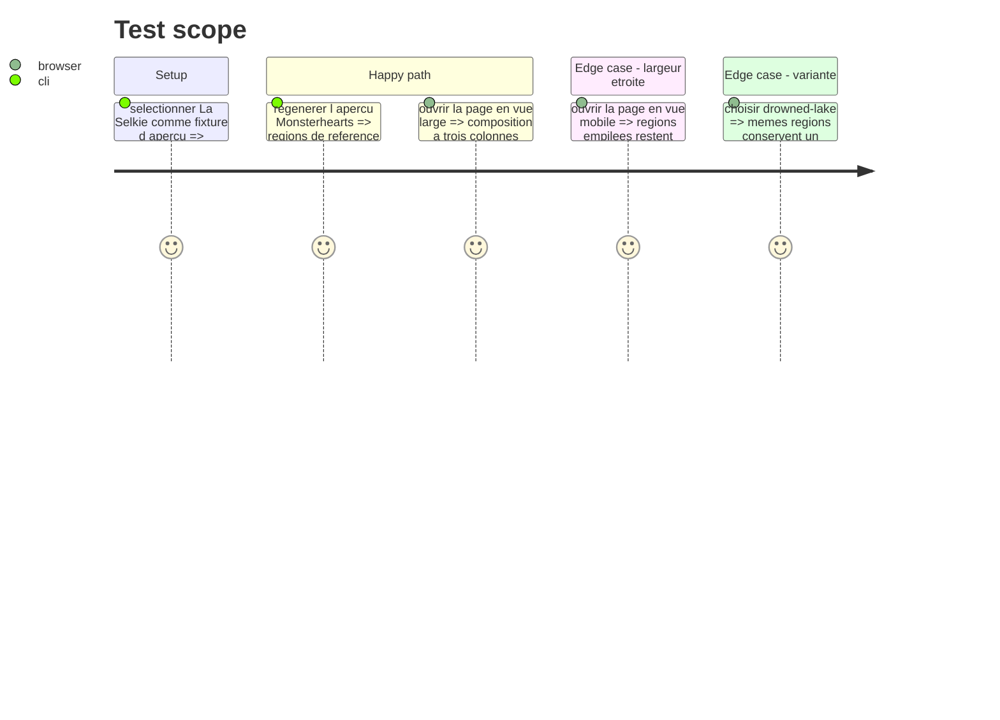

# Instruction: Aperçu de livret spécialisé

## Architecture projection

> Tree of the final files. ✅ create · ✏️ modify · ❌ delete

```txt
handbook/monsterhearts/preview/preview.toml       ✏️ Sélectionne la fixture spécialisée La Selkie pour l’aperçu.
tools/render-handbook-preview.ts                  ✏️ Charge le type de document choisi et rend les régions Monsterhearts dédiées.
handbook/monsterhearts/preview/index.html         ✏️ Dérivé régénéré du TOML spécialisé, jamais édité à la main.
handbook/monsterhearts/styles/base.css            ✏️ Place les régions Monsterhearts dans la composition de référence.
handbook/monsterhearts/styles/variants/drowned-lake.css ✏️ Préserve l’adaptation visuelle de variante pour les nouvelles régions.
tools/validate-handbook-packs.ts                  ✏️ Vérifie la présence des régions Monsterhearts rendues et leurs références locales.
```

## User Journey



## Test Scope



## Wireframe

```txt
┌──────────────────────────────────────────────────────────────────────────┐
│ (1) Titre du livret · phrase d’ambiance                                  │
├───────────────────────┬───────────────────────┬──────────────────────────┤
│ (2) Origine           │ (3) Démon intérieur   │ (4) Action sexuelle      │
│     conseils           │                       │     repère MC            │
├───────────────────────┼───────────────────────┼──────────────────────────┤
│ (5) Actions           │ (6) Identité          │ (7) Suite et progression │
│                       │     choix · stats     │                          │
└───────────────────────┴───────────────────────┴──────────────────────────┘
```

## Tasks to do

### `1)` Rendre le type Monsterhearts spécialisé

> Faire lire au générateur le TOML monobloc sans détour par le playbook générique.

1. Déclarer le type de fixture dans le descripteur d’aperçu et charger le codec correspondant.
2. Construire les régions Monsterhearts à partir de leurs données structurées, avec échappement systématique du texte.
3. Continuer à utiliser les composants portables pour les actions et caractéristiques lorsque leur structure s’y prête.

### `2)` Préserver la composition de La Selkie

> Adapter uniquement la structure et les styles nécessaires à la grille de référence.

1. Disposer les sept régions dans les deux rangées et trois colonnes définies par le wireframe.
2. Préserver l’ordre de lecture, l’impression et le repli responsive.
3. Étendre la variante `drowned-lake` aux régions ajoutées sans modifier leurs données.

### `3)` Contrôler le rendu dérivé

> Rendre observable que l’aperçu reste intégralement issu du document unique.

1. Étendre la validation HTML avec les régions Monsterhearts attendues.
2. Régénérer `index.html` puis vérifier les vues large, étroite et de variante.

## Test acceptance criteria

| Task | Acceptance criteria |
| --- | --- |
| 1 | L’aperçu Monsterhearts est généré depuis `la-selkie.toml` spécialisé et contient toutes ses régions sans prose recopiée dans le générateur. |
| 2 | La vue large retrouve les trois colonnes et deux rangées de référence ; les vues mobile, impression et variante restent lisibles. |
| 3 | La validation échoue si une région Monsterhearts attendue disparaît du HTML dérivé. |
