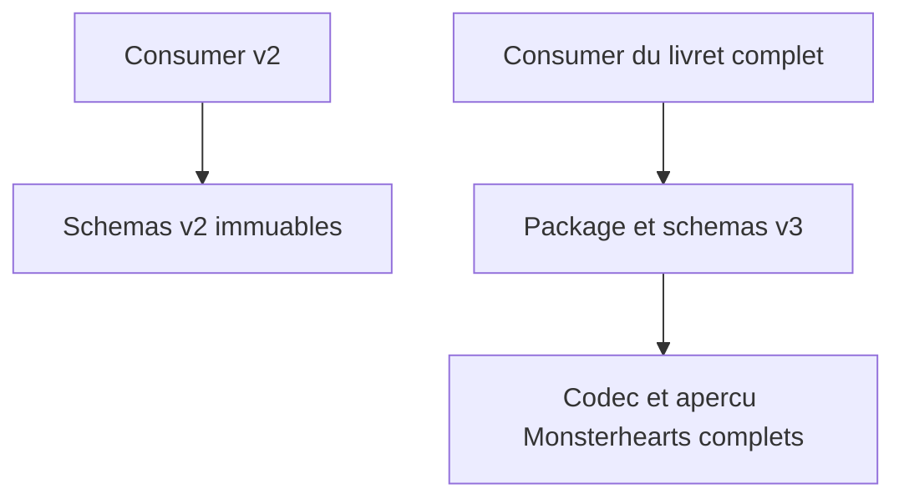
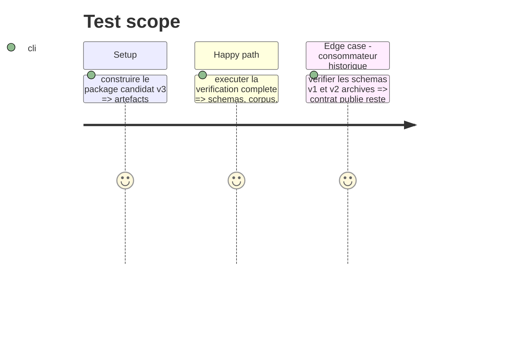

# Instruction: Documentation et vérification de livraison

## Architecture projection

> Tree of the final files. ✅ create · ✏️ modify · ❌ delete

```txt
README.md                  ✏️ Explique la disponibilité du format Monsterhearts complet en v3 et sa frontière avec le playbook portable.
docs/compatibility.md      ✏️ Documente la rupture de contrat v3 et la conservation des schémas v1/v2.
package.json               ✏️ Inclut schemas/v3 et son chemin d’export dans le paquet distribué.
package-lock.json          ✏️ Reste cohérent avec la version package si elle change.
schemas/v3/**              ✏️ Artefacts de release candidats vérifiés avant publication du tag v3.0.0.
```

## User Journey



## Test Scope



## Tasks to do

### `1)` Rendre la migration compréhensible

> Expliquer sans ambiguïté quand employer le document spécialisé v3.

1. Distinguer `playbook` portable de `monsterhearts-playbook` complet.
2. Consigner la raison de la nouvelle majeure et les garanties offertes aux utilisateurs v1/v2.
3. Vérifier que le contenu publié contient les schémas v3 et les corpus nécessaires.

### `2)` Exécuter la preuve de livraison

> Faire passer l’ensemble des contrôles avant toute préparation de release.

1. Lancer la chaîne complète de génération, typecheck, validation, corpus, audit, rendu et validation Handbook.
2. Vérifier l’archive candidate et les chemins d’exports v1, v2 et v3.
3. Préparer la release v3 selon le workflow existant, sans la publier ni créer de tag sans instruction explicite.

## Test acceptance criteria

| Task | Acceptance criteria |
| --- | --- |
| 1 | Un consommateur peut identifier le format complet et les schémas v3 dans le package, tout en continuant à résoudre les références v1/v2. |
| 2 | Tous les contrôles du dépôt passent sur l’artefact v3 candidat ; aucune publication externe n’est effectuée. |
