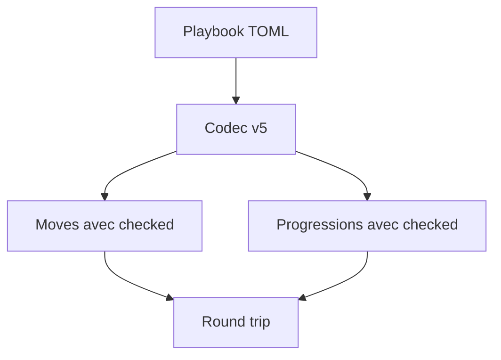
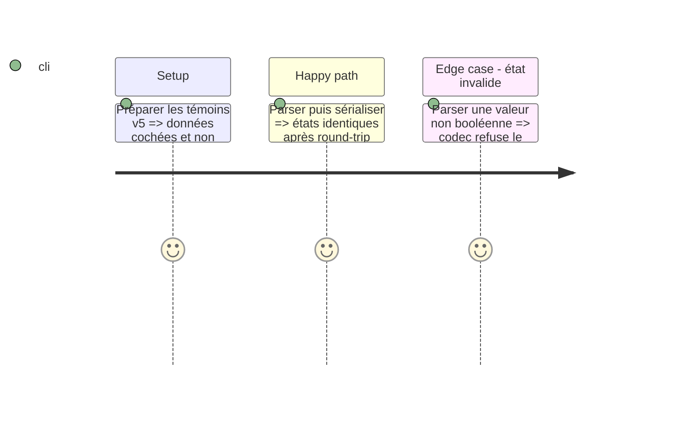

# Instruction: Contrat v5 et corpus

## Architecture projection

```txt
src/zod/playbook.ts ✏️ Étend les moves de playbook et structure les progressions avec leur état optionnel.
corpus/contract/** ✏️ Prouve les états cochés, non cochés et les refus de formes invalides.
corpus/temoins et corpus/refus ✏️ Audite le schéma JSON généré.
examples/** ✏️ Montre des données originales cochées dans les playbooks concernés.
schemas/v5/** ✏️ Régénère la baseline candidate sans modifier v1 à v4.
```

## User Journey



## Test Scope



## Tasks to do

### `1)` Porter l’état d’acquisition

> Ajouter l’état éditable sans transformer les définitions autonomes de move.

1. Créer les variantes de move effectivement détenu par le playbook avec `checked` optionnel ; garder les moves proposés dans `choiceSets` sans état d’acquisition.
2. Remplacer chaque `advancement: string[]` existant par des entrées `{ label, checked }` dont l’état initial est absent.
3. Mettre à jour corpus, exemples et schémas v5 ; préserver v1 à v4.

## Test acceptance criteria

| Task | Acceptance criteria |
| --- | --- |
| 1 | Un playbook round-trip ses moves et progressions cochés ou non cochés sans perte. |
| 1 | Un move autonome ne gagne pas de champ d’état. |
| 1 | Un choix de `choiceSets` reste une proposition non cochée tant qu’il n’est pas devenu un move du playbook. |
