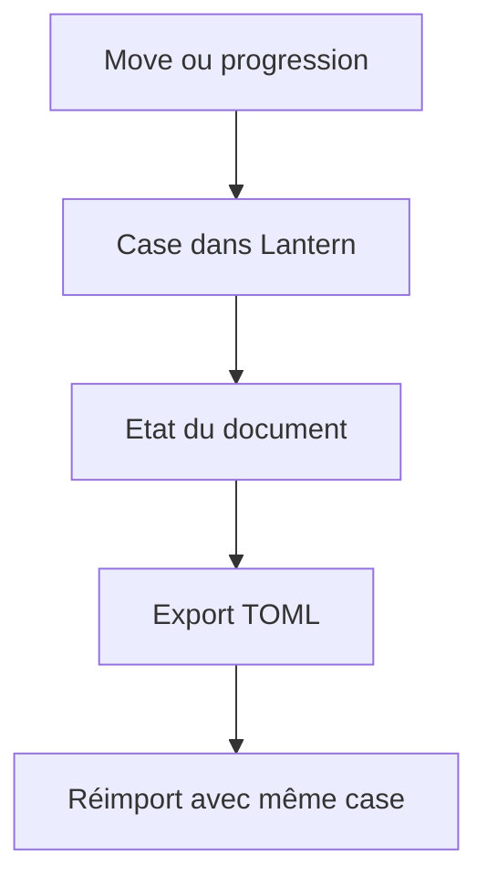
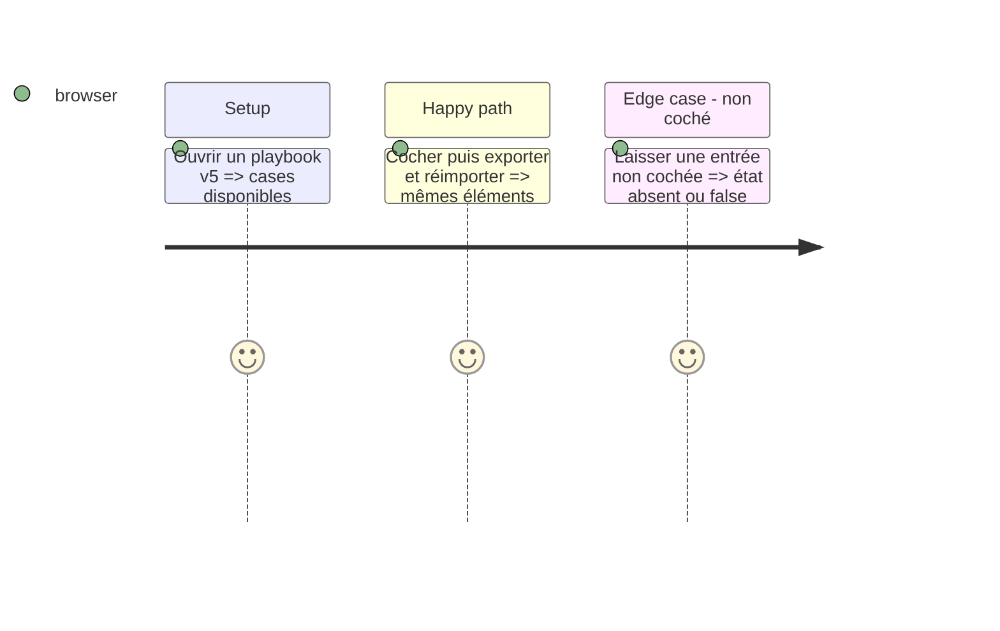

# Instruction: Édition et rendu Lantern

## Architecture projection

```txt
Lantern package.json, package-lock.json ✏️ Épinglent le tarball v5 publié.
Lantern templates de playbook ✏️ Rendent et éditent les cases des moves et progressions.
Lantern tests de contrat et navigateur ✏️ Vérifient persistance et export TOML.
```

## User Journey



## Test Scope



## Wireframe

```txt
┌──────────────────────────────────────┐
│ (1) Moves                             │
│  [ ] entrée de move                   │
├──────────────────────────────────────┤
│ (2) Progressions                      │
│  [x] progression acquise              │
└──────────────────────────────────────┘
```

1. Chaque move affiche son état persistant.
2. Chaque progression affiche son état d’achat.

## Tasks to do

### `1)` Rendre l’état coché

> L’interface édite les deux listes structurées sans perdre le TOML canonique.

1. Mettre à jour les modèles, éditeurs et previews concernés.
2. Prouver le round-trip navigateur des états cochés et non cochés.

## Test acceptance criteria

| Task | Acceptance criteria |
| --- | --- |
| 1 | Une case modifiée dans Lantern est visible, persistée et retrouvée après réimport. |
