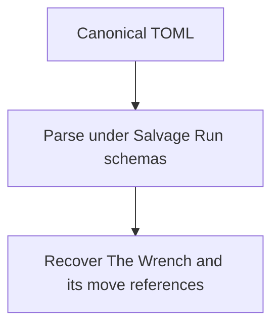
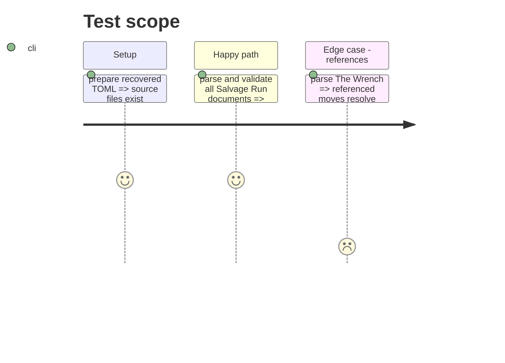

# Instruction: Recover canonical Salvage Run content

## Architecture projection

```txt
examples/salvage-run/ ✅ game definition, moves, and specialised playbook
corpus/temoins/salvage-run/ ✅ accepted documents for the recovered content
```

## User Journey



## Test Scope



## Tasks to do

### `1)` Transcribe the Lantern samples

> Recover the game definition, playbook, and referenced moves in canonical TOML.

1. Add original Salvage Run examples.
2. Add matching accepted corpus witnesses.

## Test acceptance criteria

| Task | Acceptance criteria |
| --- | --- |
| 1 | The recovered content is accepted and The Wrench has no broken move references. |
