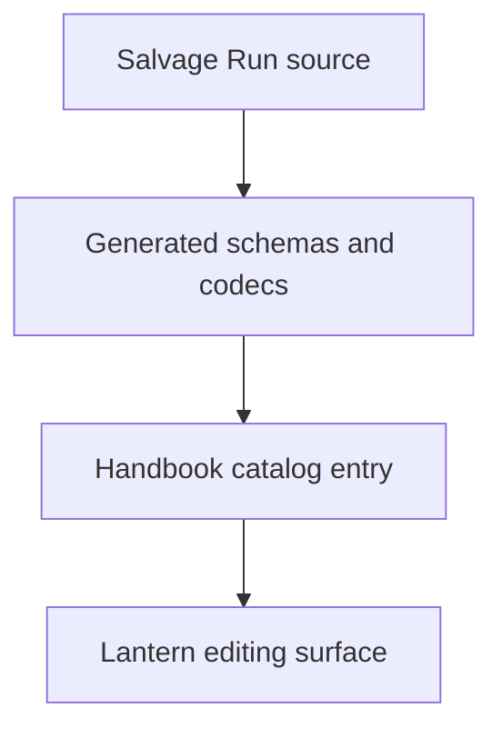
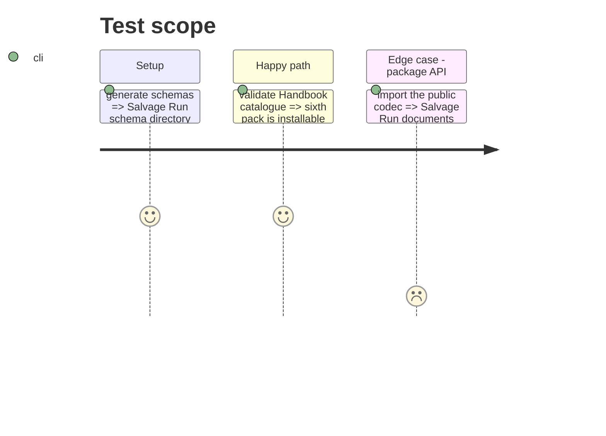

# Instruction: Publish Salvage Run through the contract and Handbook

## Architecture projection

```txt
src/zod/ ✏️ register a generic game target and specialised playbook
src/codecs/ ✏️ expose the new document codec
handbook.json ✏️ declare the sixth pack
handbook/salvage-run/ ✅ declarative presentation pack and preview inputs
```

## User Journey



## Test Scope



## Tasks to do

### `1)` Extend the canonical registry

> Give Salvage Run a stable public game and playbook target.

1. Add schemas, types, codecs, and generated artefacts.

### `2)` Add the Handbook pack

> Declare and style the sixth original game without executable assets.

1. Add the manifest, assets, preview contract, and catalogue entry.

## Test acceptance criteria

| Task | Acceptance criteria |
| --- | --- |
| 1 | Consumers can parse and stringify Salvage Run through the public package API. |
| 2 | Handbook accepts an atomic six-pack source containing Salvage Run. |
