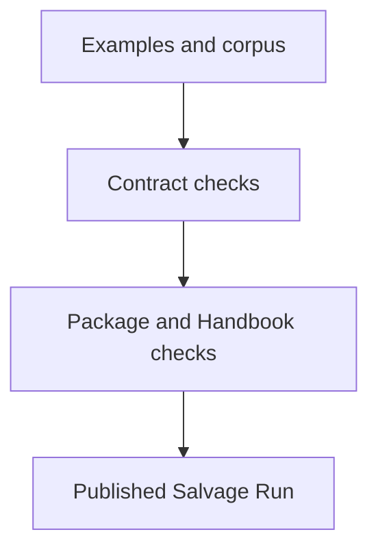
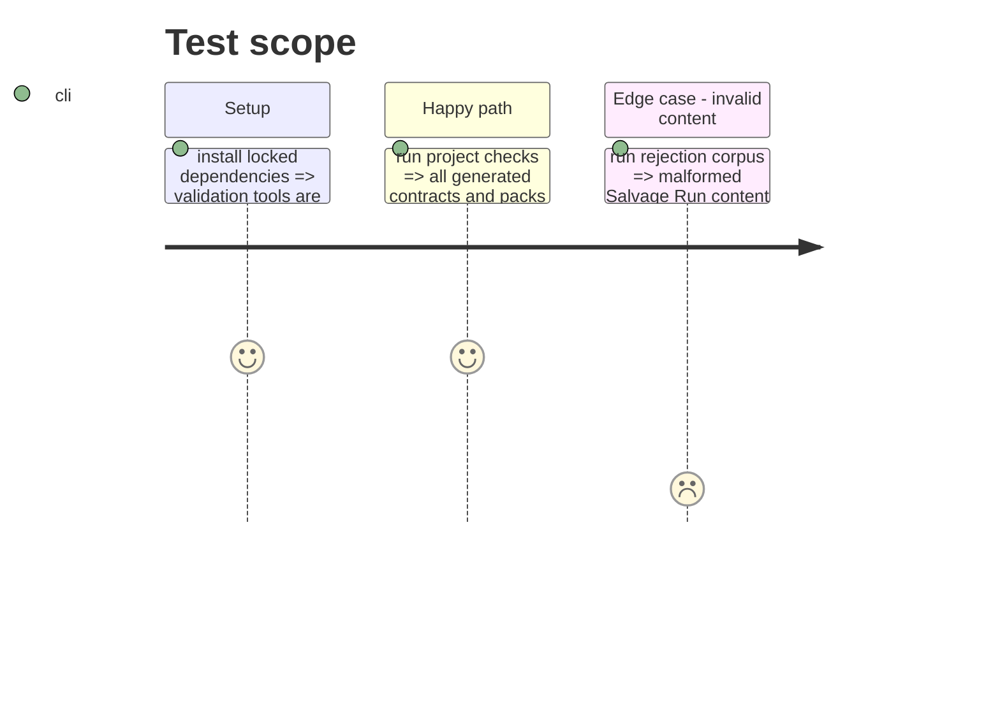

# Instruction: Validate the published game

## Architecture projection

```txt
tools/ ✏️ extend assertions where the supported game count is explicit
generated schemas/ ✏️ regenerated v4 public artefacts
```

## User Journey



## Test Scope



## Tasks to do

### `1)` Update assertions and run the suite

> Make all supported-game expectations include Salvage Run and verify them.

1. Adapt fixed game-count checks.
2. Regenerate and run targeted validations.

## Test acceptance criteria

| Task | Acceptance criteria |
| --- | --- |
| 1 | The full project check recognizes Salvage Run as a supported sixth game. |
