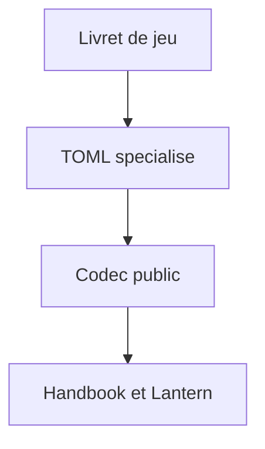
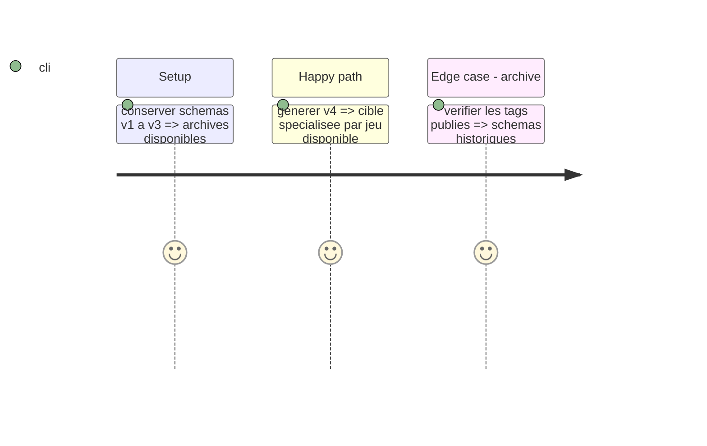

# Instruction: Contrat v4 et types spécialisés

## Architecture projection

> Tree of the final files. ✅ create · ✏️ modify · ❌ delete

```txt
src/contract-version.ts ✏️ Ouvre le contrat v4 sans modifier v1-v3.
src/zod/masks-playbook.ts ✅ Décrit le livret Masks spécialisé.
src/zod/monster-of-the-week-playbook.ts ✅ Décrit le livret MotW spécialisé.
src/zod/the-sprawl-playbook.ts ✅ Décrit le livret The Sprawl spécialisé.
src/zod/urban-shadows-playbook.ts ✏️ Porte aussi les régions éditoriales du livret.
src/zod/constants.ts ✏️ Déclare les quatre cibles spécialisées.
src/codecs/toml.ts ✏️ Expose les codecs et types publics.
src/index.ts ✏️ Exporte les surfaces spécialisées.
schemas/v4/** ✅ Schémas générés de la nouvelle ligne.
```

## User Journey



## Test Scope



## Tasks to do

### `1)` Définir les contrats par jeu

> Ajouter les données propres à chaque jeu sans élargir le socle générique.

1. Identifier les mécaniques et régions éditoriales de chaque livret.
2. Créer les extensions Zod strictes et les codecs publics.
3. Générer v4 et préserver les lignes publiées.

## Test acceptance criteria

| Task | Acceptance criteria |
| --- | --- |
| 1 | Chaque jeu a une cible spécialisée stricte et les schémas v1-v3 restent résolubles. |
