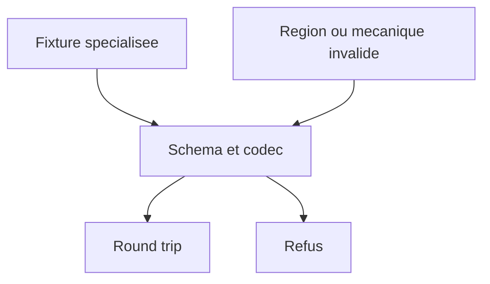
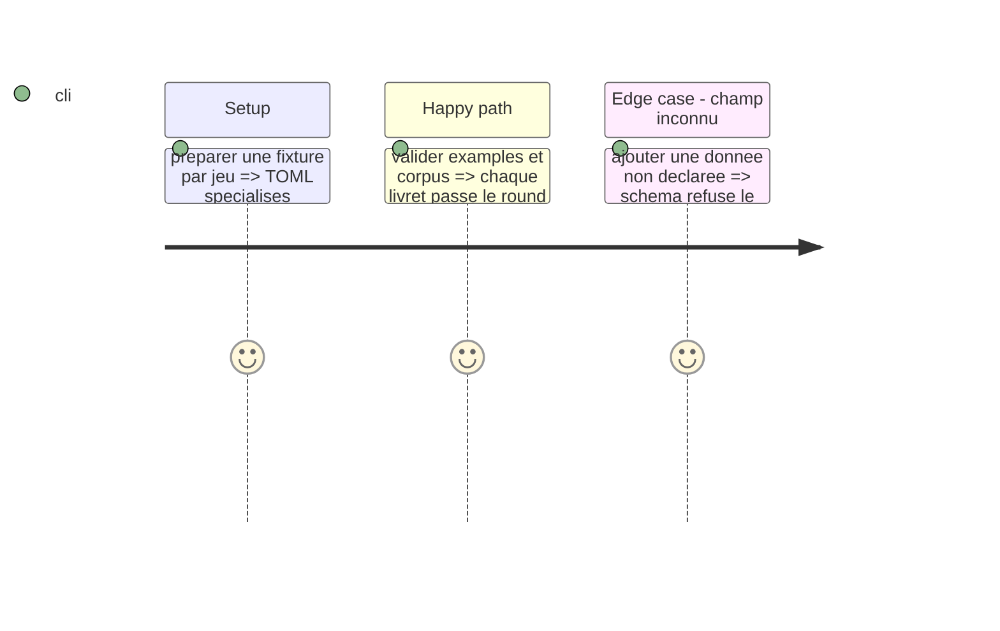

# Instruction: Fixtures, corpus et surfaces Lantern

## Architecture projection

> Tree of the final files. ✅ create · ✏️ modify · ❌ delete

```txt
examples/masks, examples/monster-of-the-week, examples/the-sprawl, examples/urban-shadows ✏️ Ajoutent un livret spécialisé canonique par jeu.
corpus/contract/** ✏️ Témoins acceptés et refusés pour chaque nouvelle cible.
corpus/temoins et corpus/refus ✏️ Audit JSON correspondant.
```

## User Journey



## Test Scope



## Tasks to do

### `1)` Migrer les sources canoniques

> Donner à chaque livret une unique fixture spécialisée complète.

1. Ajouter les exemples originaux spécialisés, avec leur contenu éditorial complet.
2. Ajouter cas positifs et négatifs par cible.
3. Vérifier les codecs et le corpus d'audit.

## Test acceptance criteria

| Task | Acceptance criteria |
| --- | --- |
| 1 | Handbook et Lantern peuvent charger un TOML spécialisé complet pour chaque jeu. |
